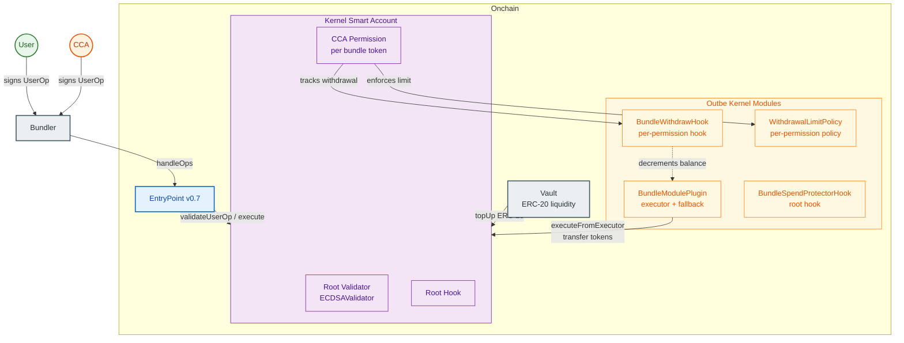

# Smart Account Solution

## Architecture Diagram

## Actors

### User
Owner of the smart account. Only restricted by BundleSpendProtectorHook prevents spending tokens reserved in bundles — only the free balance (total minus bundled) is available.

### CCA
Authorized party that can withdraw bundle tokens on behalf of the user within configured limits. Each CCA permission is scoped to a specific token with a rolling-window spending cap.

## Onchain Components

### EntryPoint
Standard ERC-4337 v0.7 contract. Receives packed user operations from the bundler, validates them against the smart account, and executes the resulting calls.

### Kernel Account
ZeroDev Kernel v3.1 modular smart account. Supports ERC-7579 modules (validators, executors, hooks, fallbacks, policies). The account is initialized via `SmartAccountFactory` with all Outbe modules pre-configured.

### Outbe Kernel Modules

#### BundleModulePlugin
Singleton ERC-7579 module installed as both **executor** and **fallback**. Manages per-token bundle balances within each smart account.

- `topUp` — Vault calls this fallback to transfer ERC-20 tokens into the account and increase the bundle balance.
- `withdraw` — Decrements bundle balance when tokens are withdrawn by CCA.
- `balanceOf` / `isBundleToken` — Queried by hooks to determine reserved amounts.

#### BundleSpendProtectorHook
Root execution hook applied to the **User's** validator. Intercepts every outgoing ERC-20 `transfer` and reverts if the amount exceeds the free balance (`totalBalance - bundleBalance`). Prevents the user from spending tokens reserved in bundles.

#### BundleWithdrawHook
Per-permission execution hook applied to **CCA** permissions. Validates that the CCA is transferring a registered bundle token, then decrements the bundle balance in `postCheck` via the plugin's executor dispatch.

#### WithdrawalLimitPolicy
ERC-7579 policy (module type 5) applied to **CCA** permissions. Enforces a cumulative spending limit over a rolling time window (e.g. 1000 USDC per day). Resets the used amount when the window expires. Returns `ValidUntil` set to the window end so the EntryPoint can enforce time-bounded validity.

### Vault
Liquidity source that holds ERC-20 tokens. Calls `BundleModulePlugin.topUp` to fund the smart account's bundle balance.

## Offchain Components

### Bundler
ERC-4337 and ERC-7579 compatible service. Receives signed user operations from Users or CCAs, bundles them, and submits them to the EntryPoint for on-chain execution.
1. Accepts UserOperations via a JSON-RPC endpoint (eth_sendUserOperation)
2. Validates them — simulates execution, checks gas limits, verifies signatures
3. Bundles multiple UserOps into a single EntryPoint.handleOps() transaction
4. Pays the gas from its own EOA, getting reimbursed from the UserOp's gas payment (prefund deposit or paymaster)
5. Handles nonce management, retry logic, and mempool ordering
