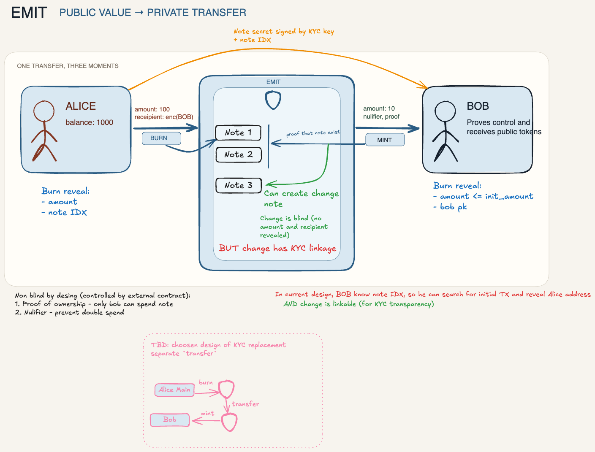

# Emit

`outbe-emit` is the private-note precompile. `burn` locks public native value
into an owner-bound note commitment appended to the chain's incremental Merkle
tree; `mint` redeems a note with a zero-knowledge proof, credits the payout
recipient, and nullifies the note. Note contents (owner, spend key, amount)
never touch the chain.

The Emit precompile address is `0x000000000000000000000000000000000000EE13`
(`EMIT_ADDRESS`).

## Protocol onepager



One-page visual summary of the Emit protocol: note derivations, the
burn / off-chain transfer / mint lifecycle, and the optional KYC and audit
overlays.

## Using the precompile

```text
sender    -> burn(noteSn) + value  : debit caller, append commitment C, emit NewNote
sender   --> recipient (off-chain) : note package {amount, spend key, note_sn, leaf index}
recipient -> mint(payoutRecipient, statement, proof)
                                      : verify proof, credit payout, record nullifier,
                                        emit NoteUsed (+ NewNote for change)
```

Write calls are signed EVM transactions to `EMIT_ADDRESS`; only `burn` carries
value — every other selector refuses credited value.

```bash
EMIT_ADDR=0x000000000000000000000000000000000000EE13

# Lock 1 native unit into a note with serial number note_sn.
cast send "$EMIT_ADDR" 'burn(bytes32)' "$NOTE_SN" \
  --value 1 --private-key "$SENDER_KEY" --rpc-url "$RPC_URL"

# Redeem: prove membership + ownership; credit the payout recipient.
cast send "$EMIT_ADDR" \
  'mint(address,uint64,bytes32,bytes32,address,uint256,bytes32,bytes)' \
  "$PAYOUT" "$CHAIN_ID" "$ROOT" "$NULLIFIER" "$NOTE_OWNER" "$MINT_UNITS" \
  "$CHANGE_COMMITMENT" "$PROOF" \
  --private-key "$RECIPIENT_KEY" --rpc-url "$RPC_URL"
```

Methods:

- `burn(bytes32 noteSn) external payable` — derives the commitment from the
  runtime chain ID, `noteSn`, and `msg.value`; initializes the tree on the
  first call.
- `mint(address payoutRecipient, uint64 chainId, bytes32 root, bytes32 nullifier, address noteOwner, uint256 mintUnits, bytes32 changeCommitment, bytes proof) external` —
  proves membership under an accepted root, nullifies, credits `mintUnits`,
  and appends the deterministic change commitment on partial mints.

Rules:

- `msg.value` on `burn`: any positive `uint256` native-base-unit value, mapped
  1:1 to circuit units.
- `mint` requires an initialized tree; caller must be `noteOwner`; calldata
  statement fields must equal the proof's embedded statement; `chainId` must
  equal the runtime chain ID.
- `root` must be inside the 32-root window; each nullifier is single-use.
- `proof` is the combined UltraHonkKeccak wire for the frozen
  `outbe.emit.mint@1.5.0` circuit, enforced at its exact frozen length.
- `NewNote.noteAmount == 0` is the sentinel for a partial mint's private
  change note.

Events:

- `NewNote(bytes32 indexed commitment, uint32 leafIndex, bytes32 rootAfter, uint256 noteAmount)`
- `NoteUsed(address indexed noteOwner, address indexed payoutRecipient, bytes32 indexed nullifier, uint256 mintAmount)`

Infrastructure failures (`UnderfundedBurn`, `VerifierUnavailable`) map to
fatal block aborts, not reverts.

Limits:

- Tree depth 32 → 4,294,967,296 commitments (bounded to 4,294,967,295 by the u32 leaf counter).
- Root window 32.
- Base gas burn 530,000, mint 3,517,500 (`ZK_VERIFY_GAS` 3,000,000 +
  517,500).

## Interaction scenarios

The diagrams use the protocol vocabulary: `burn` creates a private note and
`mint` redeems it into public tokens. Therefore, "Alice mints for Bob" is shown
as Alice creating a Bob-owned note, followed by Bob redeeming it.

- Amber blocks are authenticated off-chain linkage or data transfer.
- Purple blocks are key creation or optional audit/KYC-specific operations.
- Blue blocks are core proof operations.
- Cyan blocks are ledger processing. All diagrams use a forced dark background.

`Ledger` in the diagrams is the chain's Emit precompile at
`0x000000000000000000000000000000000000EE13`; the mapping below translates
diagram vocabulary to the implemented ABI surface.

```text
Diagram term                              Implemented precompile surface
Ledger                                    Emit precompile at EMIT_ADDRESS (0x000000000000000000000000000000000000EE13)
burn(caller, native_value, note_sn)       burn(bytes32 noteSn), payable — value is msg.value
BurnReceipt(C, note_amount, leaf_index,
root_after)                               NewNote(commitment, leafIndex, rootAfter, noteAmount) event
mint(caller, payout_recipient, statement,
proof)                                    mint(payoutRecipient, chainId, root, nullifier,
                                          noteOwner, mintUnits, changeCommitment, proof);
                                          "statement" is the flattened calldata mirrored
                                          by the proof's embedded public inputs
MintReceipt(N, mint_units, optional
C_change, root_after)                     NoteUsed(noteOwner, payoutRecipient, nullifier,
                                          mintAmount) event, then an optional NewNote for
                                          the change commitment (noteAmount = 0 sentinel)
"Validate amount, balance, supply,
note_sn, duplicate C and tree capacity"   burn guards in order: value non-zero,
                                          noteSn canonical and non-zero, tree
                                          capacity, derived commitment non-zero, no
                                          duplicate commitment
```

### 1. Alice sends tokens to Bob

```mermaid
%%{init: {"theme":"base","themeVariables":{"background":"#0b1120","primaryColor":"#111827","primaryTextColor":"#e5e7eb","primaryBorderColor":"#64748b","lineColor":"#94a3b8","actorBkg":"#111827","actorBorder":"#64748b","actorTextColor":"#f8fafc","actorLineColor":"#475569","signalColor":"#cbd5e1","signalTextColor":"#f8fafc","labelBoxBkgColor":"#1e293b","labelBoxBorderColor":"#64748b","labelTextColor":"#e2e8f0","loopTextColor":"#e2e8f0","noteBkgColor":"#1e293b","noteBorderColor":"#64748b","noteTextColor":"#f8fafc","activationBkgColor":"#164e63","activationBorderColor":"#22d3ee","sequenceNumberColor":"#fbbf24"}}}%%
sequenceDiagram
    autonumber
    actor KYC as KYC Authority
    actor Alice as Alice
    actor Bob as Bob
    participant Ledger as Ledger

    rect rgb(49, 28, 79)
        KYC-->>Alice: Create or certify audit key<br/>As result Alice get KYC_secret/public part
    end

    Bob-->>Alice: Alice receive pk of bob: owner_B

    rect rgb(49, 28, 79)
        Note over Alice: spend_key Generation
        Alice->>Alice: Generate random rho 
        Alice->>Alice: Create m_kyc(ower_b, amount, rho)
        Alice->>Alice: spend_key = Sign(KYC_secret, m_kyc)
    end

    Alice->>Alice: Compute note_sn = P(TAG_NOTE_SN,[owner_B, note_spend_key])
    Alice->>Alice: Compute expected C = P(TAG_COMMITMENT,[pool_id, note_sn, note_amount])
    
    Alice->>Ledger: burn(caller=Alice, native_value, note_sn)
    activate Ledger
    rect rgb(8, 47, 73)
        Ledger->>Ledger: Validate amount, balance, supply,<br/>note_sn, duplicate C and tree capacity
        Ledger->>Ledger: Debit Alice, append C,<br/>and publish new Merkle root
        Ledger-->>Alice: BurnReceipt(C, note_amount,<br/>leaf_index, root_after)
    end
    deactivate Ledger

    rect rgb(67, 39, 13)
        Note over Alice,Bob: OFF-CHAIN NOTE TRANSFER
        Alice-->>Bob: Send encrypted NotePackage<br/>{note_amount, note_spend_key,<br/>note_sn, leaf_index} + optional envelope
    end

    rect rgb(49, 28, 79)
        Note over Alice: Verify Alice KYC
        Bob->>KYC: request KYC credential for Alice
        KYC-->>Bob: Return pk_Alice + status
        Bob->>Bob: Compute m_key(owner_B, amount, rho)
        Bob->>Bob: verify(m_Key, pk_Alice)
    end

    Bob->>Ledger: Read commitment/root context<br/>and nullifier status
    Ledger-->>Bob: Return Merkle data(root + path) and is_spent(N)

    Bob->>Bob: Recompute note_sn, C and N<br/>then verify Merkle inclusion and N is unspent
    Note over Bob: Bob has accepted the private note

    rect rgb(23, 37, 84)
        Note over Bob: CORE MINT PROOF CREATION
        Bob->>Bob: Build MintStatement and ZK proof<br/>from note_spend_key, amount and Merkle path
    end

    Bob->>Ledger: mint(caller=Bob, payout_recipient=Any,<br/>statement, proof)
    activate Ledger
    rect rgb(8, 47, 73)
        Ledger->>Ledger: Check caller == note_owner,root.exist(), N.not_spent(), proof.valid()
        Ledger->>Ledger: Credit Bob, record N,<br/>append optional C_change
        Ledger-->>Bob: MintReceipt(N, mint_units,<br/>optional C_change, root_after)
    end
    deactivate Ledger
```



KYC Authority and provenance-envelope steps are optional. Core note acceptance
and `mint` do not depend on KYC.

### 2. Bob proves receipt from Alice to Auditor

```mermaid
%%{init: {"theme":"base","themeVariables":{"background":"#0b1120","primaryColor":"#111827","primaryTextColor":"#e5e7eb","primaryBorderColor":"#64748b","lineColor":"#94a3b8","actorBkg":"#111827","actorBorder":"#64748b","actorTextColor":"#f8fafc","actorLineColor":"#475569","signalColor":"#cbd5e1","signalTextColor":"#f8fafc","labelBoxBkgColor":"#1e293b","labelBoxBorderColor":"#64748b","labelTextColor":"#e2e8f0","loopTextColor":"#e2e8f0","noteBkgColor":"#1e293b","noteBorderColor":"#64748b","noteTextColor":"#f8fafc","activationBkgColor":"#164e63","activationBorderColor":"#22d3ee","sequenceNumberColor":"#fbbf24"}}}%%
sequenceDiagram
    autonumber
    actor KYC as KYC Authority
    actor Bob as Bob
    actor Auditor as Auditor
    participant Ledger as Ledger

    rect rgb(55, 49, 44)
        Note over Bob,Auditor: OFF-CHAIN EVIDENCE TRANSFER
        Note over Bob: EVIDENCE RECEIVED FROM ALICE IN SCENARIO 1
        Bob-->>Auditor: Send: BurnTx, MintTx, note_spend_key, note_amount, m_kyc
    end

    rect rgb(49, 28, 79)
        Note over KYC,Auditor: OFF-CHAIN CREDENTIAL LOOKUP
        Auditor->>KYC: GetCredential(KYC_ID_Alice)
        KYC-->>Auditor: Return pk_Alice, status<br/>and certification
    end

    rect rgb(49, 28, 79)
        Note over Bob,Auditor: KYC-FACTS VERIFICATION
        Auditor->>Auditor: Verify Alice signature of note_spend_key
        Auditor->>Auditor: Verify m_key(owner_B, amount, rho)
        Auditor->>Bob: Challenge bob to sign message, to prove he owns the onwer_B key
        Bob-->>Auditor: Return signature
    end

    Auditor->>Ledger: Get burn transaction, C/root inclusion<br/>and optional accepted nullifier N
    activate Ledger
    rect rgb(8, 47, 73)
        Ledger-->>Auditor: Return authenticated burn sender,<br/>amount, C, root and optional N status
    end
    deactivate Ledger
    
    Auditor->>Auditor: Match proof public values<br/>to immutable ledger facts
    
    Auditor-->>Bob: Return signed audit result<br/>Alice-linked receipt verified / rejected
    
```



Without an Alice-signed provenance envelope, core Emit cannot prove that the
note came from Alice. Without immutable ledger data identifying Alice as the
authenticated burn sender, the narrower result is "Alice authorized this note
for Bob," not "Alice funded the burn." The precompile implements only the
on-chain `burn`/`mint` surface; `pi_receive`, KYC, credential lookup,
provenance envelopes, and audit evidence storage are off-chain and
unimplemented.

## Spend-key requirements

The precompile treats `note_spend_key` as an opaque private value — `burn`
never receives it; only the mint circuit sees it, as a private witness.

```text
note_sn  = P(TAG_NOTE_SN, [note_owner, note_spend_key])
N        = P(TAG_NULLIFIER, [note_commitment, note_spend_key])
K_change = P(TAG_CHANGE_KEY, [note_spend_key, N])
```

- **One-time use — fresh key per note.** The nullifier `N` binds the full
  note commitment (chain, serial, and amount), so notes are nullified
  independently: reusing one owner/key pair across notes with different
  amounts creates distinct commitments with distinct nullifiers, each
  spendable on its own. Equal-amount reuse collides on the commitment itself
  and is rejected at burn as a duplicate. Wallets must still generate a
  fresh initial key for every note (an equal-amount burn is otherwise
  indistinguishable from a duplicate).
- **Secrecy in transfer.** Anyone holding `note_spend_key` can construct the
  mint witness and trace deterministic change successors — privacy destroyed,
  griefing enabled. Runtime `caller == noteOwner` still prevents a different
  account from minting. The off-chain note-package channel must protect the
  key.
- **Nonzero and ratcheted.** Key, serial, commitment, and nullifier must be
  nonzero at protocol boundaries. A partial mint deterministically rotates
  the key via `K_change`; the circuit enforces a nonzero rotated serial,
  commitment, and future nullifier, so a partial mint never creates a
  cryptographically unspendable successor.

## Proposed KYC design

Status: proposal, not implemented. No KYC profile changes the mint circuit or
the precompile API; the core accepts any opaque `note_spend_key`.

Construction (wallet-side; the purple blocks in scenario 1):
`note_spend_key = (recipient, amount).build_kyc_spend_key(random)` — the
proposed profile signs a pool/recipient/amount/random context
(`m_kyc(owner_B, amount, rho)`, `spend_key = Sign(KYC_secret, m_kyc)`) and
derives the spend key from the canonical signature.

**Requirement — signed and off-chain verifiable.** Before accepting a note,
the recipient fetches the issuer credential (`pk_Alice` + status) from the KYC
authority, recomputes `m_key(owner, amount, rho)`, and verifies the signature
against the issuer public key. All verification happens off-chain; the
precompile never sees or checks KYC data.

**Open linkage questions** (summary mirror of the onepager): the current
design leaves change notes KYC-linkable, and a recipient who learns the note
index can locate the initial burn transaction and reveal the sender's
address. The onepager sketches three alternatives — external linkage,
change-as-private-transfer (loses KYC linkage for change), and full private
transfer. The choice is open; none is implemented.

Boundary: KYC is optional. Core note acceptance and `mint` do not depend on
it.
