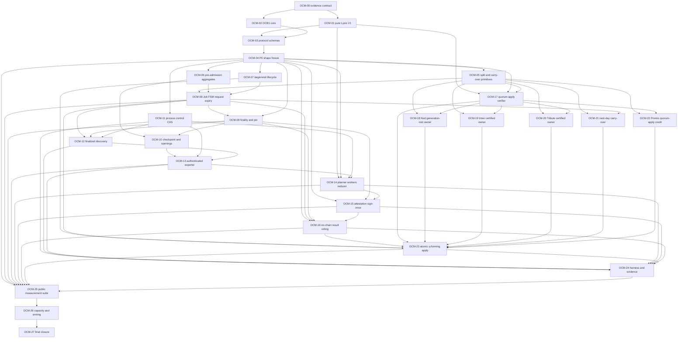

# Off-chain Computation PoC implementation plan

Status: **IMPLEMENTED ON `feat/ocomp-poc` — exact OCM-27 closure run pending**

This is the canonical plan for the fresh-devnet Lysis V1 PoC over bounded
work units and constant-size commitments, with no total Tribute cap. It plans
implementation and records its merge gates. Production surfaces and
task-local tests exist on the feature branch; only a successful exact-revision
public/E2E/isolation evidence bundle may close OCM-27.

Authoritative inputs:

- [`off-chain-computation.md`](../off-chain-computation.md);
- [`off-chain-poc.md`](../off-chain-poc.md);
- [`ADR-S-OCM-001`](../docs/adr/system/ADR-S-OCM-001-ocomp-kernel-and-typed-program-boundary.md)
  through
  [`ADR-S-OCM-004`](../docs/adr/system/ADR-S-OCM-004-certified-activation-job-fsm-and-protocol-versioning.md);
- [`PFS-002`](../docs/flows/002-off-chain-poc-protocol-flow.md);
- the [Lysis V1 semantic baseline](off-chain-poc-lysis-v1-semantics.md);
- the [finalized input/export decision](off-chain-poc-finalized-input-export.md);
- the revised [planning ledger](off-chain-poc-evidence-ledger.yaml).

The implementation decision map, current-code map, protocol freeze,
process/CAS, deterministic/quorum, activation/apply, test/evidence and prior
audit notes remain planning history. Where they describe a result relay or
`ExecutionCertificateV1`, that text is superseded and must not be implemented.
The affected notes are explicitly marked reopened/superseded and require
regeneration before they can again be authoritative.

### Full-result quorum-apply correction accepted during OCM public-path integration

The public-path review exposed a protocol-accountability defect: an off-chain
relay could drop a validator announcement, so consensus could not distinguish
validator non-response from relay censorship. That makes timely-response
slashing evidence impossible and turns the relay into an unnecessary second
consensus contour.

The accepted correction is:

- each validator-domain `OffchainLysis Supervisor` replaces its relay
  publication edge with one signed `ResultVoteV1` carrying the canonical
  constant-size `LysisResultV1` through the ordinary public transaction path;
- the validator does not pay for that transaction: one exact-selector,
  zero-value, bounded-envelope ZeroFee hook modelled on Oracle authorizes only
  the eligible validator EVM signer; OCOMP alone validates finality, window,
  job, digest, signature and slot rules;
- the node retains both OCOMP and EVM private keys behind restricted signing
  seams; the Supervisor owns prepare/submit/inclusion/finality/reorg workflow;
- consensus records request finality, waits four additional blocks, then
  atomically installs `VOTING_OPEN(open_height, deadline_height)` where
  `open_height = finality_recorded_height + 4`;
- consensus stores exactly four bounded first-vote slots;
- consensus derives `ResultDigest` from the complete canonical
  `LysisResultV1`; four state slots retain only digest/signature/height;
- the third equal first-vote digest atomically records quorum, stores the
  canonical result once and executes the bounded typed apply in the same
  checkpoint, producing `COMPLETED` or the defined `CONFLICTED` outcome;
- there is no `QUORUM_READY` waiting state, `PoCActivationV1`,
  `activateLysis`, activator or post-quorum result delivery;
- the fourth slot remains open until the exclusive response deadline after
  quorum application;
- deadline close records matching, divergent, missing and equivocation
  evidence; PoC does not apply monetary slashing;
- fourth-slot/equivocation/close writes live in a separate bounded
  `OcompVoteAccountabilityV1`; immutable terminal receipt, active generation,
  applied result and exact-retry identity never change after completion;
- only no-quorum pending jobs expire; a timely q=3 is already applied by its
  forming transaction.

This correction reopens the affected schema/freeze/FSM/signing/quorum/public
quorum-apply/harness/capacity/closure work in `OCM-03`, `OCM-04`, `OCM-08`,
`OCM-09`, `OCM-15`, `OCM-16` and `OCM-23..27`. It does not change
authenticated input, deterministic Lysis, owner effects, Mongo/CE transport,
Tribute population scope or the Lysis-only program boundary. The only permitted
ZeroFee change is the closed full-result-vote hook above. It includes the
bounded apply work when that submission forms q=3; consensus gas/work limits
still apply.

### Protocol correction accepted during OCM-13

The input-export implementation exposed a freeze omission: the manifest
contained nested codec identifiers while the bundle schema omitted their
authoritative values, and the aggregate node opening handoff had no canonical
record/root mapping. The accepted minimal correction is part of G1 and must be
regenerated before OCM-13 closes:

- add `tribute_body_codec_id`, `fidelity_opening_codec_id` and
  `oracle_opening_codec_id` directly to `ProtocolBundleV1`;
- generate the three IDs from complete checked-in descriptors and derive the
  opening-registry hash from the ordered Fidelity/Oracle pair;
- partition sorted owners into node requests of at most 256 without a total
  owner or Tribute cap;
- materialize each Fidelity batch and the one job-wide Oracle proof as
  source-specific `AuthenticatedOpeningV1` records;
- commit them with distinct Fidelity/Oracle ordered-list kinds and verify every
  bundle/manifest/chunk/record binding fail-closed.

This correction reopens only the affected OCM-02/03/04 generated artifacts and
OCM-13 exporter evidence. It does not change Mongo, CE, Fidelity/Oracle storage,
activation ABI/FSM, owner state, or the fixed Lysis-only scope.

## 1. Outcome and non-goals

The last task must prove this real path:

```text
public Tribute transactions
  -> terminal Metadosis JobIntent without Lysis/effects
  -> consensus-recorded finality + four blocks -> VOTING_OPEN
  -> finalized authenticated export
  -> four independent validator-domain executions
  -> four Supervisor-submitted validator ZeroFee full-result transactions
  -> the third matching transaction records q=3 and verifies without Lysis
  -> four certified owner effects in the same checkpoint
  -> fourth-slot accountability stays open
  -> finalized Nod/effect/generation public reads and proofs
```

The plan adds exactly two workspace packages:

- `crates/system/ocomp-protocol`;
- `bin/outbe-ocomp`, one executable with fixed `supervisor`,
  `snapshot-exporter` and `worker` modes.

It does not add a `ProgramRegistry`, `TaskAdapter`, second program, generic
write/action dispatcher, separate activation transaction, new RPC namespace,
separate CAS daemon, node-spawned arbitrary worker, synchronous fallback,
generic/broad ZeroFee policy, TargetLarge proof/DA path or
supported-network deployment.

`PFS-002-07` and `PFS-002-08` remain deferred. Normal restart and finalized
generation replay are still PoC requirements.

## 2. How tasks are executed

Each `OCM-NN` card is one reviewable PR or a short stacked PR that:

1. starts with the named task-local or ledger test failing;
2. changes only the listed authority owners;
3. keeps the PoC fork unarmed until `OCM-26`;
4. records produced vectors/manifests/test discovery in the evidence format;
5. ends with its task-local commands green and no skip/todo/quarantine;
6. does not claim downstream production boundaries.

“Closes test IDs” means the task owns implementation of those stable ledger
tests. Final `PASS` is accepted only from the exact-source closure run in
`OCM-27`; an earlier green run is development evidence.

Incremental CI uses
`mise run ocomp-poc-task -- OCM-NN`: it requires the named task's local tests,
its closing ledger IDs and every already-discovered OCOMP test, while future
planned IDs remain visibly `MISSING`. This mode may claim only the named task.
The unqualified lane commands and `mise run ocomp-poc-closure` are fail-closed
PoC-closure commands and do not become required closure gates until `OCM-27`.
Thus early PRs are mergeable without converting missing future work into PASS.

Existing unrelated worktree changes are preserved. Every PR regenerates only
owned artifacts and includes a no-unregistered-literal/no-generic-bypass scan.

## 3. Non-circular merge and fork gates

The fork and capacity gates are deliberately split:

| Gate | After task | Meaning |
|---|---:|---|
| `G0 EVIDENCE` | `OCM-00` | missing evidence is visible and fail-closed |
| `G1 SHAPE FREEZE` | `OCM-04` | schemas/domains/registries/candidate ceilings frozen; no checked-in network can activate OCOMP |
| `G2 REQUEST` | `OCM-08` | a typed measurement fixture can create/expire a real JobIntent with no Lysis/effects; production chain-manifest installation closes in `OCM-24/25` |
| `G3 ONE DOMAIN` | `OCM-15` | one domain can export, compute, verify and durably attest |
| `G4 QUORUM` | `OCM-16` | four bounded on-chain slots derive q=3 and objective accountability |
| `G5 QUORUM APPLY` | `OCM-23` | the q-forming validator vote atomically applies four owner effects and terminal state |
| `G6 PUBLIC MEASUREMENT` | `OCM-25` | disposable four-node measurement chain exercises real RPC/import/replay |
| `G7 ARMING` | `OCM-26` | final cap/bundle/genesis/committee are checked in; canonical fresh-devnet fork may activate |
| `G8 CLOSURE` | `OCM-27` | exact thirteen-step, isolation and evidence verifier pass |

Before `G7`, code is unreachable on every checked-in network schedule. The
capacity harness may generate a disposable measurement chain, but its
provisional manifest/history cannot satisfy closure or become canonical PoC
history.

## 4. Dependency graph



Parallelizable groups:

- `OCM-01` and `OCM-02`;
- `OCM-05`, `OCM-06`, `OCM-07` and `OCM-11` after shape freeze;
- process plane `OCM-09..16` and quorum-apply verifier `OCM-17`;
- quorum-apply owner tasks `OCM-18..20` and `OCM-22`.

## 5. Task index

| ID | Deliverable | Depends on | Ledger tests owned |
|---|---|---|---|
| `OCM-00` | evidence/CI contract | — | `OCM-EVD-001` |
| `OCM-01` | pure Lysis V1 + reference | `00` | `OCM-SEM-001` |
| `OCM-02` | OCB1/hash/list foundation | `00` | contributes `OCM-BYT-001` |
| `OCM-03` | complete protocol schemas/verifiers | `01,02` | contributes `BYT/APL/FIN/VOT` |
| `OCM-04` | P0 shape freeze and vectors | `03` | `OCM-BYT-001/002`, `OCM-BND-003` |
| `OCM-05` | budget split, strict Desis and carry-over primitives | `04` | contributes `OCM-REQ-001`, `OCM-APL-002` |
| `OCM-06` | maintained bounded pre-admission | `04` | contributes `OCM-REQ/EXP/TIM` |
| `OCM-07` | begin/end SystemTx lifecycle | `04` | contributes `OCM-REQ/PUB` |
| `OCM-08` | Job FSM/request/expiry | `05,06,07` | `OCM-FSM-001`, `OCM-REQ-001` |
| `OCM-09` | finalized proof and durable pin | `04,08` | `OCM-FIN-001`, `OCM-PIN-001` |
| `OCM-10` | retained CE/Reth/Mongo/openings handoff | `06,09` | contributes `OCM-EXP-001` |
| `OCM-11` | process/control/CAS/systemd base | `04` | `OCM-CTL-001` |
| `OCM-12` | finalized cursor discovery | `08,09,11` | `OCM-DIS-001` |
| `OCM-13` | authenticated exporter and CAS closure | `10,11,12` | `OCM-EXP-001`, `OCM-CAS-001` |
| `OCM-14` | deterministic plan/work/reduce | `01,04,11,13` | `OCM-SEM-002`, `OCM-DET-001` |
| `OCM-15` | node attestation and sign-once | `04,09,14` | `OCM-SIG-001` |
| `OCM-16` | Supervisor zero-fee result votes, q=3 and accountability | `04,08,09,15` | `OCM-VOT-001` |
| `OCM-17` | structural verifier/capability/equations | `01,04,05` | `OCM-APL-001`, `OCM-BND-002` |
| `OCM-18` | Nod certified generation-root install | `05,17` | contributes `OCM-APL-002` |
| `OCM-19` | Intex certified contributor-root install | `05,17` | contributes `OCM-APL-002` |
| `OCM-20` | Tribute consume/retire | `05,17` | contributes `OCM-APL-002` |
| `OCM-21` | consume carry-over into the next unformed day limit | `05,08` | contributes `OCM-REQ-001`, `OCM-TIM-001` |
| `OCM-22` | Promis certified `unused_lysis` credit | `05,17` | contributes `OCM-APL-002` |
| `OCM-23` | q-forming atomic apply and views | `07,08,16..22` | `OCM-BND-001`, `OCM-APL-002`, `OCM-TIM-001` |
| `OCM-24` | OCOMP harness/topology/evidence/trace | `11..16,23` | enables all public/E2E IDs |
| `OCM-25` | public fork/vote/quorum-apply measurement suite | `04,08,09,13..16,23,24` | `OCM-PUB-001/002/003/004` |
| `OCM-26` | final capacity, bundle and fork arming | `25` | `OCM-CAP-001` |
| `OCM-27` | final E2E, isolation and closure report | `26` | `OCM-E2E-001/002/004..008`, `OCM-ISO-001`, `OCM-TRC-001` |

## 6. Detailed task cards

### OCM-00 — Establish the verification contract first

**Depends on:** none.

**Outcome:** the repository can describe all planned OCOMP evidence and fail
closed on missing or corrupt evidence before production work begins.

**Files/symbols:**

- `outbe-plan/off-chain-poc-evidence-ledger.yaml`;
- `crates/testing/e2e-harness/src/evidence.rs`;
- new OCOMP-specific evidence schema/writer modules under the same package;
- new test-only `outbe-e2e-evidence` binary;
- `mise.toml` command placeholders and fail-closed discovery checks;
- task-progress CI plus closure workflow stubs that report `MISSING`, never
  false green.

**Changes:**

- parse the planning ledger with duplicate-ID/reference validation;
- define exact runtime manifest/assertion schemas and atomic publication;
- add independent closure computation and deterministic JSON/Markdown report;
- record tracked/untracked dirty state, toolchain, exact binary hashes and
  exact node/OCOMP/network/systemd configuration hashes;
- expose the six planned `mise` lanes without pretending absent tests pass.
- expose `mise run ocomp-poc-task -- OCM-NN` separately from fail-closed
  closure mode.

**Invariants/failures:** mixed revisions, bad member hashes, missing tests,
skip/todo/quarantine, illegal deferred IDs and retried-away failures reject.
Incomplete implementation yields `MISSING`.

**Fork impact:** none; this task creates verification tooling and cannot arm or
alter consensus behavior.

**Reuse/non-goals:** extend existing `ScenarioEvidence`; do not build a second
harness, release-signing system or generic project-wide ADR ledger.

**Test first:** `OCM-EVD-001` complete synthetic bundle plus every negative
closure mutation.

**Evidence/CI:** `OCM-FAST`; retain verifier fixtures, discovery output and
closure report hash.

**Observable acceptance:** `mise run ocomp-poc-task -- OCM-00` passes verifier
self-tests and labels its claim `task_progress`; the closure command on an
empty OCOMP implementation returns non-zero with exact missing IDs.

**Risks:** a verifier that trusts scenario `"passed"` fields or its own writer.
Mitigation: recompute coverage from the checked-in ledger and independent
fixtures.

**DoD:** verifier positive/negative fixtures pass, zero duplicate/unowned IDs,
no mandatory lane can convert missing evidence to success.

### OCM-01 — Extract pure Lysis V1 and freeze the independent oracle

**Depends on:** `OCM-00`.

**Outcome:** one storage-independent Lysis implementation preserves the current
successful economics and first-failure order; the synchronous legacy path calls
that same semantic core.

**Files/symbols:**

- `crates/core/lysis/src/runtime.rs::lysis_inner` extraction source;
- new `crates/core/lysis/src/program_v1/`;
- independent Rust reference crate with no production dependencies and a
  versioned JSONL corpus;
- `crates/core/lysis/tests/program_v1_reference.rs`.

**Changes:** define canonical logical inputs/observations, checked arithmetic,
Fidelity/Oracle snapshot use, actions, semantic events and failures. Keep
storage reads/writes in the legacy adapter only.

**Invariants/failures:** exact operation order; `f=allocation/nominal`,
`fmax=2f`; zero/over-budget failure; exclusion affects contributor issuance but
not Tribute/Nod conservation; no wall-clock/current-state input.

**Fork impact:** none; legacy behavior remains active and equivalent.

**Reuse/non-goals:** reuse existing arithmetic and identity helpers. Do not add
workers, codecs, storage abstraction, new economic behavior or on-chain
reference execution.

**Test first:** `OCM-SEM-001`; native/reference differential for required edge
classes and an adapter equivalence corpus against the current path.

**Evidence/CI:** `OCM-FAST`; corpus hash, reference implementation hash, case
IDs and native/reference output bytes.

**Observable acceptance:** all valid cases are byte/field equivalent and both
implementations select the same first failure.

**Risks:** accidentally freezing stale comments or unused constants.
Mitigation: derive corpus expected values independently and preserve runtime
source links.

**DoD:** no storage/node/process dependency under `program_v1`; legacy tests and
independent differential pass; corpus changes require explicit review.

### OCM-02 — Implement OCB1, hash framing and ordered roots

**Depends on:** `OCM-00`.

**Outcome:** the one shared protocol package provides bounded canonical scalar,
collection, envelope, hash-domain and list-root primitives.

**Files/symbols:**

- new `crates/system/ocomp-protocol/Cargo.toml`;
- `src/{codec,hash,list,registry,error}.rs`;
- independent test encoder/decoder under `tests/support/`.

**Changes:** exact big-endian grammar, OCB1 envelope, strict re-encode check,
domain framing, padded ordered-list roots, preallocation limits and one
machine-generated registry source.

**Invariants/failures:** reject unknown kind/version/enum, duplicate/order
violations, truncation, trailing bytes and cap+1 before allocation. No `serde`
or Rust layout is consensus encoding.

**Fork impact:** none; no schema/bundle is armable yet.

**Reuse/non-goals:** reuse `keccak256` and fixed primitive types. Do not add a
generic serialization framework, program registry, database/process/HTTP
dependency or compression.

**Task-local tests:** every scalar/option/vector/envelope boundary, list
empty/leaf/pad/node/root and domain collision. Contributes `OCM-BYT-001` and
`OCM-BND-003`.

**Evidence/CI:** `OCM-FAST`; canonical bytes, allocation counters and registry
generation diff.

**Observable acceptance:** production and independent implementations agree
for core vectors; mutation at every byte boundary rejects deterministically.

**Risks:** two handwritten literal authorities. Mitigation: generator owns
constants and CI scans duplicates.

**DoD:** package has no forbidden dependencies, core vectors pass, regeneration
is byte-reproducible and unregistered domains/tags fail CI.

### OCM-03 — Implement all frozen protocol schemas and pure verifiers

**Depends on:** `OCM-01`, `OCM-02`.

**Outcome:** every durable/wire/hashed PoC object has one canonical type and
pure validation contract; objects that carry bodies are individually bounded,
while population-wide objects use constant-size count/root commitments.

**Files/symbols:**

- `crates/system/ocomp-protocol/src/{profile,intent,input,unit,result,committee,vote,state,activation,receipts,control}.rs`;
- ABI/system-transaction/event/error registries;
- golden vector semantic fixtures.

**Changes:** implement the complete regenerated object registry, nested
types, exact IDs/hashes/signature rules, Job/attempt/finality/open/deadline bindings, local
control frames, receipts/job record and public ABI constants. The capacity
profile contains no total Tribute cap. `JobIntentV1` binds the complete
population; `InputManifestV1`, `PlanCommitmentV1` and `LysisResultV1` commit
chunk/unit/result catalogs by count/root, while `UnitSpecV1` and
`ResultChunkV1` are bounded worker/artifact objects. The final registry entry
is the Lysis-specific `ShuffleRunArtifactV1`: owner/bucket leaves contain at
most 256 records and canonical internal nodes contain two CAS child references.
Leaf ordered-record roots use the frozen ordered-list construction; internal
ordered-record roots use `OUTBE_OCOMP_SHUFFLE_RUN_NODE_V1` over the node
summary and two child roots, so every root is recomputed from bounded content.
It does not introduce a generic artifact or program extension surface.
The closed `ROOT_REDUCE` phase payload is bounded
`RootReduceSummaryV1`; list kinds `11..13` commit result-chunk hashes, league
fractions and Gratis leaf prefixes. `VerifiedLysisFinalizationInputsV1` is an
internal typed Rust interface over bounded cursors, not a wire/control object.
`FinalizedOutputRunV1` carries one checked `tribute_nominal_total` per bounded
primary shard, including excluded Tribute; nominal is not duplicated in every
finalized record.

Add `AWAITING_FINALITY`, `VOTING_OPEN`, `LysisTerminalV1`, `ResultVoteV1`,
four fixed `ResultVoteSlotV1` records, `EquivocationEvidenceV1`, immutable
quorum fields and separate bounded
`OcompVoteAccountabilityV1`/`OcompAccountabilitySummaryV1`. Freeze that terminal
identity excludes mutable accountability fields. Remove
`ExecutionCertificateV1` and every candidate-announcement/relay wire object
from the PoC registry.

**Invariants/failures:** exact field order and sort keys; one chain/genesis/fork/
bundle/parent job; complete canonical shard coverage; q=3 equal first-vote
slots; high-s/invalid keys reject; exact retry is idempotent; conflicting
second vote records evidence without replacing the first; fixed owner order;
no opaque target/call/write bytes.

**Fork impact:** defines bytes only; no checked-in schedule selects them.

**Reuse/non-goals:** reuse the OCB1 foundation and pure Lysis shapes. Do not add
node, filesystem, signer backend, Lysis storage access or generic program
traits.

**Task-local tests:** per-type roundtrip/negative/cap/hash tests, independent ABI
selector/topic checks and schema dependency-cycle checks. Contributes
`OCM-BYT-001/002`, `OCM-FIN-001`, `OCM-APL-001` and `OCM-VOT-001`.
Finalized-output vectors include mixed eligible/excluded, all-excluded,
subtotal overflow, mutation/truncation and rejection of bytes produced under
the previous work-output schema.

**Evidence/CI:** `OCM-FAST`; schema/domain manifests and preliminary marked
measurement vectors.

**Observable acceptance:** every registry type has positive and mandatory
negative fixtures; unknown future bytes cannot decode as V1.

**Risks:** self-referential plan/artifact or committee/genesis hashes.
Mitigation: enforce the frozen producer-UnitId, root-carrier exclusion and
two-stage final chain binding.

**DoD:** all types/caps/hash formulas exist once, independent vectors agree and
no provisional network is armable.

### OCM-04 — P0 protocol shape freeze

**Depends on:** `OCM-03`.

**Outcome:** `G1` freezes every semantic byte decision before dependent runtime
merges while leaving final capacity/network identity explicitly unarmed.

**Files/symbols:**

- machine-readable protocol/crypto/object/schema/domain registries;
- correctness profile and candidate compile-ceiling manifest;
- exact `OcompPocDevnetMachineV1` and 20%-headroom measurement policy;
- marked measurement `ProtocolBundleV1` template and vector set;
- generated Rust constants/docs and CI literal scans.

**Changes:** add deterministic generator invocation, source hash, independent
verification result, machine/headroom policy hash and explicit
`measurement_only` evidence classification. No checked-in genesis/fork
schedule may reference the fixture.
Regenerate all former certificate registry/domain/cap vectors as
finality+4-open/full-result-vote-slot/quorum-apply/separate-accountability/
immutable-terminal vectors. Freeze the exact `submitLysisResult` selector,
`ResultVoteV1 { result: LysisResultV1, ... }` envelope and
validator ZeroFee classification separately from OCOMP validity; stale
`ExecutionCertificateV1` bytes must fail V1 decoding and cannot be armed.

**Invariants/failures:** regeneration without inputs is byte-identical;
candidate per-interface limits never exceed documented ceilings; `S+1`
creates two shards and synthetic 10,000/1,000,000,000 counts derive exact unit
counts without proportional allocation; provisional bundle/genesis/committee
values cannot be accepted as final closure identities.

**Fork impact:** OCOMP remains unreachable on every checked-in network.

**Reuse/non-goals:** use protocol package generators and existing genesis
tooling. Do not guess final capacity, publish a canonical devnet or generate
production secrets.

**Test first:** close `OCM-BYT-001`, `OCM-BYT-002`, `OCM-BND-003` against the
shape fixture; add a negative test that checked-in network manifests cannot
select it.

**Evidence/CI:** `OCM-FAST`; registries, vectors, generator command/source and
non-armability assertion.

**Observable acceptance:** dependent crates can compile solely against generated
schema/ceiling constants, while starting any checked-in network cannot create
an OCOMP job.

**Risks:** treating candidate cap/vector identity as final. Mitigation:
different evidence classification and closure verifier rejection.

**DoD:** `G1` artifacts are complete/reproducible, all shape tests pass and no
armable manifest or hardcoded provisional identity exists.

### OCM-05 — Add budget split, strict Desis and carry-over primitives

**Depends on:** `OCM-04`.

**Outcome:** Metadosis can derive one checked day split, Desis can strictly
accept GREEN `auction_base`, and PromisLimit can checked-add/take carry-over.
No owner receives OCOMP reservation state.

**Files/symbols:**

- `crates/core/{metadosis,desis,promislimit}/src/`;
- narrow internal `ocomp_budget.rs` modules;
- protocol split/precondition/receipt types only.

**Changes:** add checked `day_limit = lysis_budget + auction_base`; strict
request-phase Desis apply; checked carry-over add/take; canonical
`RequestBudgetSplitReceiptV1`. Reuse the frozen activation-precondition types,
but add each read-only owner projection only with the state it projects in
`OCM-06`/`OCM-08`; do not fabricate placeholder counters in this task.

**Invariants/failures:** exactly one request effect per day split; GREEN brief
supply is `auction_base`; RED has no brief and credits `auction_base`; checked
overflow or owner refusal leaves no partial split/intent.

**Fork impact:** the new strict methods are private and unreachable before the
OCOMP request handler is active.

**Reuse/non-goals:** reuse Desis validation/storage and PromisLimit accumulator
helpers. Do not add state fields to Desis/Intex/Tribute/NodFactory, an owner
adapter, generic lease or auction top-up.

**Task-local tests:** checked split boundaries; GREEN/RED exact effects;
strict-Desis failure; carry-over overflow/add/take; retry idempotence; compile/
ABI assertions for the unchanged public surface. Absence of owner reservation
state is verified by storage-layout review, not by source-text inspection.
The primitive exposes separate fresh-apply and pure replay-validation paths;
the authoritative persisted-receipt lookup belongs to `OCM-08`.

**Evidence/CI:** `OCM-FAST` owner tests and `OCM-INT` checkpoint integration;
pre/post typed state snapshots and storage-schema diff.

**Observable acceptance:** a synthetic request commits the exact split and one
early effect or none; repeating an attempt never repeats that effect.

**Risks:** changing public owner behavior or topping up a live auction.
Mitigation: private strict methods, no selector and explicit no-top-up tests.

**DoD:** split/add/take and strict Desis APIs pass rollback/idempotence tests;
public ABI is unchanged and no reservation storage was added.

### OCM-06 — Maintain bounded authenticated pre-admission state

**Depends on:** `OCM-04`.

**Outcome:** terminal request creation decides eligibility and caps in O(1)
without enumerating Tribute, Fidelity or Oracle.

**Files/symbols:**

- `crates/core/metadosis` WorldwideDay/state update paths;
- bounded Tribute day totals/collection seal hooks;
- existing Fidelity/Oracle update owners for authenticated counts/opening
  bounds and auction-entry-price source;
- protocol `PreAdmissionEnvelopeV1` and `FrozenMetadosisValuesV1`.

**Changes:** maintain sealed root/count/nominal/body bytes, distinct owner/
currency counts, Fidelity cohort maximum, Oracle WWD/S-curve counts, encoded
upper bounds, auction price/source/day and Oracle state version. Store envelope
hash and increment `state_version` with relevant updates. Expose the
corresponding immutable read-only owner projections consumed by activation
preconditions.

**Invariants/failures:** accumulator updates use checked arithmetic and exact
canonical identity; the sealed envelope equals later full export; admission
never rejects a job because its Tribute population is large;
worker-shard-cap+1 remains eligible and creates another shard;
request/activation never call Oracle calculation.

**Fork impact:** new state fields are initialized by the fresh-devnet fork
handler; pre-fork semantics and existing status values are unchanged.

**Reuse/non-goals:** reuse current day totals, CE collection identity and Oracle
state. Do not cache Tribute bodies, leagues or computed Lysis outputs on-chain.

**Task-local tests:** randomized incremental totals versus independent full fold,
auction source selection, cap boundaries, overflow rollback and seal immutability.
Contributes `OCM-REQ-001`, `OCM-EXP-001`, `OCM-TIM-001`.

**Evidence/CI:** `OCM-FAST`; envelope/hash vectors and incremental/full-fold
comparison. Later `OCM-EXP-001` discharges storage authority.

**Observable acceptance:** terminal code can make the complete pre-admission
decision from bounded state reads whose final envelope matches an independent
fold.

**Risks:** derived accumulator drift. Mitigation: update at the canonical owner
mutation and compare against full-fold fixtures at seal.

**DoD:** every envelope field has one update owner, checked limits and seal test;
no request-time data-dependent scan is reachable.

### OCM-07 — Add the mandatory begin/end SystemTx lifecycle

**Depends on:** `OCM-04`.

**Outcome:** the executor has stable fork-install/expiry and post-CE-seal
request slots without a second execution path.

**Files/symbols:**

- `crates/blockchain/primitives/src/system_tx.rs`;
- `crates/blockchain/evm/src/{executor.rs,begin_block_precompile.rs}`;
- `crates/blockchain/node/src/payload_builder.rs`;
- typed `OcompForkInstallV1` and its canonical validation;
- system transaction layout/cursor tests.

**Changes:** add `OcompLifecycleBegin` (`OSE2`) after
`LateFinalizeCredits`/before `CycleTick`; at `H` its first subphase atomically
installs the chain-manifest-bound request profile, exact bundle and complete
committee; later active blocks consume consensus-recorded request finality,
open jobs due at `finality_recorded_height+4`, then close/expire due voting
windows before ordinary transactions; add sole end-zone
`OcompTerminalRequest` (`OSR2`);
finalize compressed entities when the first end envelope is reached; reject
missing/duplicate/misordered/user-after-end forms. Preserve the empty OSE2 body
and existing SystemTx ABI. The protocol-version-1 Update handler remains the
sole owner-profile initializer at the same `H` and runs in deterministic
pre-execution hooks before the receipt-visible begin zone.

**Invariants/failures:** every path receives one immutable install parsed before
startup; all install objects validate before the first write; install is
idempotent only for exact replay and otherwise fatal; ordinary transactions
finish before CE sealing; final CE root exists before request; no semantic
writer follows terminal request; proposer/import/replay enforce identical
layout, authority and visible receipts.

**Fork impact:** pre-fork blocks contain neither envelope; measurement/final
fork includes both. End-zone structural support remains inert without an armed
schedule.

**Reuse/non-goals:** extend current `SystemTxLayout` and idempotent CE finalizer.
Do not add an executor, transaction type, infinite gas or alternate block loop.

**Task-local tests:** canonical decoder and partial/hash/chain/genesis/PoP
rejection; H-1/H/H+1 layout/state with unchanged empty envelope bytes/order;
atomic rollback and exact replay; CE finalization exactly once, malformed
suffix and proposer/import/replay unit parity.
Contributes `OCM-REQ-001`, `OCM-PUB-001`, `OCM-PUB-003`.

**Evidence/CI:** `OCM-FAST` structural tests and `OCM-INT` execution integration;
phase/receipt/CE-root traces.

**Observable acceptance:** a measurement block executes begin -> users -> final
CE seal -> end, and any alternate order is invalid.

**Risks:** double CE finalization or accepting a later user transaction.
Mitigation: one cursor transition and explicit closed-scope assertion.

**DoD:** builder/executor/import/replay share one layout authority, all order
mutations reject and pre-fork blocks remain byte-compatible.

### OCM-08 — Implement Metadosis Job FSM, request and expiry

**Depends on:** `OCM-05`, `OCM-06`, `OCM-07`.

**Outcome:** an eligible non-empty READY WWD creates one complete JobIntent,
Metadosis `OFFCHAIN_PENDING`, OCOMP `AWAITING_FINALITY` and one request-phase
budget effect. Four blocks after consensus records request finality, it becomes
`VOTING_OPEN`, then either completes through the third matching full-result
vote, records the defined conflict/retry outcome, or expires/requeues with the
same budget and without executing Lysis.

**Files/symbols:**

- `crates/core/metadosis/src/ocomp/{schema,state,request,expiry,views}.rs`;
- `crates/core/common/src/worldwideday.rs`;
- Metadosis dispatch/interface for the initial job view;
- lifecycle handlers wired from `OCM-07`.

**Changes:** retain Metadosis `OFFCHAIN_PENDING=8`; add fork-pinned OCOMP
`AWAITING_FINALITY` and `VOTING_OPEN` tags; add
nonce/state/envelope fields; job/live/READY/finality-open/
response-deadline/terminal indexes; exact request checkpoint; checked
`open_height = finality_recorded_height + 4`; exclusive result-vote deadline;
one-block retry; terminal cap; empty/ineligible direct
compatibility branches. At deadline, close accountability and expire only a
no-quorum pending job. A q=3 result is already terminally applied before close.
Assemble the complete apply-precondition snapshot through the read-only projections owned here
and in `OCM-06`. Perform the authoritative budget-effect receipt lookup before
choosing the `OCM-05` fresh-apply or replay-validation path.

**Invariants/failures:** status/index/budget equivalences; request creation has
no deadline index; pre-open signature/vote authority is absent; initial nonce zero and
`attempt=checked_u32(nonce)`; no-quorum expiry increments once; quorum is
immutable and never expires; completed/conflicted response windows close once;
no scan; no `RUNNING`; retry does not repeat Desis/carry-over; terminal evidence
is not silently evicted; invariant corruption is fatal.

**Fork impact:** pre-fork remains synchronous; active eligible non-empty path has
no synchronous fallback; empty/zero/ineligible behavior remains pinned.

**Reuse/non-goals:** reuse `CycleLifecycle`, `StorageHandle::with_checkpoint`
and existing compatibility operations. Do not calculate Lysis, finality, export
or local progress.

**Test first:** `OCM-FSM-001` model plus `OCM-REQ-001` real executor checkpoint/
CE-seal/no-effects integration.

**Evidence/CI:** `OCM-FAST`, `OCM-INT`; transition sequences, exact pre/post
state/events and zero-effect public reads.

**Observable acceptance:** a measurement request block exposes the canonical
split, exact early effect, Metadosis `OFFCHAIN_PENDING` and OCOMP
`AWAITING_FINALITY`, with zero Nod/contributor/Tribute-consume effects. The job
opens exactly at `finality_recorded_height + 4`; no-quorum expiry preserves the
budget and schedules only height+1; a timely q=3 transition is already
`COMPLETED` or `CONFLICTED` before window close.

**Risks:** re-acquiring in the expiry block or scanning READY state. Mitigation:
exact due indexes and fixed retry key.

**DoD:** `G2` request/expiry paths and invariant checker pass; every failure is
atomic; fork compatibility tests remain green.

### OCM-09 — Bind finalized proof authority and durable retention pins

**Depends on:** `OCM-04`, `OCM-08`.

**Outcome:** only a finalized canonical request becomes a JobId; consensus
records its finality height and deterministically opens voting four blocks
later. Each validator durably pins its source before a positive vote.

**Files/symbols:**

- `crates/blockchain/node/src/ocomp/{retention,finality}.rs`;
- consensus vote/finalization hooks;
- `FinalizedParentCertStore`, `CertifiedParentProofRecord` adapters;
- OCOMP consensus finality/open due record and begin-zone transition;
- bounded durable multi-job registry plus separately addressed authenticated
  input-lease registry;
- protocol finality proof verifier/tests.

**Changes:** implement `OcompRetentionCoordinator`,
`FinalizedInputProofSource`, tentative-before-vote ack, finalized/orphan
reconciliation, independent Job entries, typed `InputLeaseId` derivation and
reference tracking, historical committee opening and exact `JobId` proof building;
feed the existing consensus-certified finalization path into the OCOMP
`finality_recorded_height` marker; checked-add four, then atomically install
`VOTING_OPEN`, deadline and due index. The asynchronous node finality worker
must also promote the exact pin and pre-arm the immutable CE export lease while
the finalized marker still names the request block; the consensus callback
only enqueues this work. No vote payload or local event can mark finality/open.

**Invariants/failures:** event is not authority; missing/wrong finality abstains;
open height is exactly finality height plus four; pre-open attestation/vote
rejects; height overflow fails closed;
pin fsync failure withholds local positive vote; orphan releases and becomes
non-signable; a retained predecessor and retry coexist; one stuck Job does not
block another; changed input commitments cannot alias an existing lease;
ambiguous/corrupt registry data fails closed for affected OCOMP work while
consensus continues.

**Fork impact:** the finality/open marker is consensus state; local pin/export
readiness cannot change block validity or threshold.

**Reuse/non-goals:** adapt persisted finalization records/subscriptions and
existing key permission patterns. Do not expose broad proof RPC, stream bodies,
sign or schedule work.

**Test first:** `OCM-FIN-001` adversarial proof vectors and `OCM-PIN-001`
persistence/orphan/restart boundaries. The tracer regression is the observed
production sequence: Job A finalizes at 151, becomes terminal at 219 and remains
retained through 283; retry Job B is admitted/finalized at 221 and progresses
without replacing A. Add independent Jobs, same-lease retry, changed-lease
retry, last-reference GC and restart recovery.

**Evidence/CI:** `OCM-FAST`, `OCM-INT`; proof bytes, tentative/final/orphan
journal bytes and withheld-vote/refusal result.

**Observable acceptance:** four nodes derive the same JobId/finality height,
remain non-signable for four blocks, then expose the same
`VOTING_OPEN(open_height, deadline_height)`; an orphaned candidate never opens
and cannot be signed after restart. A Supervisor first started or restarted
after later CE finalization consumes the pre-armed exact request lease and
cannot fall back to the then-current CE marker.

**Risks:** blocking consensus on local export health. Mitigation: only
tentative-pin durability participates before vote; all later OCOMP failures
abstain locally.

**DoD:** finality vectors and durable pin FSM pass, source identity is exact and
no event/live-state shortcut exists.

### OCM-10 — Add the bounded finalized checkpoint/opening handoff

**Depends on:** `OCM-06`, `OCM-09`.

**Outcome:** an exporter UID can open one exact finalized CE/Reth/Mongo source
window without receiving writer or arbitrary query authority.

**Files/symbols:**

- CE MDBX `FinalizedMarker` read-only open/next-apply lease seam;
- node `FinalizedInputProofSource`;
- Tribute projection raw-body retention/pinned namespace;
- Fidelity/Oracle historical opening builders;
- Mongo projection checkpoint containment checks.

**Changes:** implement opaque lease generation, bounded open timeout, exact block
hash/state/CE marker identity, typed raw proof set and terminal+64-finalized-block
release ownership. Retained Tribute release is cursor/page bounded across the
parent JobId; finding more than one worker shard continues GC and is not an
invariant violation. The lease is created by the node finality worker at exact
request finality and handed to the independently started exporter/Supervisor;
late process startup never re-opens an historical snapshot from live state.

**Invariants/failures:** CE marker ahead/missed lease, pruned state, Mongo lag,
wrong containment/proof or opening cap makes that validator abstain; exporter
cannot mutate source; worker/supervisor cannot release pins.

**Fork impact:** local availability only; no live-state fallback and no change
to consensus validity.

**Reuse/non-goals:** reuse CE snapshots, Reth exact-block reads, Mongo storage
and current proof types. Do not add historical CE query service, second
projection DB or long-horizon production recovery.

**Task-local tests:** lease generation/stale handle, marker race, finality-time
pre-arm followed by late Supervisor start/restart, raw retention,
multi-page release with `max_tributes_per_work_shard + 1` retained Tribute,
Mongo behind/ahead containment and Fidelity/Oracle proof mutation. Contributes
`OCM-EXP-001`.

**Evidence/CI:** `OCM-INT` with real CE MDBX and Mongo; checkpoint identities,
proofs and exact release-height records.

**Observable acceptance:** exporter can read each requested final JobId snapshot
and no other height/path; simultaneous handoffs remain independently
addressable; a retry may read its exact shared input lease while the predecessor
evidence is retained; source ambiguity yields no manifest/signature while blocks
continue.

**Risks:** holding the CE writer indefinitely. Mitigation: one bounded
next-apply gate and local abstention on timeout.

**DoD:** typed handoff and retention/release tests pass on real backends; no
caller-selected path/query/writer capability is exposed.

### OCM-11 — Implement the fixed process/control/CAS base

**Depends on:** `OCM-04`.

**Outcome:** one `outbe-ocomp` package runs only the three fixed roles over
bounded UDS/CAS contracts, with checked-in systemd/cgroup topology.

**Files/symbols:**

- new `bin/outbe-ocomp/{Cargo.toml,src/}`;
- role entrypoints `supervisor`, `snapshot-exporter`, `worker`;
- bounded frame/session/counter clients using `outbe-ocomp-protocol`;
- filesystem CAS and worker inbox;
- `deploy/systemd/outbe-ocomp-*` service/socket/target/slice units.

**Changes:** exact role CLI, UID/peer-credential/method ACLs, inherited
descriptor handling, session generation/counters, atomic digest publish,
same-descriptor read verification, quotas and one-unit socket-activated worker.

**Invariants/failures:** no role accepts path/query/command/key/arbitrary digest;
wrong UID/bundle/session/counter/cap rejects before privileged work; fifth worker
connection is refused; CAS corruption/full causes retry/abstention, never node
failure.

**Fork impact:** none; processes cannot write chain state or sign.

**Reuse/non-goals:** reuse bounded socket/file-permission patterns and existing
service supervision vocabulary. Do not reuse TEE Noise semantics, add a CAS
daemon, launch broker, one crate per role or node lifecycle dependency.

**Test first:** `OCM-CTL-001`; task-local CAS atomicity, worker-one-unit and
`systemd-analyze verify` tests.

**Evidence/CI:** `OCM-INT`; frame vectors, peer credentials, process exits,
object hashes and unit dependency report. Isolation claims wait for `OCM-27`.

**Observable acceptance:** node can be absent; each role starts only with its
declared capabilities; four real worker processes handle four exact UnitIds and
exit.

**Risks:** one executable accidentally grants all roles. Mitigation: startup
checks effective UID/descriptors/mounts and role-specific method tables.

**DoD:** exactly one new compute package, bounded protocols and CAS tests pass,
service units have no node `Requires/BindsTo`, and `OCM-CTL-001` is green.

### OCM-12 — Discover finalized work by cursor, not event

**Depends on:** `OCM-08`, `OCM-09`, `OCM-11`.

**Outcome:** each supervisor independently discovers every finalized live job
exactly once through the node control cursor.

**Files/symbols:**

- `crates/blockchain/node/src/ocomp/control.rs`;
- bounded finalized cursor and job-read methods;
- `bin/outbe-ocomp` supervisor discovery/journal;
- node readiness state and metrics.

**Changes:** add bounded `ListFinalizedJobsV1`/exact job retrieval from the
frozen control registry, durable `DISCOVERED` cursor/journal and event hint that
only reduces latency.

**Invariants/failures:** lost/duplicate/reordered event cannot lose/duplicate
work; cursor resumes after restart; incompatible bundle sets local
`ocomp_ready=false`; control outage cannot stop node finality.

**Fork impact:** local readiness only.

**Reuse/non-goals:** adapt existing finalized subscription/cursor and child
process ownership. Do not add public job streaming, database scan, consensus
`RUNNING` or event authority.

**Test first:** `OCM-DIS-001` real UDS lost-event/restart/duplicate scenarios.

**Evidence/CI:** `OCM-INT`; canonical job read, cursor/journal bytes, process
restart and exactly-once assertion.

**Observable acceptance:** dropping the complete request subscription still
discovers the finalized job once; replaying the hint changes nothing.

**Risks:** unbounded cursor backlog. Mitigation: the generated PoC profile
admits at most two simultaneously live Jobs, advances at most one request per
block and returns one bounded discovery response.

**DoD:** supervisor uses only finalized cursor authority, discovery test passes
with real processes and no direct node DB access exists.

### OCM-13 — Export and close the authenticated input manifest

**Depends on:** `OCM-10`, `OCM-11`, `OCM-12`.

**Outcome:** each validator domain independently materializes one immutable
`InputManifestV1` whose root/count/nominal/openings match the finalized job.

**Files/symbols:**

- `bin/outbe-ocomp` snapshot-exporter and CAS modules;
- node checkpoint/proof control clients;
- canonical Tribute body decoder/commitment verifier;
- input chunk/manifest construction and supervisor adoption;
- export journal transition.

**Changes:** execute the exact authority chain/full fold, normalize canonical
order, verify Mongo bodies and state openings, publish chunks/manifest
atomically and record exported identity only after closure. Worker startup
loads the canonical bundle only from the fixed service-owned path; each
selected manifest/chunk is decoded from the same digest-verified CAS bytes and
matched to the typed `UnitSpecV1` input binding.
Opening requests use the frozen maximum of 256 consecutive owners, but a
canonical proof that exceeds the bundle-pinned control-body cap receives typed
`LimitExceeded` without poisoning the session and is deterministically
bisected left-first. The exact oversize request is not blindly retried; a
single-owner oversize makes only that validator domain abstain.

**Invariants/failures:** Mongo/CAS/path are transport only; missing/extra/
changed/reordered body or opening fails root/count/nominal; worker hashes exact
consumed stream; restart is idempotent; no bad manifest reaches sign-once.

**Fork impact:** none; local abstention on all failures.

**Reuse/non-goals:** reuse existing body repository, CE commitment and proof
verification. Do not let workers query Mongo/node or add streaming TargetLarge
input.

**Test first:** `OCM-EXP-001` real CE/Mongo/opening matrix and `OCM-CAS-001`
publish/TOCTOU/corruption/quota matrix.

**Evidence/CI:** `OCM-INT`; finality/checkpoint refs, exact manifest/chunk bytes,
semantic/transport digests and unchanged sign journal on every negative case.

**Observable acceptance:** four domains reconstruct the same manifest semantic
root independently; corrupt local transport produces no signature.

**Risks:** check-then-reopen TOCTOU. Mitigation: hash/decode/use the same open
descriptor and compare final metadata/EOF.

**DoD:** exporter closes only complete authenticated inputs, both ledger tests
pass with real backends and no trusted Mongo/CAS assertion exists.

### OCM-14 — Implement deterministic planning, workers and reducers

**Depends on:** `OCM-01`, `OCM-04`, `OCM-11`, `OCM-13`.

**Outcome:** one finalized manifest deterministically produces bounded
`ResultChunkV1` objects, one bounded `RootReduceSummaryV1` and, through the pure
typed finalizer, one constant-size `LysisResultV1`, independent of worker count,
order and retries.

**Files/symbols:**

- `crates/core/lysis/src/program_v1/{planner,phases,reducers,result}.rs`,
  including `RootReduceSummaryV1` and `finalize_v1`;
- `bin/outbe-ocomp` supervisor scheduler, worker runner, durable verified
  admission and finalizer host;
- plan/unit/result protocol types and vector fixtures.

**Changes:** implement fixed bounded source ranges from
`max_tributes_per_work_shard`, constant-size `PlanCommitmentV1`, lazy unit
derivation, padded Fidelity tree, two-direction parallel prefix scan,
bounded-run owner/bucket merge trees, result chunks and root reducer; verify
producer membership/coverage before CAS adoption. No phase may collapse all
`K` ranges into one unit or input vector.

`OUTPUT_FINALIZE` checked-adds the nominal amount of every record in its shard,
including excluded Tribute, into one
`FinalizedOutputRunV1.checked_tribute_nominal_total`. The supervisor
re-executes the phase from exact producer artifacts and requires byte equality
before adoption. A `ROOT_REDUCE` leaf consumes only this verified subtotal,
internal nodes checked-add child subtotals, and `finalize_v1` requires the root
total to equal `InputManifestV1.tribute_nominal_total`. Do not add nominal to
each finalized record, add a second subtotal artifact, or reread the original
input shard in `ROOT_REDUCE`.

The final `ROOT_REDUCE` worker emits only the bounded closed payload
`LEAF(RootReduceSummaryV1, OutputManifestEntryV1)` for a one-shard plan or
`NODE(RootReduceSummaryV1)` otherwise. Its five list carriers are
fixed-capacity positional evidence: 256 slots per primary shard for
Nod/bucket/contributor records and one slot per shard for both the
output-manifest entry and result-chunk hash. Frozen globally indexed pad hashes
fill unused slots, canonical empty leaves are all-pad trees, and internal units
merge only equal-height adjacent carriers. These carrier roots are never
wrapped or installed as canonical dense result-list roots.

Each real leaf stages one canonical `ResultChunkV1` and embeds one
`OutputManifestEntryV1(chunk_ordinal, result_chunk_hash, typed CAS ref)` in its
unit artifact. Before the leaf becomes `VERIFIED`, the supervisor must discover
the chunk only through that reported artifact, reopen and validate its exact
length/digests/kind/job/attempt/ordinal, publish the bytes to authoritative CAS
and durably admit the entry plus chunk. Directory scans, control-only refs and
uncommitted side indexes are forbidden. Internal nodes consume either child
tag, merge only the summaries and never accumulate entry vectors.
After all required artifacts/chunks are durably verified, the supervisor opens
bounded exact-order cursors and invokes the closed
`LysisProgramV1::finalize_v1`. The finalizer reloads canonical
`FinalizedJobSpecV1`, manifest and plan authority, revalidates every streamed
CAS object, independently derives all unit/chunk/manifest/fraction/prefix/
dense-result roots, fixes `semantic_event_count=0` plus the canonical empty
list-kind `SemanticEventRecords` root, verifies every descriptor against its exact chunk
bytes plus the summary carriers/counts/totals and emits `LysisResultV1`. It
accepts no caller-built result/root/scalar and is neither a schedulable unit nor
a generic program interface.

Shuffle workers embed one bounded `ShuffleRunArtifactV1` root in their
`UnitArtifactV1` and stage every bounded descendant by content digest. The
supervisor adopts descendants only after verifying their OCB1 kind, digest,
exact job/unit/run binding, canonical binary page split, adjacency, counts,
sort order, and recomputed leaf/internal ordered-record root before source
coverage is admitted. No control frame or unit
artifact carries all page references.

For `K` primary runs, each shuffle phase plans exactly `K` leaf units plus
`K - 1` real binary merge units. It plans no shuffle `CanonicalEmpty` or
copy-only promotion unit: an odd run becomes the exact lower-level producer of
the next canonical real merge. Every real merge reads two materialized inputs
and writes a new local page tree under its own `UnitId`; it must not reuse
producer roots as output descendants. Non-final pages contain exactly 256
records, and the valid zero-contributor result has one canonical empty owner
leaf with preserved raw source coverage.

**Invariants/failures:** topological canonical UnitSpec order; stable UnitId;
zero/many executions allowed; ranges are adjacent/non-overlapping and cover all
`N` manifest records exactly once; shard-cap+1 starts a second shard; only exact
plan member participates; two different valid-looking artifacts cause
abstention; no reduce-as-completed; exact plan/chunk order rather than
completion order drives finalization; missing, duplicate, reordered,
substituted or conflicting catalog entries cause abstention; worker
identity/wall time/filesystem order are irrelevant.

**Fork impact:** none; pure/local work.

**Reuse/non-goals:** link pure Lysis program, protocol codecs and fixed worker
entrypoint. Do not copy semantics into process code, count workers as voters or
add generic DAG/program interfaces.

**Test first:** implement vertical behavioral slices through public Rust
interfaces: `OCM-SEM-002` plan-commitment/lazy-reducer vectors including
`S-1/S/S+1` shard boundaries plus synthetic 10,000/1,000,000,000 unit counts;
then `OCM-DET-001` real 1/2/4-worker randomized kill/retry/order runs over the
`S+1` multi-shard fixture. Add behavioral cases for missing/duplicate/reordered/
substituted artifact or chunk, changed finalized intent scalar, stale manifest,
included final carrier, malformed summary, sparse fixed-capacity carrier versus
canonical dense root, wrong/missing/reordered/duplicate manifest entry,
descriptor kind/length/digest/hash mismatch, exact replay and conflicting retry.
Add mixed eligible/excluded and all-excluded shard totals, checked `U256`
subtotal overflow, forged canonical subtotal with recomputed artifact digest,
`S/S+1/2S+1` subtotal reduction and final manifest-total mismatch. Prove that
the forged subtotal is rejected by semantic phase replay rather than by a
source-text or metadata-only assertion.
Crash after CAS-before-journal and journal-before-finalize must restart to the
same result. No test may inspect source text.

**Evidence/CI:** `OCM-FAST`, `OCM-INT`; seed/operation schedule, UnitSpecs,
artifacts, durable admission catalog, reduction-summary bytes, coverage/catalog
roots, result bytes and digest equality.

**Observable acceptance:** the same `S+1`-Tribute JobId places the last Tribute
in shard 2 and under 1, 2 and 4 workers produces byte-identical
plan/summary/result/digest matching the independent Lysis corpus. A synthetic
1,000,000,000-Tribute plan/catalog traversal uses bounded cursor memory and does
not allocate a population-sized vector.

**Risks:** hidden completion-order, trusted result-field injection, unbounded
catalog materialization or hash self-reference. Mitigation: fixed tree
width/order, producer UnitIds, typed finalizer-owned derivation, bounded cursors
and final root carrier exclusion.

**DoD:** deterministic and negative/restart tests pass across real worker
processes; finalizer output is byte-identical for exact replay; no worker has
node/Mongo/key/write-CAS authority; supervisor has no signing authority and
cannot inject a precomputed result root.

### OCM-15 — Add node-owned OCOMP keys, attestation and sign-once

**Depends on:** `OCM-04`, `OCM-09`, `OCM-14`.

**Outcome:** a node independently reloads and validates the canonical
`LysisResultV1`, then releases at most one durable signed full-result
`ResultVoteV1` for one exact job attempt.
Independent
means finalized intent/export authority and constant-size bindings/equations;
the node does not read result chunks or rerun Lysis.

**Files/symbols:**

- `crates/blockchain/node/src/ocomp/{attestation,signer,sign_once}.rs`;
- node control attestation method;
- existing `bin/outbe-keygen` offline OCOMP key/registration/PoP command;
- immutable sign-once directory/store.

**Changes:** separate secp256k1 OCOMP key type/epoch, proof-of-possession
artifacts, exact 64-lowercase-hex-plus-LF owner-only secret file, candidate
reload/reconstruction, cap/program checks and create/write/file-fsync/
no-clobber-link/directory-fsync-before-response protocol. The gate recomputes
the signing subject and `ResultDigest` from canonical candidate bytes; it does
not claim to prove opaque catalog bodies it does not read. It requires the
exact consensus `VOTING_OPEN` attempt; finality alone is insufficient.

**Invariants/failures:** compute processes never access key; caller supplies no
arbitrary digest/purpose; exact retry returns recorded signature; different
digest refuses after restart; uncertain/corrupt/full store disables local
signing only. Symlink/non-regular/wrong-owner/wrong-mode/non-canonical key files
reject before readiness.

**Fork impact:** key artifacts are measurement-only until final arming;
attestation cannot affect consensus validity.

**Reuse/non-goals:** reuse k256 and safe file permission/key loading patterns.
Do not reuse EVM/consensus/TEE keys, current best-effort JSON journals or expose
a generic signing endpoint.

**Test first:** `OCM-SIG-001` fault after every persistence boundary, exact
retry, equivocation and restart, plus rejected stale/wrong intent, export,
bundle, committee, deadline, arithmetic and result bindings.

**Evidence/CI:** `OCM-INT`; key public identity/epoch, candidate/digest,
sign-once exact bytes, fsync boundary and typed refusal.

**Observable acceptance:** one domain signs the independently reconstructed
ResultDigest only after `open_height`; the canonical signed vote envelope is
ready for the downstream submitter without exposing either signing key; a
second digest is refused before and after node restart. A
malicious internally consistent opaque catalog claim can consume at most its
faulty domain's one sign-once/vote slot and cannot form `q=3`.

**Risks:** signature released before durable record. Mitigation: response is
strictly after directory fsync and startup reconciliation.

**DoD:** `G3` one-domain export/compute/attest passes, key isolation/call shape
is closed and `OCM-SIG-001` is green.

### OCM-16 — Implement on-chain result voting, q=3 and accountability

**Depends on:** `OCM-04`, `OCM-08`, `OCM-09`, `OCM-15`.

**Outcome:** the production on-chain full-result-vote dispatch and narrow
validator-only ZeroFee classification are complete; four bounded consensus
slots accept eligible timely submissions, derive one immutable q=3 digest and
close objective fourth-validator accountability without a relay, certificate
or separate activator.
Supervisor RPC submission, inclusion tracking and reorg rebroadcast are
integrated and proven later by `OCM-25`, after the public harness exists.
The PoC submitter uses canonical `latest` account nonce plus the frozen bounded
gas envelope; it never invokes `eth_estimateGas` or pending-block execution.
Its single-writer journal persists exact node-signed raw bytes for retry and
reorg rebroadcast.

**Files/symbols:**

- `crates/core/metadosis/src/ocomp/{vote,state,views}.rs`;
- `crates/system/zerofee/src/hooks.rs` exact result-vote hook;
- `xtask/src/ocomp/task.rs` fail-first `OCM-VOT-001` task-progress gate;
- Metadosis public `submitLysisResult(bytes)` dispatch and interface;
- `ResultVoteV1`, `ResultVoteSlotV1`, `EquivocationEvidenceV1` and
  separate `OcompVoteAccountabilityV1`/`OcompAccountabilitySummaryV1` pure
  verifiers;
- begin-zone response-window close wired through the OCM-07 lifecycle;
- public exact-block vote/state proof collectors.

**Changes:** add an Oracle-model exact-selector/zero-value/bounded-envelope/
eligible-validator ZeroFee hook that only waives native debit. OCOMP bounded
ABI preflight bounded-decodes the complete canonical `LysisResultV1`, derives
`ResultDigest`, and verifies `VOTING_OPEN`, finalized job binding, committee,
validator index, key epoch, low-s signature and exclusive inclusion height;
store the first vote digest/signature/height without copying the result and
consensus-assigned height; make exact retry idempotent; record a conflicting
second valid signature without replacing/counting it; scan exactly four slots;
surface the q-forming current result plus immutable
digest/height/bitmap/evidence hash to the OCM-23 apply command at three matches;
keep a missing fourth slot open in `COMPLETED` or `CONFLICTED`; close matching,
divergent, missing and equivocation bitmaps in separate bounded accountability
state at the deadline. No monetary slashing call is part of PoC.

**Invariants/failures:** one first tally vote per eligible index; no
unknown/wrong-epoch/high-s/late authority; q never lowers; quorum never changes
or expires; fourth vote never changes applied output; minority digest is
recorded but not automatically slashable; only canonical inclusion height
defines timeliness; pre-open rejects in OCOMP; fee waiver grants no protocol
authority; Supervisor retry/reorg cannot double-count; fourth/close cannot
change terminal receipt, active generation or exact-retry identity.

**Fork impact:** measurement transaction/state only until arming.

**Reuse/non-goals:** reuse Supervisor discovery/job runner, node control
authentication, Oracle ZeroFee registry shape, normal public transaction
dispatch, OCOMP committee verifier, lifecycle due index and state checkpoints.
Do not add a relay mode,
candidate HTTP API, `ExecutionCertificateV1`, custom transaction type, direct
state injection, generic voting framework, separate activation call or broad ZeroFee waiver, or
monetary slashing policy.

**Test first:** `OCM-VOT-001` execution matrix: healthy `4/4`;
one-unavailable `3/4` plus one missing bit; two-unavailable q<3 expiry;
finality+3 reject/finality+4 accept; exact retry;
duplicate/wrong/unknown/key-epoch/high-s/late vote; conflicting second
vote/equivocation; minority fourth digest; q persistence across deadline and
restart/replay. `OCM-PUB-001` later proves Supervisor inclusion/reorg
rebroadcast and unchanged validator native balance through the real public
path.

**Evidence/CI:** `OCM-FAST`, `OCM-INT`; canonical vote transaction bytes,
ZeroFee classification decisions, slot transitions, quorum/accountability
summaries, block heights, rejection codes and replay equality. Public
Supervisor submission/reorg/balance claims are deliberately absent from this
task and belong to `OCM-PUB-001`.

**Observable acceptance:** the healthy path records all four identical slots;
the one-domain-down path reaches q from exactly three and passes the q-forming
result into the atomic-apply seam completed by OCM-23, then later records one
missing validator; no off-chain component can hide or synthesize participation.

**Risks:** treating the fourth validator as a veto, expiring a timely quorum, or
allowing q-forming apply to close accountability early. Mitigation: terminal
result state is immutable while the four-slot accountability record has its own
deadline and model tests.

**DoD:** `G4` execution-level vote/quorum/accountability tests pass; no
relay/certificate authority is used as result evidence; no test inspects source
text. The public block-path gate remains visibly open until `OCM-25`.

### OCM-17 — Implement the Lysis structural verifier and private apply authority

**Depends on:** `OCM-01`, `OCM-04`, `OCM-05`.

**Outcome:** consensus can verify a complete typed Lysis result and create one
runtime-only apply capability without executing Lysis or reading business
inputs.

**Files/symbols:**

- `crates/core/lysis/src/activation_v1/{verify,apply_plan,receipts}.rs`;
- `crates/blockchain/primitives/src/storage/{lysis_activation,handle}.rs`;
- the existing `PrecompileStorageProvider` capability seam;
- compile-fail/dependency boundary tests.

**Changes:** reconstruct result-chunk count/root, output roots, counts, totals,
activation preconditions and arithmetic summary; require the exact LYSIS_V1
zero-count/canonical-empty pre-result semantic-event commitment; bind every
Metadosis completion field to finalized `JobIntentV1`; produce a closed
constant-size four-owner root-transition apply plan; add the
non-Clone/non-codec `CertifiedLysisActivation` token and one-shot
`StorageHandle::with_lysis_activation_frame` closure. The token carries only a
raw `B256` call/binding identity, so `outbe-primitives` never depends on the
wire crate; the provider default denies frame creation.

**Invariants/failures:** verifier is storage-free and bounded; no Fidelity/
Oracle/Lysis call; capability has no public constructor/generic supertype;
owner cursor order fixed; only verified receipts produce terminal permit.

**Fork impact:** none until Metadosis q-forming vote dispatch.

**Reuse/non-goals:** reuse pure Lysis equations and protocol types. Do not
recompute economics, access `StorageHandle`, invent a generic capability/action
stream or call owners from the structural verifier. Do not add a capability
crate or make owner crates depend on Lysis/Metadosis.

**Test first:** `OCM-APL-001` structural/receipt/conservation mutation vectors
and `OCM-BND-002` compiler dependency/runtime-trace boundary.

**Evidence/CI:** `OCM-FAST`; result/vector mutations, dependency report and
compile-fail fixtures.

**Observable acceptance:** valid bytes yield one typed plan plus the exact
binding input later consumed by the frame closure; every mutation rejects
before owner access; mutating Lysis/Fidelity/Oracle dependencies are absent.

**Risks:** making capability constructible in tests/other crates. Mitigation:
private fields/factory, execution-frame lease, compile-fail visibility tests and
behavioral provider-denial/runtime-trace tests.

**DoD:** both ledger tests pass, verifier is pure/bounded and no raw/generic
effect authority is exposed.

### OCM-18 — Add NodFactory certified generation-root installation

**Depends on:** `OCM-05`, `OCM-17`.

**Outcome:** the Nod owner installs one certified Nod/bucket/output generation
root transition and returns constant-size `NodBatchReceiptV1`.

**Files/symbols:**

- `crates/core/nodfactory/src/certified.rs`;
- active Nod generation/root state, proof-backed reads and event helpers;
- owner receipt projection/hash tests.

**Changes:** private capability-gated generation-install method,
target-precondition/generation checks, explicit request
`logical_evaluation_time`, certified roots/counts/totals and one canonical
receipt/event projection. Quorum apply never iterates `NodActionV1`.

**Invariants/failures:** certified count equals consumed Tribute count; exact
old/new roots and amount/Gratis totals; no current block timestamp in semantic
fields; namespace generation compare-and-set; no public issuance selector.

**Fork impact:** private method unreachable except the verified q-forming apply frame.

**Reuse/non-goals:** reuse generation/CE root and proof-read helpers. Do not
call legacy Lysis, expose public root install, inline action batches or write
contributor/Tribute state.

**Task-local tests:** exact/wrong old generation, time/root/count/totals,
storage/event failure rollback, idempotent terminal retry and receipt hash.

**Evidence/CI:** `OCM-FAST` owner tests, `OCM-INT` capability integration;
enables `OCM-APL-002`.

**Observable acceptance:** a valid capability produces the exact Nod root/count/
totals and receipt; every failure leaves namespace/CE/events unchanged.

**Risks:** helper reads current timestamp. Mitigation: explicit logical time in
the only certified construction path.

**DoD:** method is private/capability-gated, owner tests pass and no alternate
post-fork raw issuance path is reachable in behavioral execution.

### OCM-19 — Add Intex certified contributor-root installation

**Depends on:** `OCM-05`, `OCM-17`.

**Outcome:** Intex installs the exact certified contributor root/count/totals
without per-owner activation writes and returns `ContributorReceiptV1`.

**Files/symbols:**

- `crates/core/intex/src/certified.rs`;
- contributor generation/root state, proof-backed reads and event helpers;
- series version/root/count tests.

**Changes:** strict capability-gated root-install method, absent/version-0
series precondition, certified count/eligible nominal/root and constant-size
event projection.

**Invariants/failures:** excluded Tributes still count in Lysis/Nod but not in
the committed contributor count/root; no overwrite; exact included
count/nominal/root; wrong old generation or totals roll back.

**Fork impact:** private certified path only.

**Reuse/non-goals:** preserve contributor semantics and add proof-backed reads.
Do not reuse unchecked overwrite/`+=`, add generic batch writes, iterate owners
on-chain or alter exclusion economics.

**Task-local tests:** included/excluded commitment fixture, wrong
version/root/count/nominal, event/storage failure and receipt mutation.

**Evidence/CI:** `OCM-FAST`, `OCM-INT`; enables `OCM-APL-002`.

**Observable acceptance:** contributor public proof reads resolve against the
exact active root while Nod count still equals all consumed Tributes.

**Risks:** silently reusing overwrite semantics. Mitigation: new strict method
with absent/version compare-and-set.

**DoD:** checked method and receipt tests pass, legacy API remains unchanged and
only the private q-forming apply capability can call it post-fork.

### OCM-20 — Add Tribute certified consume and logical retirement

**Depends on:** `OCM-05`, `OCM-17`.

**Outcome:** the authenticated sealed Tribute generation is consumed exactly
once, logically retired and represented by `TributeReceiptV1`.

**Files/symbols:**

- `crates/core/tribute/src/certified.rs`;
- current consume/CE retirement helpers and events;
- retained projection/source release integration.

**Changes:** capability-gated root/count/nominal verification, generation
`0 -> 1` retirement, collection visibility transition and canonical receipt/
event projection. Physical body deletion remains retention-coordinator owned.

**Invariants/failures:** exact sealed root/count/nominal; no per-record partial
delete; old generation cannot become active; retry cannot consume twice; source
bodies remain through terminal+64 finalized blocks.

**Fork impact:** populated post-fork certified path only; empty compatibility
retirement remains pinned.

**Reuse/non-goals:** reuse collection consume/retire and CE mutation primitives.
Do not trust Mongo, synchronously delete bodies or add production GC.

**Task-local tests:** exact/wrong root/count/nominal/generation, retirement
event/CE failure rollback and retention non-deletion.

**Evidence/CI:** `OCM-FAST`, `OCM-INT`; enables `OCM-APL-002` and public retired
partition proof.

**Observable acceptance:** active collection is retired atomically with exact
receipt while retained source remains readable until node-owned release.

**Risks:** conflating logical retirement with local GC. Mitigation: separate
owners and explicit retention evidence.

**DoD:** consume/retire is capability-gated/atomic, receipt tests pass and no
certified path issues physical projection deletion.

### OCM-21 — Consume carry-over into the next unformed day limit

**Depends on:** `OCM-05`, `OCM-08`.

**Outcome:** `PromisLimit.total_unallocated` has explicit forward semantics:
the next not-yet-formed day limit atomically takes the available carry-over.

**Files/symbols:**

- `crates/core/{promislimit,metadosis}/src/`;
- existing day-limit formation path;
- carry-over add/take and replay tests.

**Changes:** add a checked atomic take during limit formation; bind the taken
amount into the day-limit receipt/state; leave later credits for the following
unformed day. Keep the daily Cycle terminal allocation as the sole OCOMP
`base_limit` producer. Route `LateFinalizeCredits` residue through a distinct
purpose-bound headroom path that checked-adds carry-over instead of invoking
day-limit formation.

**Invariants/failures:** no double take; add/take conservation; a formed day is
immutable; a non-daily headroom credit cannot form or replace a day; retry never
consumes or credits again; overflow/failure rolls back.

**Fork impact:** active PoC day-limit formation only; pre-fork behavior is
unchanged.

**Reuse/non-goals:** reuse current `total_unallocated` storage and limit
formation. Do not top up a live auction or add per-job Promis reservations.

**Task-local tests:** zero/non-zero carry-over, credit before/after formation,
late-settlement residue before Cycle, unchanged pre-fork residue routing,
restart/replay, checked overflow and two consecutive days.

**Evidence/CI:** `OCM-FAST`, `OCM-INT`; contributes `OCM-REQ-001` and
`OCM-TIM-001`.

**Observable acceptance:** a credited remainder appears exactly once in the next
unformed day limit; a late credit waits for the following day.

**Risks:** implicit read-without-clear duplicates value. Mitigation: one
transactional take primitive and conservation assertions.

**DoD:** two-day integration passes, existing accumulated value has one explicit
consumer and no auction top-up path exists.

### OCM-22 — Add PromisLimit certified unused-Lysis credit

**Depends on:** `OCM-05`, `OCM-17`.

**Outcome:** quorum apply credits exact signed `unused_lysis` with checked
arithmetic and returns `CarryOverReceiptV1`.

**Files/symbols:**

- `crates/core/promislimit/src/certified.rs`;
- existing checked add/storage/event helpers;
- carry-over receipt tests.

**Changes:** capability-gated exact `unused_lysis` validation, actual current
before-value read, checked add, canonical event projection and receipt.

**Invariants/failures:** `lysis_budget = consumed + unused_lysis`; unrelated
commutative adds do not conflict; `before + unused_lysis = after`; overflow or
event/storage failure rolls back.

**Fork impact:** private certified path only.

**Reuse/non-goals:** reuse the OCM-05 checked accumulator update. Do not reserve
a mutable value, overwrite unrelated additions or expose generic accumulator
operations.

**Task-local tests:** zero/non-zero `unused_lysis`, unrelated prior add, wrong
budget/conservation, overflow and receipt/event rollback.

**Evidence/CI:** `OCM-FAST`, `OCM-INT`; enables `OCM-APL-002`.

**Observable acceptance:** receipt reports actual before/delta/after and valid
unrelated additions remain compatible.

**Risks:** crediting `auction_base` again at quorum apply. Mitigation: result type
contains only `unused_lysis` and conservation tests pin both equations.

**DoD:** certified carry-over tests pass, method is private/capability-gated and
both budget conservation equations are independently verified.

### OCM-23 — Wire q-forming vote to atomic terminal apply

**Depends on:** `OCM-07`, `OCM-08`, `OCM-16`, `OCM-17`, `OCM-18`,
`OCM-19`, `OCM-20`, `OCM-21`, `OCM-22`.

**Outcome:** the validator ZeroFee `submitLysisResult(bytes)` transaction that
creates the third matching slot records quorum, stores one canonical
`LysisResultV1` and commits four owner effects, active generation, receipts and
`COMPLETED` in one checkpoint. No separate activation transaction exists.

**Files/symbols:**

- `crates/core/metadosis/src/ocomp/{vote,activation,state,views}.rs`;
- existing Metadosis precompile/interface and `outbe_ctx_dispatch`;
- `crates/blockchain/evm/src/{precompiles,executor}.rs`;
- `crates/blockchain/evm/src/storage/ctx_provider.rs`;
- `crates/system/zerofee` only for the already-frozen result selector;
- `crates/blockchain/txpool/src/lib.rs` for full-result vote size/admission parity;
- `contracts/precompiles/src/IMetadosis.sol`.

**Changes:** extend the OCM-16 vote checkpoint so the q-forming current result
passes directly into exact structural/result/precondition verification and the
one-shot private capability. Commit the new slot, immutable quorum, one
canonical result, owner receipts, active generation and terminal record
together. First and second matching votes perform no owner writes. Remove
`activateLysis`, `PoCActivationV1`, transaction-carried finalized-intent proof
and all activator state. Q-forming apply neither closes the fourth vote slot nor
removes its response-deadline entry. Keep immutable `LysisTerminalV1` separate
from `OcompVoteAccountabilityV1`; terminal/receipt/active-generation/exact-retry
identity excludes mutable fourth-slot and closed-summary fields.

`APPLIED` recomputes the aggregate event summary from four validated owner
state-event digests in fixed Nod/Contributor/Tribute/CarryOver order.
`CONFLICT_RESOLVED` executes no owner effect and uses the canonical empty
apply-event-summary hash. Neither is compared with the signed empty
`SemanticEventRecords` root.

**Invariants/failures:** at most one q-forming apply/block; completed exact
resubmission does no owner/event work; no caller chooses a signer subset;
expected stale preconditions commit quorum plus `CONFLICTED`/retry with zero
owner effects; invalid evidence rejects before the slot; unexpected
owner/receipt failure reverts the q-forming slot, quorum and every effect;
fatal corruption rejects the block; the validator pays no native fee, while
consensus gas/work accounting and the exact result-vote cap remain enforced; no
public owner/raw/activation path exists.

**Fork impact:** the full-result selector and q-forming behavior exist only
under the active measurement/final profile; pre-fork dispatch is unchanged.

**Reuse/non-goals:** reuse `StorageHandle::with_checkpoint`, precompile dispatch,
owner methods and public transaction path. Do not add custom RPC, transaction
type, generic dispatcher/write set, activator or on-chain Lysis.

**Test first:** `OCM-BND-001` factory/raw-path/compile-fail scan,
`OCM-APL-002` table-driven four-owner/four-receipt rollback/conflict/retry and
`OCM-TIM-001` logical time.

**Evidence/CI:** `OCM-FAST`, `OCM-INT`; full-result vote/receipt/event bytes,
capability-denial/runtime-trace report and exact pre/post
slot/quorum/owner/job/CE state.

**Observable acceptance:** first and second matching full-result votes have no
owner effects; the third yields the frozen public receipt/views and every owner
effect in its transaction; the fourth changes only accountability. A named
owner failure leaves the third slot, quorum, job and all owner state/events
unchanged.

**Risks:** Metadosis view-only dispatch lacks execution scope, or a helper
swallows owner errors. Mitigation: exact selector special-case passes the active
scope; strict certified methods only.

**DoD:** `G5` quorum-apply tests pass, one production capability factory exists,
all public views/logs/errors match vectors and no post-fork raw/synchronous
bypass is reachable.

### OCM-24 — Extend the existing harness with OCOMP topology and evidence

**Depends on:** `OCM-11`, `OCM-12`, `OCM-13`, `OCM-14`, `OCM-15`,
`OCM-16`, `OCM-23`.

**Outcome:** the Rust/Cucumber harness owns all real OCOMP processes/faults and
can emit one hash-indexed multi-scenario evidence bundle.

**Files/symbols:**

- `crates/testing/e2e-harness/src/world/ocomp.rs`;
- `crates/testing/e2e-harness/src/world/{mod,state,rpc,mongodb}.rs` and the
  existing `Localnet` modules;
- `crates/testing/e2e-harness/src/features/ocomp.rs`, registered by
  `src/features/mod.rs`;
- the existing `features/tribute_projection.feature` and
  `src/features/tribute_projection.rs` as the executable public-Tribute
  baseline;
- OCOMP process/CAS guards, event drop/corruption/schedule/bundle/failpoint
controls, including Supervisor vote-submit/reorg and validator balance checks;
- OCOMP scenario evidence/run manifest and closure verifier integration;
- structured calculation-boundary markers/traces in exact production call
  owners.

**Changes:** add four domain handles, supervisor-only stop/restart, worker
socket launcher, exporter/CAS/Mongo faults, vote-submitter controls, exact-block OCOMP
vote/quorum/accountability views/proofs, process/topology inventory and
correlation across delay variants.
Generate the disposable base genesis, bundle and committee first, then emit one
canonical `Measurement` `OcompForkInstallV1` before node launch. All four nodes
load that exact immutable binding; the harness cannot hot-load or override it.
OCOMP steps reuse `Rpc::tribute_offer*`, the Mongo projection readers, the CE
point-read verifier and the existing fixture state instead of adding a second
Tribute sender, database reader or shell path. If step-neutral orchestration is
factored, it lives behind the typed `World` handles; one Cucumber step never
calls another step.

**Invariants/failures:** harness cannot inject jobs/results/state or emulate
worker/CAS logic; every process is owned/reaped; failure preserves bounded
diagnostics; pass records exact binaries/configs/chain refs and install hash;
all validators/followers use the same install for proposal/import/replay; mock
Gramine substitutes SGX hardware only.

**Fork impact:** harness generates measurement networks before `OCM-26`; those
manifests are marked and rejected as final evidence.

**Reuse/non-goals:** extend existing Cucumber World, native Alloy RPC, Mongo
replica set, CE proof verifier, ChildGuard and per-scenario data/evidence. Do
not create another harness or production deployment controller.

**Mandatory public-Tribute fixture contract:** `OCM-E2E-001` starts with the
same production path exercised by `tribute_projection.feature`, while that
existing feature remains an independent regression test and does not acquire
an OCOMP dependency. Before the scenario may observe a `JobIntent`, retained
evidence must prove, in order:

1. the operator submitted the deterministic encrypted Tribute fixture through
   the public transaction path;
2. its successful receipt, inclusion and finalized chain reference are bound
   to the scenario;
3. all four validators expose the same primary, owner and Worldwide-Day Mongo
   projection identities and bytes;
4. each validator's CE point-read package verifies independently at a
   finalized header, and the present body equals its projected Mongo bytes;
5. the fixture correlation record binds transaction/block/header, owner/day,
   raw entity ID, projection digest and CE proof/root to the later snapshot,
   manifest, `JobIntent`, result-vote and quorum-apply evidence.

The next state transition is the production Metadosis request path. Harness
code cannot provide a Tribute root, snapshot root, manifest, job, result or
canonical state directly, and it cannot treat Mongo or CAS as outcome
authority. A source/proof mismatch fails before signing; the already planned
one-domain Mongo/CAS corruption case proves this fail-closed behavior.

**Task-local tests:** process guard teardown, exact discovery count, fault
control authorization, manifest atomicity/hash, correlated fixture identity and
trace coverage completeness, plus a harness-contract test proving the OCOMP
feature is registered once and has no direct job/result/state injection hook.

**Evidence/CI:** `OCM-INT`; contributes all `OCM-PUB/E2E/ISO/TRC` IDs.

**Observable acceptance:** an unprivileged development run starts four nodes
and four OCOMP domains with real UDS/Mongo/CE, records a healthy `4/4` vote
window, then stops only a supervisor while finality advances and a fresh job
reaches `3/4`.

**Risks:** harness shortcut becoming an alternate product path. Mitigation:
steps call typed production handles only and closure rejects direct injection.

**DoD:** all OCOMP handles/fault controls use production entrypoints, evidence
manifest validates, cleanup cannot touch operator/unowned data and no scenario
can self-declare closure.

### OCM-25 — Run the public fork/vote/quorum-apply measurement suite

**Depends on:** `OCM-04`, `OCM-08`, `OCM-09`, `OCM-13`, `OCM-14`,
`OCM-15`, `OCM-16`, `OCM-23`, `OCM-24`.

**Outcome:** a disposable four-node measurement chain proves the complete
public ingress/import/replay semantics and supplies measured shapes for final
capacity generation.

**Files/symbols:**

- `bin/outbe-ocomp/src/{supervisor_job,vote_submitter}.rs`;
- `crates/blockchain/node/src/ocomp/control.rs` restricted outer EVM signing seam;
- `xtask/src/ocomp/task.rs` public-path task runner and exact PUB-ID gate;
- `crates/testing/e2e-harness/features/ocomp_public_path.feature`;
- OCOMP step definitions and exact block/state proof collectors;
- `mise run ocomp-poc-public-path`;
- measurement-only network/profile generator inputs.

**Changes:** replace the superseded `run_to_relay/publish_candidate` edge with
Supervisor-owned prepare/submit/inclusion/finality/reorg-rebroadcast state and
the node-owned outer EVM signing seam without exporting the key. Add
pre-fork/fork/post-fork phase scenarios; result/job/order/voter mutations; vote
at finality+3/finality+4, before/at/after the response deadline; Supervisor
direct zero-fee submit/reorg replay and validator balance equality;
q-forming atomic apply; exact/different completed resubmission; provisional
non-q-forming and q-forming full-result-vote
cap-1/cap/cap+1 RPC/txpool/P2P/proposer/import/replay runs;
also prove worker-shard-cap+1 succeeds as a multi-shard parent job and synthetic
large counts do not allocate proportional plans. Exercise the same startup
install path planned for the final network, including restart before/at/after
`H`, historical follower sync and rejection of a mismatched install.

**Invariants/failures:** no direct executor/state injection or post-start
profile load; each failed vote/q-forming apply proves scoped public pre/post equality;
proposer/import/replay produce equal state/receipt/header/CE roots; response
window opens only at finality+4, closes before deadline transaction order,
expires only q<3; ZeroFee does not perform OCOMP validation, but waives the
eligible full-result vote even when that vote forms q and applies.

**Fork impact:** only disposable measurement manifest is active. No checked-in
canonical fresh-devnet schedule changes.

**Reuse/non-goals:** reuse the new harness/public APIs. Do not claim final cap,
final bundle identity or PoC completion.

**Test first:** close `OCM-PUB-001`, `OCM-PUB-002`, `OCM-PUB-003`,
`OCM-PUB-004`; execute
provisional `OCM-PUB-001` measurements consumed by `OCM-26`.

**Evidence/CI:** `OCM-PUBLIC`; exact transactions/blocks/finality/state proofs,
work counters, machine profile and replay results.

**Observable acceptance:** every public vote/quorum/accountability/q-forming-apply
mutation/deadline/retry oracle is green,
and cap behavior is measured consistently enough for the generator to select a
lower/equal final candidate.

**Risks:** accidentally treating measurement chain as canonical. Mitigation:
manifest classification, different run namespace and closure verifier rejection.

**DoD:** `G6` public tests pass with no skip/retry, full measurement evidence is
retained and no canonical network artifact is modified.

### OCM-26 — Generate final capacity/bundle/genesis and arm the PoC fork

**Depends on:** `OCM-25`.

**Outcome:** the actual implementation determines the final per-interface
profile,
regenerates every chain-bound artifact and is activated only on the canonical
fresh four-validator devnet.

**Files/symbols:**

- production capacity generator in `outbe-ocomp-protocol`;
- final `OcompPocLimitsV1`, correctness/capacity profiles and Rust constants;
- fresh base genesis, network binding, static committee/key registrations/PoPs,
  canonical `Final` `OcompForkInstallV1`, final chain manifest and fork height
  32;
- final bundle/genesis/cap golden vectors;
- genesis/network/profile consumers, the checked-in
  `crates/testing/e2e-harness/fixtures/ocomp-final-v1/{base,artifacts}` fixture
  and `mise` capacity command.

**Changes:** start with worker-shard `S<=256`, construct maximum-shaped
individual chunks, full-result `ResultVoteV1`, four-slot/accountability state and
q-forming apply, prove `S-1/S/S+1` partition
coverage plus exact 10,000/1,000,000,000 unit-count derivation, run real
non-q-forming and q-forming vote-byte cap-1/cap/cap+1, run the five cold measurements on the frozen
`OcompPocDevnetMachineV1` class, lower per-interface bounds until the worst run
has at least 20% headroom, bind benchmark/machine evidence, regenerate
bundle/genesis/committee in the frozen two-stage order and remove all
provisional acceptance. The final install is loaded once before node startup
and propagated unchanged through executor, consensus and txpool. It must not
generate a total Tribute ceiling. Final public/E2E scenarios copy the exact
four-validator base identities and armed chain manifest; the harness rewrites
only scenario loopback ports and applies a process-local logical-clock offset.
It does not regenerate DKG/validator identity or mutate final genesis.
The cold runner first snapshots every executed binary into a new read-only
artifact-set directory and all five scenarios bind those paths and hashes;
later builds cannot invalidate an existing run by replacing `target/` files.
Finality latency is the maximum positive validator observation from canonical
q-forming block application to finalization acknowledgement. Any binary change
requires a new artifact set and five new runs rather than mutation of old
evidence.

**Invariants/failures:** smallest bound across every interface wins; compiled/
genesis/network constants equal; exact install classification/hash and all
chain/genesis/fork/bundle/committee bindings match; cap+1 rejects before
unbounded work; final public path/replay parity; no zero/missing field; no
provisional manifest or key accepted.

**Fork impact:** this is the only task allowed to check in/arm the canonical PoC
fork. No supported-network rollout occurs.

**Reuse/non-goals:** use real production encoders/path and existing genesis/
keygen tools. Do not tune for billion records, claim production SLO/headroom,
raise documented ceilings or alter schema semantics.

**Test first:** `OCM-CAP-001`, final `OCM-PUB-001`, all final
`OCM-BYT-001/002` chain-bound vectors and H-1/H/H+1 fork replay.

**Evidence/CI:** `OCM-FAST`, `OCM-PUBLIC`; generator inputs/outputs, exact
machine measurements, final artifact hashes and independent vector result.

**Observable acceptance:** worker-shard-cap+1 succeeds with complete two-shard
coverage; non-q-forming and q-forming full-result-vote cap-1/cap succeed and cap+1 reject identically on
the final profile through RPC/txpool/P2P/proposal/import/replay; canonical
fresh-devnet starts at pre-fork height and activates at 32. All five cold runs
meet the exact machine/headroom rule with no retry.

**Risks:** final lower cap invalidates assumptions or golden vectors. Mitigation:
all runtime dimensions derive from generated constants and every dependent test
reruns after regeneration.

**DoD:** `G7` final artifacts are reproducible/clean, no provisional identity
remains reachable, final public cap/fork tests pass and the closure verifier
accepts their identities as eligible (not yet complete).

### OCM-27 — Execute the exact PoC closure

**Depends on:** `OCM-26`.

**Outcome:** one exact clean revision/artifact set passes the thirteen-step
story, every required PFS/POC/ADR mapping, real isolation and independent
closure verification.

**Files/symbols:**

- `crates/testing/e2e-harness/features/{ocomp_poc,ocomp_isolation}.feature`;
- `crates/testing/e2e-harness/src/features/ocomp.rs` and its single
  `src/features/mod.rs` registration;
- OCOMP scenario steps and evidence correlation, including the mandatory
  public-Tribute prefix frozen by `OCM-24`;
- final `mise run ocomp-poc-{e2e,isolation,evidence-verify,closure}`;
- CI closure workflows/artifact retention.

**Changes:** implement all stable Gherkin scenarios/tags, final mock-Gramine
encrypted Tribute fixtures, one/two supervisor stops, Mongo/CAS mutations,
`S+1` multi-shard 1/2/4-worker schedules, finality+4 window,
Supervisor zero-fee submit/reorg, sign-once/restart, healthy `4/4`,
one-down `3/4`, two-down q<3, late/conflicting/minority fourth votes, delayed
q-forming apply at a different valid height, owner failure, bundle mismatch, generation
replay, compatibility branches and forbidden-call trace.

**Invariants/failures:** real four node/OCOMP domains; real UDS/Mongo/CE/
checkpoints/public path; no central calculator, direct state/handler injection,
trusted local outcome or synchronous fallback; `--all` plus exact discovery;
automatic retries zero. `OCM-E2E-001` cannot advance to `JobIntent` evidence
until the public Tribute receipt/finality, four-validator Mongo projection
parity and independently verified CE/Mongo byte equality are present. The job,
manifest and Tribute root must then be observed from production components, not
constructed by a step.

**Fork impact:** uses only the final canonical fresh-devnet manifest from
`OCM-26`; no other network changes.

**Reuse/non-goals:** reuse existing localnet/Mongo/Gramine/process/evidence
harness. Do not add real-SGX claims, exhaustive CE crash matrix, backlog policy,
production release gate, TargetLarge or second program.

**Test first/owned IDs:**

- `OCM-E2E-001/002/004..008`;
- `OCM-ISO-001`;
- `OCM-TRC-001`;
- rerun every mandatory fast/integration/public ID on exact final artifacts.

**Evidence/CI:** `OCM-E2E`, `OCM-ISO`, `OCM-VERIFY`; publish one atomic
hash-indexed bundle, deterministic `closure-report.json/.md` and report SHA-256.

**Observable acceptance:** public Tribute -> finalized JobIntent -> independent
results -> public full-result vote slots -> q-forming atomic apply -> finalized
Nod/effects/proofs succeeds, with one correlation chain from the original encrypted
Tribute transaction and verified projection/CE package through every later
artifact; healthy execution records `4/4`, one-domain-down records one missing
bit without losing the applied result, q<3 expires with no Nod, equivocation is
canonical evidence, all negative cases leave exact expected state and forbidden
counters are zero.

**Risks:** environment skip/flakiness or report trusting scenario status.
Mitigation: exact discovery, no automatic retry, retained first failure,
independent recomputation and systemd runner requirement.

**DoD:** `G8` verifier reports PASS for every cataloged OCM ADR invariant,
`POC-01..26`, every non-deferred `PFS-002` row and story `1..13`; only
`PFS-002-07/-08` are DEFERRED; no mandatory status is missing/skipped/todo/
quarantined/retried-away.

## 7. Stable commands and CI ownership

`mise run ocomp-poc-task -- OCM-NN` is the incremental merge gate described in
section 2. The following commands are the final lane surfaces; unqualified
execution has closure semantics and cannot ignore future `MISSING` IDs.

| Command | First made real by | Required result |
|---|---:|---|
| `mise run ocomp-poc-fast` | `OCM-00`; populated through `OCM-04/17` | exact discovery, byte/reference/model/boundary PASS |
| `mise run ocomp-poc-integration` | `OCM-00`; populated through `OCM-23` | real backend/process/owner seams PASS |
| `mise run ocomp-poc-public-path` | `OCM-25` | public vote/quorum/q-forming-apply mutation, deadline, retry and cap measurement PASS |
| `mise run ocomp-poc-e2e -- --evidence-dir <dir>` | `OCM-27` | four-domain scenario set PASS |
| `mise run ocomp-poc-isolation -- --evidence-dir <dir>` | `OCM-27` | systemd/cgroup topology and failure isolation PASS |
| `mise run ocomp-poc-evidence-verify -- <manifest>` | `OCM-00`; final in `OCM-27` | independent closure PASS |
| `mise run ocomp-poc-closure -- --evidence-dir <dir>` | `OCM-27` | all exact-artifact lanes plus report PASS |

The task-progress wrapper runs relevant `OCM-FAST`, `OCM-INT` and
`OCM-PUBLIC` tests as they appear and requires every discovered test plus the
named task's owned tests. Unqualified full lanes run on closure candidates;
full E2E also runs on scheduled main, and a scheduled failure blocks closure.
Isolation is mandatory for closure. Timeouts and zero-retry rules are those
frozen in the evidence ledger.

## 8. Test/evidence ownership and bidirectional traceability

The machine-readable ledger owns:

```text
ADR/PFS/POC/story requirement
  -> stable test ID
  -> layer and allowed oracle
  -> planned source and production entrypoint
  -> real/substituted components
  -> CI command/lane
  -> evidence artifacts
```

This plan adds:

```text
test ID -> closing OCM task
OCM task -> dependencies + required task-local command
task card -> files/interfaces/tests/evidence/DoD
```

No task may cite a downstream test as its own completed evidence. It may state
that it “contributes” to the test; closure remains owned by the task listed in
the task index and verified only in `OCM-27`. An empty `task_ownership` row
means that the task closes no stable cross-task test ID; it does not waive its
machine-readable `task_commands` gate or the task-local tests named in its
card.

The prior reverse audit in
[`off-chain-poc-implementation-audit.md`](off-chain-poc-implementation-audit.md)
predates the on-chain-vote correction and is no longer closure authority. The
revised ledger parser enforces:

- every ledger test has exactly one closing task;
- all `OCM-00..27` tasks have one task-local command;
- every normative requirement reaches a non-deferred test/task/command/oracle;
- every task dependency exists and the graph is acyclic;
- exactly `PFS-002-07/-08` are deferred;
- all referenced lanes, oracles, planned paths and substitution discharges are
  valid.

File/interface and authority-owner boundaries remain explicit in task cards and
the `G1/G7` and DoD constraints remain review gates; the planning ledger does
not pretend to infer them by scanning source text.

A new reverse audit must be generated after `OCM-03/04/08/09/15/16/23..27` are
reconciled with the corrected protocol and before any `OCM-27` closure claim.

## 9. PoC to BoundedMVP evolution

The following core remains unchanged:

- finalized JobIntent/finality binding and authenticated manifest;
- consensus `VOTING_OPEN` exactly four blocks after recorded finality;
- deterministic Lysis V1 plan/result;
- q=3/4 execute-and-attest, sign-once and four on-chain result-vote slots;
- Supervisor-owned validator ZeroFee vote submission;
- immutable quorum/terminal identity, q-forming atomic apply and separate
  fourth-slot accountability;
- exclusive result-vote deadline with no-quorum expiry;
- request split receipt, private capability, four apply receipts and
  atomic generation switch;
- begin response-window close/no-quorum expiry -> users -> CE seal -> terminal
  request order;
- public active-generation/terminal authority.

BoundedMVP may replace demo key custody, the bounded local registry, local CAS, worker
service hardening, retention/GC, pause/revocation, recovery, observability and
deployment operations under a new governed bundle. It does not require changing
the core protocol above. TargetLarge proof/DA and a second typed program remain
separate protocol work.

## 10. Plan completion boundary

This revised plan is ready to resume at the first affected task, `OCM-03`, while
preserving already valid earlier work. `OCM-03/04/08/09/15/16/23..27` must be
reconciled in dependency order, with `OCM-09` added for the finality+4 marker;
relay/certificate implementation cannot count as progress. The prior blanket
“no ZeroFee changes” goal constraint is superseded only for the exact
validator-result-vote hook approved here. Neither this plan nor green
planning-file validation claims the PoC implementation exists. Actual PoC
completion remains strictly `OCM-27` plus a PASS from the exact-artifact closure
verifier and the regenerated reverse audit.
