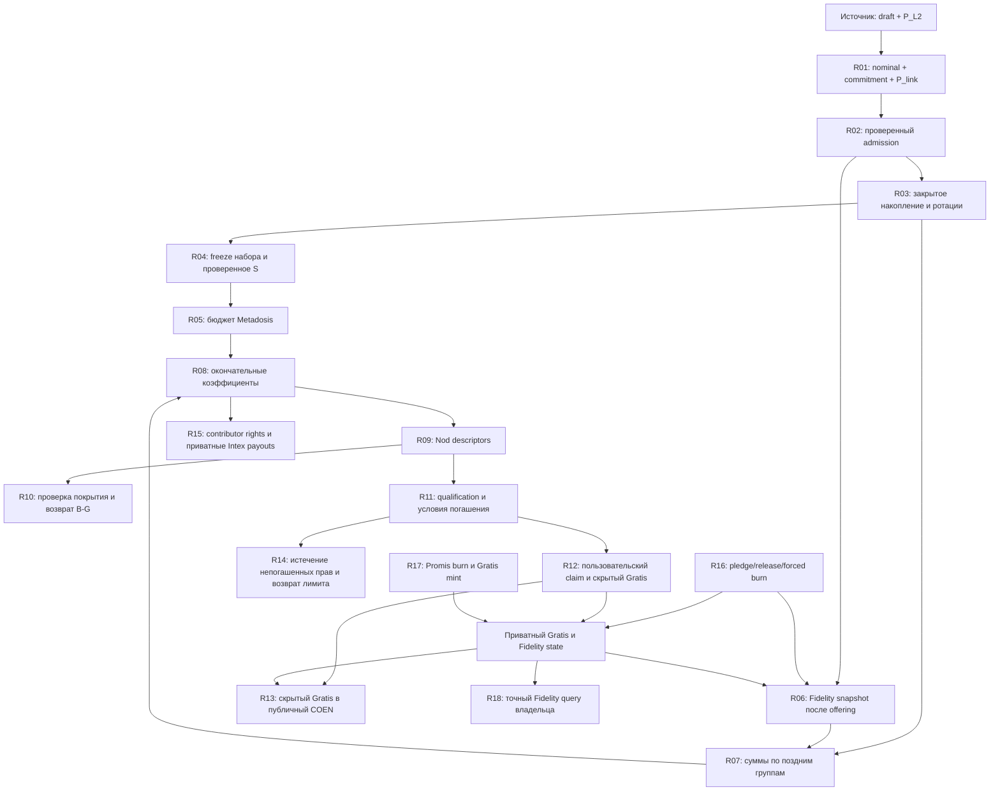

# Tribute → Lysis → Nod → Gratis: trace и требования до выбора криптографии

Дата: 2026-09-11. Рабочее дерево `177a72ddbea9f2e52eef094405481292ecd56046`, с локальными изменениями. Этот документ — исходное задание для следующего исследования. Кривая, proof backend и протокол агрегирования **не выбраны**. Production не менялся.

Здесь разделены **КОД** — поведение прочитанного исходника, **ЦЕЛЬ** — требования пользователя, **ОТКРЫТО** — вопрос, который нельзя разрешать выбором библиотеки. Предыдущие исследования и прототипы остаются экспериментальными материалами; они не утверждают целевой протокол. Новые эксперименты остановлены до завершения этой схемы.

После независимой проверки trace расширен до **R00–R18**. **ПРЕДЛОЖЕНИЕ** означает конкретный исследовательский контракт, ещё не выбранный для production. [Замечания, исправления и остаточные вопросы](REVIEW_REMEDIATION.md); [подробный trace дополнительных consumers](DOWNSTREAM_PRIVATE_STATE_TRACE.md). Исходные независимые отчёты сохранены без изменений.

Codebase MCP graph в доступном наборе инструментов отсутствовал; проверка выполнена прямым чтением указанных файлов. Это trace заданного денежного маршрута и его непосредственных потребителей, а не аудит всего репозитория. Хеши файлов и границы проверки — [TRACE_EVIDENCE.json](TRACE_EVIDENCE.json).

## 1. Зафиксированные требования и открытые границы

| ID | Требование | Статус |
|---|---|---|
| C01 | Убрать TEE из всего описанного маршрута, включая связанные операции Gratis/Fidelity | ЦЕЛЬ |
| C02 | Скрыть issuance, nominal каждого Tribute, индивидуальные Gratis load/cost и баланс Gratis | ЦЕЛЬ; исходный источник и владелец знают свою сумму |
| C03 | Получить проверяемую общую сумму nominal дня S без публикации отдельных nominal | ЦЕЛЬ; S разрешено раскрыть после закрытия набора |
| C04 | В Nod сохранить commitment nominal и проверяемые коэффициенты/цены; расчёт claim доказывает пользователь | ЦЕЛЬ |
| C05 | Пользователь создаёт доказательства; ноды проверяют. Для выпуска Nod после admission пользователь может быть offline | Принятая схема; это отдельное требование к Fidelity и доступности данных |
| C06 | Индивидуальный nominal имеет верхнюю границу uint256; значение не сводится по модулю поля | ЦЕЛЬ; более тесные границы могут следовать текущему source format/формуле, см. §4 R01 |
| C07 | Стресс-профиль — до 10⁹ Tribute; число входов не подменять числом операций над одним повторённым входом | ЦЕЛЬ измерений |
| C08 | Приём длится 50 часов; состав валидаторов за это время меняется | ЦЕЛЬ; defaults кода также содержат 12 часов waiting перед обработкой |
| C09 | Входы nominal/fraction/entry price — fixed integer 10⁶; целевые g/c/Gratis — 10¹⁸ | ЦЕЛЬ; production сейчас использует 10⁶ для Gratis/load/cost |
| C10 | Пик RAM создания P_link в кошельке ≤512 МБ | Жёсткое ограничение; для измерений принят более строгий decimal-предел 512 000 000 B |
| C11 | Раскрытие индивидуальной денежной суммы допускается при Gratis → COEN | ЦЕЛЬ; публичны выводимая сумма и адрес, остаток Gratis скрыт |
| C12 | SEAL исключён из дальнейшего выбора | Решение пользователя |
| C13 | И отдельный nominal, и общий итог дня ограничены uint256 | Подтверждено пользователем; текущее правило отказа при переполнении admission сохраняется |
| C14 | После закрытия дня разрешено раскрывать S и S_l | Подтверждено пользователем; Lysis coefficient kernel остаётся публичным |

**Не считаются принятыми ограничениями:** P-384, Edwards, Groth16, SHA bridge, VSS 16/6, Q=11, четыре SU marker на proof, одна конкретная модель кошелька. Это параметры прежних экспериментов. Часовая ротация и DKG раз в 1200 блоков — предложенный пользователем сценарий нагрузки; его связь с конфигурацией сети здесь не установлена. От DKG нельзя автоматически вывести возможность переноса денежных секретов.

**Дополнительные параметры для оценки, пока без численного SLA:** время создания proof с холодной загрузкой ключей; время проверки; размер полного Tribute; окно завершения Lysis; ресурсы одного worker/валидатора; допустимые online/offline и Byzantine thresholds; сроки хранения активных Nod. Пока эти числа не заданы, исследование должно показывать стоимость, а не объявлять пригодность по одному удачному замеру.

## 2. Исполнители и обозначения

| Исполнитель | Обязанность |
|---|---|
| L2 / источник | Выдать пользователю canonical draft и доказательство P_L2; сеть должна аутентифицировать соответствующий root |
| Кошелёк | Знать свои суммы/openings; создавать commitments и proofs; сохранять witness для будущих действий |
| Валидатор | Проверять proofs, chain context, авторизацию, отсутствие повторов, диапазоны и атомарность переходов |
| Исполнитель закрытого агрегирования | Поддерживать проверяемый закрытый итог и его перенос при смене состава; раскрывать только разрешённый результат. Конкретный механизм и состав — результат будущего исследования |
| Lysis worker | Обрабатывать аутентифицированный набор и публичные параметры; создавать Nod descriptors. Не получать индивидуальный nominal |
| DA / архив | Хранить доступные тела и публичные свидетельства; root в consensus state сам по себе не заменяет доступность |

`M=10^6`; `a_i6` — nominal; `u_i6` — issuance; `f_l6` — коэффициент лиги; `p_i6` — цена; `g_i18` — Gratis load; `c_i18` — cost; `b18` — баланс Gratis. `S6=Σa_i6`. `S_l6=Σ_{league(i)=l}a_i6`. `N` и `n_l` — количества записей, не денежные суммы. `B18` — бюджет Lysis; `G18` — сумма выделенных прав; `K18` — накопитель нераспределённого лимита.

`C(x)` обозначает commitment к **точному ограниченному целому** x. Для пользовательского input opening хранит владелец; для служебного агрегата его представляют shares исполнителей. Opening нового private right должен быть восстанавливаем владельцем по принятому recovery contract. Конфиденциальность оценивается относительно разрешённых публичных результатов: выбранный метод не должен дополнительно раскрывать индивидуальные суммы. `[x]` обозначает закрытое состояние, достаточное выбранному протоколу для последующих вычислений; это требование к интерфейсу, а не название уже реализованной структуры. Обычное сложение commitments не раскрывает численное значение суммы.

## 3. Граф зависимостей



R03 имеет петлю `старый состав → проверенный handoff → новый состав` в течение всего срока нужных секретов. Этот срок может выходить за 50 часов и за завершение Lysis из-за R14/R15. R06 читает state с учётом всех предшествующих R12/R13/R16/R17. R15–R18 — ветви зависимости, а не события, которые обязательно происходят после R14. R06 и forced R16 требуют закрытого исполнителя при offline-владельце.

## 4. Trace: вход → расчёт/проверка → выход → хранение

### R00. Получить аутентифицированный исходный draft

**КОД.** Registered L2 с включённым ZK: проверяется подпись root, его совпадение с public input, затем настоящий `verify_circuit::<FullProof>`. Public inputs: `derived_owner, nft_hash, binding_hash, merkle_root`. Enclave сейчас устанавливает связь hash с расшифрованным draft. Unregistered/disabled ветки такой проверки не выполняют. [TributeFactory](../../crates/core/tributefactory/src/runtime.rs#L104), [verify](../../crates/core/tributefactory/src/runtime.rs#L282), [draft schema](../../bin/outbe-tee-enclave/src/zk_claim.rs#L27).

**ЦЕЛЬ.** L2 передаёт кошельку canonical draft с id/owner/day/currency/base/remainder/SU IDs и готовый P_L2. Кошельку не нужны приватные signature/Merkle witnesses готового P_L2. Ему нужен сам draft; ciphertext исключительно под enclave key для этого недостаточен.

- Вход кошелька: draft и P_L2; вход verifier: P_L2, public vector и authority root.
- Выход: источник и canonical hash, к которому обязан привязаться R01.
- Хранение: draft приватно в кошельке до финального admission/повторных подач; proof/root публично по DA policy.
- Граница: приватный admission должен требовать эквивалентную авторизацию источника и для альтернативных входных путей. Недоказанный hash, выбранный клиентом, не подтверждает источник.
- Агрегат не нужен. Публичный L2 payload также не должен содержать скрываемые исходные суммы; это отдельная проверка L2-интеграции.

### R01. Исходная сумма → nominal → commitment

**КОД:** [parse_canonical_amount](../../bin/outbe-tee-enclave/src/compute.rs#L160), [compute_nominal](../../bin/outbe-tee-enclave/src/compute.rs#L118).

```text
private base: u64; 0 <= remainder < M
u6 = base*M + remainder
public vI = issuance VWAP; vR = reference VWAP; sc = reference S-curve
e = max(vR, sc)
numerator = u6*M*vR                 # current: checked U512
denominator = vI*e                  # current: checked U512; vI,vR > 0
a6 = floor(numerator/denominator)  # checked conversion to U256
```

Кошелёк выполняет расчёт, выбирает opening, создаёт C(a6) и P_link. P_link доказывает canonical draft hash, owner/day/currency/source markers, binding sender/draft-id/chain-id, диапазоны и `numerator = a6*denominator + remainder_div`, `0 <= remainder_div < denominator`. Валидатор сверяет Oracle inputs и sender/day с chain state, проверяет P_L2 и P_link на общих public values.

Выход публично: C(a6), proofs, source identifiers, цены и контекст. Выход приватно: u6, a6, opening. **C(u6) создаётся только если есть потребитель:** для одной проверки расчёта u6 может оставаться private intermediate. Публичный u6 при публичных ценах раскрыл бы a6.

Current source format уже, чем произвольный uint256: расширять его без новой версии schema/circuit нельзя. Приватный P_link не должен менять canonical codec источника ради удобства backend.

**Выведенные границы действующего источника — важный вход исследования:**

```text
u_max6 = (2^64-1)*M + (M-1) = 2^64*M-1             # 84 бита
vI >= 1; e=max(vR,sc) >= vR
=> a6=floor(u6*M*vR/(vI*e)) <= u6*M
=> a_max6 <= (2^64*M-1)*M                         # 104 бита
N <= 10^9 => S6 <= 10^9*a_max6                    # 134 бита
S18=S6*10^12                                     # максимум 174 бита
```

Тип хранения остаётся uint256. Границы следуют из current u64 source codec и самой формулы, а не из произвольного ограничения выбранной криптографии. При доказанном R01 и проверенном count эта граница гарантирует отсутствие overflow общего uint256 итога без знания S. Даже для полного текущего u32 count, N<2^32, bound даёт S<2^136; стресс-профиль 10⁹ не требуется превращать в новый protocol cap ради этой гарантии. Если появляется альтернативный admission без этих правил или расширяется source codec, гарантия перестаёт действовать и требуется другой профиль/проверка. Граница 134 бит относится к дневному nominal, а не автоматически к пожизненному Gratis balance, cost или Fidelity intermediates.

Точные верхние границы проверены арифметически: `u_max6=18446744073709551615999999`; `a_max6=18446744073709551615999999000000`; `S_max6=18446744073709551615999999000000000000000`. Это вывод по коду, не нагрузочный тест миллиарда записей.

### R02. Admission: связать proof, доступность и уникальность

**КОД:** [identity / duplicate / SU gate](../../crates/core/tributefactory/src/runtime.rs#L211), [issue](../../crates/core/tribute/src/runtime.rs#L319), [day counter](../../crates/core/tribute/src/state.rs#L317).

Сейчас `TributeId = identity(owner,day)`, повторный Tribute того же владельца в тот же день отвергается. `issue` увеличивает count и публичный nominal total; тело и `TributeIssued` содержат issuance/nominal. `burn` до закрытия дня выполняет обратное вычитание.

**ЦЕЛЬ — атомарный admission:**

1. Валидатор проверяет R00/R01, offering state, уникальность owner/day и SU reuse.
2. Исполнитель агрегирования получает необходимый закрытый вход, **связанный с тем же C(a6)**, и подтверждает durable availability.
3. Consensus фиксирует accepted root/count/context. Только accepted записи включаются в итог.
4. Публичные числовые u6/a6 удаляются из тела, событий и иных проекций. Вместо них сохраняются commitments и проверяемые ссылки.

Pending shares/inputs хранятся отдельно и не увеличивают accepted total. Повторная отправка, локальное применение и reorg не могут удвоить сумму. Если сохраняется burn во время offering, требуется закрытое точное вычитание и тот же rollback-контракт.

**C13 подтверждено:** текущий код отвергает переполнение общего U256 total при каждом добавлении. Это сохраняется. Одних деклараций типа uint256 недостаточно: исследование должно предъявить закрытую проверку либо математическую гарантию по доказанным диапазонам и публичному count. Для текущего source profile такая существенно более тесная граница выведена в R01; её условия нельзя потерять при расширении codec.

### R03. Накапливать закрытое состояние и менять состав

Исполнитель агрегирования поддерживает `[S6]` по принятому набору. Для аддитивных commitments любой валидатор может сложить C(a_i), но численное S из одного C(S) не получается. Для другой конструкции исследование должно задать эквивалентную проверяемую связь агрегата с принятыми входами.

```text
accepted transition:
    [S] <- [S] + [a_i]
    C(S) <- C(S) + C(a_i)      # если commitments аддитивны
    bind new accepted root/count/version
rotation:
    old checkpoint + retained private state -> verifiable new private state
    SAME accepted set and committed values
    durable new-state acknowledgement -> switch admission epoch
```

Клиент после final admission не должен заново приходить при каждой ротации. Новый состав получает достаточное состояние до отключения старого. Требуются определённые failure/repair правила: кто продолжает хранить данные, когда handoff не завершён, и что происходит с новыми входами.

**Нельзя заранее считать состояние O(1).** При текущем позднем snapshot данные должны позволять R07 сгруппировать суммы по ещё неизвестным лигам. Позднее R14 требует учёта непогашенных прав. Удалить индивидуальное закрытое состояние можно только после перехода в достаточное состояние следующего потребителя.

### R04. Закрыть набор и получить S

**КОД:** [offering/waiting](../../crates/core/metadosis/src/constants.rs#L13), [lifecycle](../../crates/core/metadosis/src/lifecycle.rs#L206), [первый потребитель total](../../crates/core/metadosis/src/settlement.rs#L119).

После канонического завершения offering фиксируются окончательные `root, N, day`. Исполнитель агрегирования выдаёт проверяемый S именно этого набора. Валидатор проверяет результат, count/root, диапазон и отсутствие field wraparound. R05 не начинается без verified S.

Публичный выход: `AggregateReceipt(day, finalRoot, count, S, proof/certificate)`. Индивидуальные a_i и openings не публикуются. Промежуточные публичные суммы по блокам не являются требуемым интерфейсом.

Для абстрактных N≤10⁹ и произвольных a_i≤2²⁵⁶−1 сумма до проверки переполнения занимает **286 бит**. Для **текущего canonical source profile** из R01 доказана граница **134 бита**. Это два разных профиля; выбирать поле по 286 битам без проверки реального допустимого входа было преждевременно. Внешнее требование S≤uint256 остаётся в обоих. Нельзя брать сумму по модулю поля/2²⁵⁶ и называть её точным итогом.

**Момент удаления:** получение S не разрешает удалить данные для R06/R07/R14.

### R05. Verified S → публичный бюджет Metadosis

**КОД:** [calculate_metadosis](../../crates/core/metadosis/src/settlement.rs#L32), [READY](../../crates/core/metadosis/src/settlement.rs#L119), [RequestBudgetSplit](../../crates/core/metadosis/src/ocomp_budget.rs#L41).

Код считает в текущих денежных units. Целевой вариант сначала согласует units:

```text
S18 = S6 * 10^12                    # checked conversion, не modular cast
D0 = floor(S18 * 32 / 100)
Green: D=D0;          Q=E18
Red:   D=floor(D0/8); Q=floor(E18/8)
B18 = min(D,Q)

C0 = E18-B18
available = K18+C0
Green: A18 = min(S18-B18, available)
Red:   A18 = 0
request receipt.day_limit = E18+A18
```

`E18` — собственный лимит дня, `B18` — бюджет Lysis, `A18` — сумма для аукциона. `E18+A18` **не** становится бюджетом Gratis. `calculate_metadosis` также возвращает локальный `auction_base=min(S,E)-B`; authoritative request receipt строится отдельным `RequestBudgetSplit::derive` с K. Эти величины нельзя молча смешивать.

При request в накопитель возвращается C0. Фактическое списание A/brief выполняется после успешного Lysis; при недостаче накопителя activation не вправе молча взять меньше receipt. [apply_auction_brief](../../crates/core/metadosis/src/ocomp_budget.rs#L129).

Ветки `E=0`, `N=0`, неизвестный тип дня, `B=0` обрабатываются до обычного worker-пути. Для нормального расчёта здесь нужен **только S**, индивидуальные суммы не нужны.

### R06. Зафиксировать Fidelity league для каждого owner

**КОД:** [build_fidelity_league_snapshot](../../crates/core/metadosis/src/ocomp/snapshot.rs#L21) выполняется при READY после offering; [Fidelity runtime](../../crates/core/fidelity/src/runtime.rs#L1) сейчас расшифровывает/evaluates cohorts через enclave. Фиксируется упорядоченный `owner→league` и snapshot root.

Вход: принятый owner set, точный evaluation timestamp, текущее корректное Fidelity state. Выход публично: league и snapshot root. Nominal для выбора лиги этой функцией не используется; скрытое состояние Fidelity используется.

Внутренний trace Fidelity — [CohortState](../../bin/outbe-tee-enclave/src/fidelity.rs#L155), [RcfiAccumulator](../../crates/core/fidelity-math/src/lib.rs#L42):

```text
private state: qualified_start, active(size,acquired_at), sold(size,acquired_at,sold_at)
claim/In:  push active(g18, now); initialize qualified_start on first acquisition
withdraw/Out: consume active LIFO by x18; append sold slices with original acquired_at
T(age) = fixed-integer time decay, scale 10^18, half-life 365 days
A = Σ_active size*T(now-acquired_at)
D = A + Σ_sold size*(T(now-acquired_at)-T(now-sold_at))
efficiency = D==0 ? 0 : floor(A*10^18/D)
rcfi = floor(T(now-qualified_start)*efficiency/10^18)
max_rcfi = T(now-first_qualified_start_global)
league = max_rcfi==0 ? 1 : 1+min(floor(rcfi*4096/max_rcfi),4095)
```

Временные разности saturating; точный `T` — бинарное разложение с 63 предвычисленными множителями и fixed-integer truncation, не floating point. Текущее состояние хранит историю проданных slices; один текущий баланс не заменяет её. Требуется отдельная bound/state-growth оценка для proofs и offline snapshot. При переносе cohort sizes из 6 в 18 математическое отношение сохраняется, но `size*T` и `A*10^18` требуют пересмотра ширины intermediate; текущие checked U256 могут начать отказывать раньше.

**Нерешённое обязательство:** кто без TEE вычисляет/доказывает league в этот момент, если владелец offline? Одного commitment к приватной истории недостаточно для автоматического чтения её результата. Предварительный пользовательский proof подходит только если доказывает именно требуемый state/time, а не устаревшее состояние. Перенос snapshot на admission изменяет правила и пока не принят.

**Уточнение producer/consumer:** R16 forced burn также создаёт Out до snapshot, R17 — In. Предложен timestamped opaque transition log: wallet/MPC доказывает payload относительно старого root; закрытый исполнитель завершает exact-time validity proof для candidate context, включая checked Fidelity evaluation; runtime сверяет фактический timestamp и только после этого атомарно добавляет log leaf и денежный переход. READY читает frozen log root и evaluation time. Полные роли, zero guards, LIFO, конфликт nonce и recovery — [research §7.4](DEEP_RESEARCH_IMPLEMENTATION.md#74-кто-фиксирует-время-проверенный-переход-и-timestamped-log). Закрытый snapshot commitment создаётся только по уже известным временам с proof fold. Это формат-кандидат, не заявление о готовом MPC.

### R07. Получить суммы поздних групп

**КОД:** [fidelity_map/reduce](../../crates/core/lysis/src/program_v1/phases.rs#L156) и [fraction inputs](../../crates/core/lysis/src/program_v1/execute.rs#L392).

После R06 набор разбивается по league:

```text
S_l6 = Σ a_i6 for snapshot_league(owner_i)=l
n_l = count(group_l)
Σ S_l6 = S6;  Σ n_l = N
каждый принятый Tribute принадлежит ровно одной группе
```

Grouping keys/counts могут быть публичны; исполнителю закрытого агрегирования нужны данные, сохраняющие распределение сумм по владельцам. Один итог S его не содержит.

**C14 подтверждено:** после закрытия дня и фиксации snapshot исполнитель открывает проверенные S_l. Они передаются обычному публичному coefficient kernel. Закрытый MPC расчёт нелинейного Lysis kernel для этой цели не требуется. Проблема сохранения данных до поздней группировки при этом остаётся.

### R08. Суммы/популяции → окончательные коэффициенты

**КОД:** [compute_fraction_map_from_groups](../../crates/core/lysis/src/program_v1/execute.rs#L392), [calc_fraction_distribution_fp](../../crates/core/lysis/src/algorithm.rs#L229). Детальные промежуточные операции — в §5.

```text
y_l6 = floor(S_l6*M/S6); последняя доля получает остаток до M
f6 = floor(B18*M/S18); fmax6 = 2*f6
(y_l6,n_l,N,f6,fmax6) -> policy -> preliminary_f_l6

# ЦЕЛЕВАЯ exact-модель 6→18:
G0_18 = Σ_l S_l6*preliminary_f_l6*M
if G0_18 > B18:
    f_l6 = floor(preliminary_f_l6*B18/G0_18)
else:
    f_l6 = preliminary_f_l6
G18 = Σ_l S_l6*f_l6*M
require G18 <= B18
```

Выход: окончательные f_l6, аутентифицированный результат правильного публичного расчёта, согласованный G18. S_l разрешено раскрыть, поэтому сравнения/деления/корни из §5 выполняются обычным публичным кодом; индивидуальные суммы для этого не нужны.

Текущий код нормализует сумму `floor(S_l*f_l/M)` в units 10⁶. Целевое выражение без индивидуального округления требует другой проверки фактического расхода. Изменение units нельзя объявить простым переносом decimal point.

### R09. Worker создаёт Nod descriptors

**КОД:** [amount_map](../../crates/core/lysis/src/program_v1/phases.rs#L358), [output_finalize](../../crates/core/lysis/src/program_v1/phases.rs#L637). Размер primary shard — **256 Tribute records**: [planner](../../crates/core/lysis/src/program_v1/planner.rs#L17).

Сейчас worker читает a_i и считает числовые g_i/c_i. Целевой worker получает metadata, C(a_i), league snapshot, f_l, entry prices, eligibility и roots:

```text
f_i6 = final_fraction[league_i]
p_i6 = authenticated entry price for reference_currency_i
h_i6 = floor(max(tribute_effective_price_i, p_i6)*108/100)
bucket_i = identity(day,h_i6,reference_currency_i)
Nod_i = {source/owner/day, C(a_i6), f_i6, price/bucket binding,
         qualification/call rules, formula version, certified roots}
```

Кошелёк offline. **Новое C(a_i) worker не создаёт:** использует проверенный commitment Tribute. Индивидуальные `g_i18=a_i6*f_i6*M` и `c_i18=a_i6*f_i6*p_i6` здесь не раскрываются.

Сейчас zero load/cost — ошибка. Для новой модели нужны явные правила `f_i=0`, конечного overflow, отсутствующей цены и непогашаемого права. Отложенный claim не даёт права выпустить заведомо неисполнимый Nod. Сохраняются проверки полного покрытия/порядка/target availability.

Ветка `exclude=false` создаёт contributor с nominal. Её надо перевести на C(a_i) и сохранить eligibility/conservation. Обязательный consumer — R15 Intex payout: он делит на eligible nominal total и сейчас переводит публичный COEN. Только замена nominal в leaf не закрывает эту зависимость.

### R10. Сертифицировать выходы и вернуть неиспользованный лимит

**КОД:** [finalizer](../../crates/core/lysis/src/program_v1/finalizer.rs#L241), [activation](../../crates/core/metadosis/src/ocomp/activation.rs#L349).

```text
G18 = Σ_i g_i18 = Σ_l S_l6*f_l6*M   # exact, если весь доказанный набор получил права
unused18 = B18-G18
атомарно: установить Nod roots + закрепить G18 за правами + вернуть unused18
```

Для этого не требуется ждать индивидуальных claims. G18 точно выводится из разрешённых публичных S_l и f_l. Публичные B и возврат также определяют G.

**Другие текущие денежные поля finalizer:** `eligible_nominal_total`, `nod_cost_total`, `tribute_nominal_total`, prefix/segment totals. Для каждого требуется решение: остаётся открытым разрешённым агрегатом, проверяется закрыто, либо исключается с доказанным сохранением потребителей. `nod_cost_total` реально присутствует в conservation schema; это не гипотетическое поле. Если p_i различается, S_l недостаточно для `Σc_i18`: нужны более точные weighted groups либо закрытая weighted-sum проверка. Открытая сумма cost разных валют также не является автоматически экономически однородной величиной; текущую schema не расширяем таким предположением.

Числовые per-shard prefixes нельзя просто оставить открытыми без решения о разрешённых агрегатах. Аутентификация/полнота result chunks и OCOMP certification нужны и при замене чисел commitments.

### R11. Qualification / call / settlement terms

**КОД:** [bucket state](../../crates/core/nod/src/schema.rs#L95), [qualification](../../crates/core/nod/src/runtime.rs#L19), [call scan](../../crates/core/nod/src/called.rs#L50).

Bucket хранит публичные day/floor/reference currency/entry price/count/qualification. Qualification фиксирует call terms; далее публикуются called_at/deadline. Эти операции используют цены/время/число записей, а не индивидуальный nominal.

Для claim authoritative entry price сейчас читается из **bucket**, а cost выводится из неё и load. Целевой Nod обязан ссылаться на тот же неизменяемый price/bucket context, а не на произвольную цену клиента. [discharge_cost](../../crates/core/nodfactory/src/runtime.rs#L256).

### R12. Погасить Nod → скрытый Gratis

Кошелёк берёт a_i/opening, старый b18/opening, платёжные witnesses, Fidelity state. Создаёт новые commitments и доказательство:

```text
open source C(a_i6)
g18 = a_i6*f_i6*M
c18 = a_i6*f_i6*p_i6
private payment spends exactly c18 in accepted asset for reference currency
b_new18 = b_old18 + g18
prove bounded integers, authorized current state, eligibility/deadline,
      unspent Nod, payment nullifier/change and Fidelity transition
```

Валидатор проверяет public terms, owner, PoW (если правило сохраняется), квалификацию, nonce/nullifiers и proofs. Атомарно расходует Nod и платёж, заменяет C(balance), обновляет Fidelity. Ошибка не может оставить платёж потраченным или баланс частично обновлённым. Для Fidelity proof заранее связывает amount/order с текущим state, а точное время новой операции добавляет runtime при включении по R06. Если другие writers изменили account version, старый proof отклоняется; для pending incoming/pledged compartments действуют отдельные R16 conservation rules.

**КОД:** [mine path](../../crates/core/nodfactory/src/runtime.rs#L170) сейчас публикует amountCovered/gratisLoadMinor и требует `claim.spend_amount==cost`; [Gratis mint/Fidelity](../../crates/core/gratisfactory/src/runtime.rs#L129) обращается к enclave. Эти поля/переходы также должны стать приватными. Открытое изменение supply на g18 раскроет зачисление даже при скрытом account balance.

**ОТКРЫТО:** exact c18 может требовать до 18 дробных знаков, а settlement asset/PayNote может поддерживать только 6. Нужна модель дробного остатка/учёта или явное правило округления на платёжной границе. Нельзя доказать списание недоступной деноминации.

### R13. Скрытый Gratis → публичный COEN

Кошелёк выбирает x18, доказывает `b_old18=b_new18+x18`, диапазоны, текущий nonce/owner и корректное уменьшение Fidelity. Валидатор атомарно меняет C(balance)/Fidelity и увеличивает публичный native COEN balance на x18.

Публичны x18/получатель/факт операции; b_new остаётся закрытым. [Текущий mine_coen](../../crates/core/gratisfactory/src/runtime.rs#L145) конвертирует Gratis6 в COEN18 через 10¹². При целевом Gratis18 этот множитель применять повторно нельзя.

### R14. Истечение непогашенных Nod → возврат их лимита

**КОД:** [forfeit_members](../../crates/core/nod/src/called.rs#L241) без участия владельца перебирает оставшиеся Nod после deadline, читает каждый `gratis_load_minor`, удаляет право, публикует его load и возвращает сумму этих load в PromisLimit. Возврат выполняется по ограниченным проходам.

**Это отдельный обязательный потребитель скрытых сумм после Lysis.** Он не покрывается ранним возвратом B−G в R10:

```text
U_expired = права, не погашенные к зафиксированному deadline
F18 = Σ_{i in U_expired} g_i18
проверить состав, право на forfeit, отсутствие двойного возврата
атомарно закрыть права + вернуть ровно F18
```

Если удалить все данные агрегатора после R10, а непогасивший владелец offline, из C(a_i) и коэффициентов числовой F18 прочитать нельзя. До R14 должно дожить либо достаточное закрытое состояние отдельных прав, либо доказанно обновляемое закрытое состояние остатка по нужным группам. Выбор структуры — задача исследования.

При claim состав остатка меняется; требуется приватное, проверяемое вычитание без публичного individual load. Публичный возврат F18 раскрывает соответствующий агрегат. Сохранение текущего возврата по каждому ограниченному проходу или перенос на целый закрытый batch — отдельное решение о поведении и разрешённых публикациях. Если срок Nod не ограничен заранее, нельзя считать retention равным 50 часам/концу Lysis.

### R15. Contributor → приватное право на выплату Intex

**КОД:** [pay_contributor_batch](../../crates/core/intexfactory/src/runtime.rs#L460) проверяет certified contributor leaf, читает `leaf.nominal` и `eligible_nominal_total`, считает `w_i=floor(round.amount*a_i/H)` и делает публичный native transfer владельцу. Поэтому публичная выплата может раскрыть nominal даже после замены leaf на C(a).

**ПРЕДЛОЖЕНИЕ:** runtime фиксирует funded round/pot/eligible root и создаёт deferred payout descriptor с исходным C(a), commitment H и формулой. Wallet позже доказывает `pot*a_i=w_i*H+rem_i`, `0<=rem_i<H`, H>0, eligibility, отсутствие второго расхода и достаточное обеспечение; либо этот расчёт выполняет MPC без owner. Публичного w_i нет. Нужны wide products и проверка суммарного paid/remainder, не modular division.

Куда зачисляется COEN-backed приватная выплата и как устроен deadline/carry — отдельный контракт R15. Нельзя незаметно превратить её в необеспеченную эмиссию Gratis или преждевременный публичный COEN. Подробный текущий lifecycle, storage и варианты совместимости — [дополнительный trace R15](DOWNSTREAM_PRIVATE_STATE_TRACE.md#r15). До его выбора полный путь не объявляется завершённым; lifetime numerator/denominator witnesses не удаляются вместе с дневным агрегатором.

### R16. Все writers одного Gratis/Fidelity account

**КОД:** owner pledge/unpledge, consume pledge ticket, сторонний settlement→release и scheduled void→burn изменяют liquid/pledged/Fidelity state. [Gratis writers](../../crates/core/gratis/src/runtime.rs#L388), [Credis settlement/void](../../crates/core/credisfactory/src/runtime.rs#L190). Владелец не обязан присутствовать при последних двух операциях.

**ПРЕДЛОЖЕНИЕ:** раздельные committed liquid/pending/pledged compartments с однозначным учётом прав; закрытый исполнитель получает достаточные authenticated shares для forced Out. Pledge перемещает liquid→pledged без продажи cohorts; release перемещает pledged→liquid/pending без acquisition; forced burn уменьшает pledged, supply и active Fidelity через Out. Consumed ticket блокирует повторное использование collateral, но сам по себе не burn.

Owner создаёт commitments своего перехода; authorized MPC — commitments forced transition; runtime проверяет authority/old roots/version и устанавливает новые roots атомарно. Все затронутые суммы ограничены, Экономический баланс `L+T+A+I` учитывает каждый объём один раз: liquid L, pending pledge tickets T, active pledged A и отдельно incoming credits I; `pledged_total=T+A`. Pending credit становится расходуемым только после принятого proof merge; учёт Fidelity зависит от экономической операции, а не момента скачивания witness владельцем. Recovery payload/share binding и его durable availability обязательны до finality. Полная таблица operations/authority/conservation — [R16](DOWNSTREAM_PRIVATE_STATE_TRACE.md#r16).

### R17. Дополнительная эмиссия Promis → Gratis

**КОД:** [mine_gratis](../../crates/core/promisfactory/src/runtime.rs#L69) сжигает Promis6 и вызывает GratisFactory mint6/Fidelity In; [публичный dispatch](../../crates/core/promisfactory/src/precompile.rs#L42) принимает amount. Этот source существует помимо Nod.

**ПРЕДЛОЖЕНИЕ:** proof одного атомарного conversion связывает authorized burn `m6` с mint `m18=m6*10^12`, проверяет overflow и одноразовость source; создаёт новое приватное зачисление и Fidelity In в execution time. Legacy TEE/MAC и публичный amount не считаются реализацией этого контракта; нужны новый private source adapter или явно ограниченный профиль поддержки. Роли, commitments и границы upstream Promis — [R17](DOWNSTREAM_PRIVATE_STATE_TRACE.md#r17).

Для **zero initial state + current-source Nod-only + один бюджет на каждый u32 day, без повторной эмиссии/импорта** lifetime mint <2^208 и overflow uint256 не достигается. Для действующей системы этот bound недостаточен из-за Promis mint и возможных migration/import rules. Требуется source-complete conservation; публичные exact supply deltas не допускаются как обход конфиденциальности.

### R18. Приватный точный Fidelity query владельца

**КОД:** [query_index_at/now](../../crates/core/fidelity/src/runtime.rs#L155) возвращают owner-authorized RCFI через enclave. Публичная league не заменяет числовой результат этих методов.

**ПРЕДЛОЖЕНИЕ:** wallet восстанавливает authenticated историю, проверяет roots, вычисляет exact integer RCFI на query timestamp с нужным public global context. В сеть RCFI не отправляется. Сохранение прежнего сетевого API требует private-output query по авторизации владельца; изменение ABI/RPC обозначается явно. Данные после внешнего R16 должны быть восстанавливаемы. Подробности времени/версий/хранения — [R18](DOWNSTREAM_PRIVATE_STATE_TRACE.md#r18).

## 5. Внутренний trace коэффициентов

Обозначение `div` ниже — целочисленная операция из кода. Для неотрицательных значений это floor; signed I256 `/` усекает к нулю. Это различие должно войти в circuit/MPC при закрытом R08. [algorithm.rs](../../crates/core/lysis/src/algorithm.rs#L33).

```text
(S_l,S) -> y_l6 = (S_l*M) div S -> поправить последний y до sum=M
(B18,S18) -> f6=(B18*M) div S18 -> fmax6=2*f6
n_l,N -> tau -> normalized masses m
y_l -> cumulative Y
(m,Y) -> EY, EY2 -> VarY=max(EY2-EY*EY div M,0)
(f6,fmax6,EY,VarY,m,Y) -> preliminary fractions
(fractions,y_l,f6) -> share-space normalization
(fractions,S_l,B18) -> exact monetary normalization -> final f_l
```

Подробности `tau`:

1. Для соседних непустых групп: `root5((i−0.5)*M) / min(root10(n_i*M),root10(n_{i−1}*M))`, с нужным множителем M для fixed scale.
2. При нуле — fallback из `root5(number_of_groups*M)` и `root10(N*M)`.
3. `tau_0=floor(0.2*Σmiddle_tau)`, `tau_last=floor(0.8*Σmiddle_tau)`.
4. `m_j=floor(tau_j*M/Σtau)`. Корни реализованы как integer search: `floor((x_fp*M^(q−1))^(1/q))`, промежуточный U1024.
5. `EY=Σ floor(m_j*Y_j/M)`; `EY2=Σ floor(m_j*Y_j²/M²)`; затем VarY.
6. Signed часть берёт `(floor(f*M/fmax)−EY)*(Y_j−EY)/VarY`, при VarY=0 — ноль; складывает взвешенные terms, умножает на fmax, отсекает отрицательные результаты до нуля.
7. Если `W=Σfloor(f_l*y_l/M)>f`, каждый f_l заменяется `floor(f_l*f/W)`.
8. Далее R08 проверяет именно **денежный** G18. При одной лиге kernel возвращает f напрямую.

После подтверждения публичных S_l этот kernel остаётся обычным публичным вычислением. Задание исследованию — обеспечить достоверные входные агрегаты, а не переносить эти корни/деления в пользовательский proof. Их текущая целочисленная семантика сохраняется; exact-денежная нормализация меняется вместе с units.

## 6. Реестр агрегатов: когда известна группа и где нужен результат

| Агрегат | Группа известна | Первый потребитель | Допустимость публичного результата | Состояние должно дожить |
|---|---|---|---|---|
| S6=Σa_i6 | Day известен при admission; финальный состав после offering | R05 Metadosis | Разрешено после R04 | До verified receipt + последующих группировок |
| S_l6 | После R06 Fidelity snapshot | R08 коэффициенты | Разрешено после закрытия дня и фиксации групп | До группировки/доказанного coefficient result |
| H6=Σeligible a_i6 | Exclude flag известен при admission | R10 conservation и R15 denominator каждого Intex round | Публичность отдельно не утверждена; использовать commitment/shared H | До последнего payout либо доказанного переноса прав; не только до Lysis |
| G18=Σg_i18 | После final fractions и точного набора прав | R10 возврат B−G | Определяется публичными B и возвратом | Receipt/roots сохраняются; это не текущий Gratis supply |
| CostTotal=Σc_i18 | После entry prices и fractions | Текущий finalizer | Не утверждено; mixed-currency semantics требуют проверки | До finalization либо изменения schema/consumer |
| Segment/prefix totals | После partitioning worker plan | Текущий budget-prefix path | Не утверждено; не обязаны быть публичными в целевой схеме | До certification; правила замены нужны явно |
| F18=Σremaining g_i18 | Остаток определяется claims и deadline | R14 forfeit / PromisLimit | Публичный возврат раскрывает соответствующий F | До final forfeit; может быть намного позже Lysis |
| Gratis supply / cohorts | R12/R13/R16/R17: mint, burn, collateral и conversion | Accounting / R06 и R18 Fidelity | Индивидуальные скрытые delta публиковать нельзя | Весь lifetime ledger; каждый source/forced writer входит в conservation |
| Intex paid/remainder | Certified eligible set и конкретный funded round | R15 payout и закрытие round | Индивидуальные payouts и производные delta не публикуются; политика итогов требует выбора | До final spend всех прав/остатка; для pending claims сохраняется обеспечение |

Таким образом, задача — не только сложить nominal дня. Метод должен выдержать поздние и изменяющиеся группы либо явно изменить соответствующие consumers по согласованному правилу.

## 7. Кто создаёт commitments и что хранит

### 7.1. Создание commitments

| Объект | Создатель | Когда | Что доказывается |
|---|---|---|---|
| C(a_i6) | Кошелёк | R01 | Связь с P_L2/draft/economics, диапазон |
| C(u_i6), если есть consumer | Кошелёк | R01 | Тот же canonical issuance |
| Дополнительные commitments закрытого агрегатора | Участники по выбранному протоколу | R02/R03/rotation | Связь с исходным C(a_i), а не другое тайно выбранное значение |
| C(S), C(S_l), commitments иных групп | Агрегатор/любая нода при линейной конструкции | Накопление/grouping | Точный состав группы/root и корректность вывода |
| C(a_i6) внутри Nod | Не создаётся заново | R09 | Ссылка/копия ровно из принятого Tribute |
| C(g), C(c), если нужны как интерфейсы | Кошелёк | R12 | Точные формулы и связь платежа/баланса; могут быть внутренними witnesses, если нет внешнего consumer |
| C(balance_new) / compartment roots | Кошелёк для собственной операции; MPC для forced R16 | R12/R13/R16/R17 | Текущие roots/version, authority, диапазоны и conservation; recovery обязательна |
| Начальный C(0) | Кошелёк | Регистрация private account | Proof нулевого начального баланса; произвольный начальный C недопустим |
| Commitments PayNote change/Fidelity/остатка прав | Владелец перехода или выбранный закрытый исполнитель | По соответствующему state transition | Conservation, авторизация, nonce, диапазоны и полнота состояния |
| C_delta Fidelity / timestamped log root | Wallet/MPC создаёт C_delta; runtime после exact-time validity gate добавляет time и root | Все In/Out, включая forced R16 | Proof payload от текущей истории, успешная evaluation до money commit и verified fold; secret LIFO slots скрыты |
| Intex descriptor / C(payout) | Runtime копирует C(a) и terms; wallet/MPC создаёт C(payout) | R15 round / claim | Eligibility, скрытый denominator, exact floor/remainder, backing и одноразовость |
| Lego internal D | Prover adapter через библиотеку, со свежим независимым v_internal | Каждый P_link B | CP_link связывает D с внешним C(a); unpredictability v обеспечивает prover, не verifier |

### 7.2. Хранение и условия удаления

| Данные | Кошелёк | Валидатор / агрегатор | Consensus / DA | Удаление |
|---|---|---|---|---|
| Draft / source amount | Приватно | Не получает plaintext для обычной проверки | Только proof/hash; encrypted backup возможен | После final admission, если не нужен повторный proof/архив |
| a_i и opening | Приватно | Обычный валидатор не знает; закрытый исполнитель получает только материал своего протокола | C(a_i) | Кошелёк хранит до final claim/forfeit и завершения собственных повторов |
| Pending aggregation input | Пока admission не final | Durable pending store отдельно от accepted | Pending context/receipts по схеме | Final reject либо перевод в accepted |
| Данные для поздних групп | Не обязан быть online для их чтения сетью | Сохраняются до R07; затем преобразуются для оставшихся consumers | Проверяемые roots/public commitments | Только когда есть достаточное состояние для R10/R14/R15; H и права Intex имеют собственный lifetime |
| Day/group accumulators | Исходный пользователь не обязан хранить общий итог | Участники хранят собственный закрытый материал и checkpoint | Public root/count/certificate | После final consumer и handoff/finality |
| Материал ротации | Не участвует после admission | Старые и новые участники — до durable handoff | Контекст и проверяемый transcript | Старые secrets и их backups удаляются после подтверждённого переноса |
| Tribute body / proofs | Проверенная копия по необходимости | Cache/verification | DA до самодостаточного Nod и конца остальных consumers | По DA/replay policy, не только по наличию root |
| Nod descriptor / membership proof | Может скачать позже | Public descriptor; private aggregate state для R14 | Активный root/body, spent markers | Body — после окончательного прекращения права; anti-replay остаётся |
| b18/opening, payment/Fidelity witnesses | Приватно, с backup; получает новые witnesses после внешних R16 | Authenticated shares для offline writers/snapshot; recovery material | Compartment roots, opaque timestamped log, versions/nullifiers и доступные связанные encrypted payloads | После final перехода и доказуемого восстановления текущего; seed без payload не заменяет witness |
| Intex claim / H witness | a/opening до завершения payout rights; H через принятый private protocol | Shared H/round state, при offline payout также достаточный numerator state | Descriptor/eligible root, committed paid, backing и spent bitmap | После всех consumers и finality; fan-in cutoff не является expiry claim |
| Lego internal v | Только временно в prover; external r хранится отдельно | Не передаётся validator | Только публичные D/link_d/proof | Internal v после proving; external r — после последних денежных consumers |
| Готовые public proofs | Не секрет | Проверяются с разрешённым VK | DA/state policy | По replay/snapshot policy |
| Proving parameters | Общие данные prover, не секрет суммы | Не являются per-Tribute payload | Content-addressed distribution возможен | Кеш по версии; память загрузки входит в лимит 512 МБ |

Подпись receipt о наличии ciphertext не обязательно доказывает, что у достаточного числа будущих исполнителей есть полное пригодное состояние. Исследование обязано определить именно проверяемую достаточность и repair после отказов. Private WAL/snapshots/backups учитываются при удалении старых secrets. Сохранить ключ кошелька без recoverable witness не означает возможность восстановить баланс по commitment.

## 8. Требования к отказам и корректности

| Ситуация | Требуемый результат |
|---|---|
| P_L2 и P_link корректны по отдельности, но относятся к разным данным | Reject по общей доказанной связи |
| Агрегатор получил другое значение, чем защищает C(a_i) | Reject до final admission |
| Часть входов pending/дубликаты/reorg | Не входят дважды в accepted aggregate; точный rollback/replay |
| Часть получателей исчезла при ротации | Определённый repair/handoff/fail path; не потеря принятого дня |
| Нет verified S / group result / Fidelity snapshot | Потребитель ждёт или идёт в заданную terminal policy, не угадывает сумму |
| Итог/произведение переполнился | Проверяемый отказ по согласованной стадии; никакого modular wrap |
| Нулевой coefficient, cost вне диапазона, unavailable asset | Явная политика до выпуска/погашения непригодного права |
| Owner offline после admission | Выпуск Nod, закрытие дня и forfeit имеют достаточные данные без повторного прихода owner |
| Двойной claim/платёж/forfeit | Атомарный state version/nullifier исключает второй расход/возврат |
| Public event/supply/conservation раскрывает скрытую delta | Такой формат не удовлетворяет C02, даже если основной proof zero-knowledge |

## 9. Какое исследование проводить после фиксации схемы

Это **задание на исследование**, не список уже выбранных ответов. Для каждого метода нужна таблица соответствия всем R00–R18; ответы «умеет homomorphic add» или «маленький proof» недостаточны.

| Пакет | Конкретный вопрос | Что должно быть предъявлено до прототипа |
|---|---|---|
| Q1 Источник и P_link | Как связать существующий L2 statement с полным bounded nominal и commitment при ≤512 МБ? | Точный statement/witness/encoding; trust/setup; отсутствие cross-field ambiguity; wallet data requirements |
| Q2 Дневной агрегат | Как получить точный S для accepted set при malicious inputs, dropouts и rotation? | Полный transcript по ролям, availability/repair, thresholds, proof binding, no-wrap и overflow policy |
| Q3 Поздние группы | Как получить S_l после snapshot без онлайн-владельцев и с приемлемым retention/handoff? | Состав сохраняемого состояния, asymptotic costs и проверяемое открытие S_l по подтверждённому snapshot |
| Q4 Fidelity | Кто вычисляет correct league по приватному state и точному timestamp, включая forced Out и owner queries? | R06/R16/R18: все writers, time producer, transition proofs, recovery, offline evaluation, query API и стоимость |
| Q5 Deferred Nod/claim | Как связать C(a), f/p, платёж, все Gratis writers и Intex payout? | R12/R15/R16/R17: диапазоны, exact 6→18, denomination/backing, offline mutation, source-complete supply, атомарность и replay |
| Q6 Forfeit | Как вернуть load непогашенных прав без owner и раскрытия individual load? | Закрытый residual state, его обновление на claim, финальный aggregate и условия удаления |
| Q7 Production verifier/DA | Как сеть проверяет/хранит/повторяет всё это? | Public wire schema, permitted VK/version, batch verification limits, DA and consensus effects |

Каждый кандидат обязан явно задать adversary model: malicious пользователь/источник, публичный наблюдатель, до f скомпрометированных участников, offline/dropouts, последовательные компрометации при ротациях. Конкретное f/t и доверие к источнику/Oracle нельзя скрывать за словом «валидаторы».

Для поиска сравнивать семейства: native-curve и emulated-curve ZK; sound linkage/composition proofs; additive secret-sharing/VSS и proactive resharing; secure aggregation с доступностью и malicious security; threshold/additively homomorphic constructions; exact MPC для нелинейных consumers; sparse/bucket/owner aggregation, если совместима семантика. SEAL не возвращать в shortlist. Изменение snapshot, payment precision, reclaim timing или privacy policy показывать как отдельное изменение протокола, а не бесплатную оптимизацию.

Каждый кандидат получает один из статусов: **совместим по доказанным требованиям / требует явно перечисленных изменений / не подходит / недостаточно данных**. Ссылки — на первичные papers, спецификации и точные версии реализаций; размеры/скорость из статьи не выдаются за замеры нашего statement.

### План измерений только после feasibility

1. Полный cold wallet run: загрузка/проверка parameters, witnesses, proving, serialization; peak RAM ≤512 000 000 B. Warm proving и setup — отдельные колонки. Для составного proof измеряется полный lifecycle освобождения памяти, а не просто максимум двух независимо запущенных процессов.
2. Размер Tribute = metadata + все proofs + все необходимые commitments + публичный aggregation transcript. Отдельно private fanout, shares, ACK signatures, WAL/DB/DA replication и общие proving keys.
3. Latency/throughput: client, verifier, aggregation recipient, rotation, opening. Параллелизм измерять отдельно; независимость proofs не означает линейный scaling всей сети.
4. Lysis: отдельно coefficient kernel, 256-record task, grouping, input fetch, certification, output persistence и полный job wall time. Для N=10⁹ — 3 906 250 shards по 256; это количество работ, не benchmark их выполнения.
5. Объём retention на одного участника и сеть, включая поздние группы/Fidelity/непогашенные права. Для одного 50-часового окна N=10⁹ означает в среднем около 5556 admissions/s; steady-state нескольких перекрывающихся дней считается отдельно.
6. Bad witness/source linkage, inconsistent shares, отсутствующие данные, rotation в середине batch, повтор/reorg, overflow, неверный group root, двойной claim/forfeit, crash recovery.
7. Native RSS на M4 не доказывает browser/mobile budget. Для целевого кошелька нужен выбранный runtime/device и запас внутри 512 МБ.

## 10. Что уже известно из прежних экспериментов

| Эксперимент | Доказанный результат | Чего не доказывает |
|---|---|---|
| Прямой P-384 внутри BN254 | Полный P_link создан/проверен, source link и VSS component composition проверены; полный запуск 19.445 GB | Непригоден как принятый wallet вариант с лимитом 512 МБ |
| Отдельный BN254 source → salted digest | Source proof проверен; cold process peak 398.049 MB | Сам по себе не связывает digest с новым VSS commitment |
| Wide-native commitment → тот же digest | Proof создан; cold process peak 497.418 MB, загрузка проверенного PK около 41.9 с | Отдельная проверка wide proof/negative cases/composition/new VSS не завершена; запас памяти мал; не готовая схема |

Эти артефакты сохраняются как данные для сравнения. Их наличие не разрешает пропустить Q2–Q6 или объявить решённой приватность всего маршрута.
