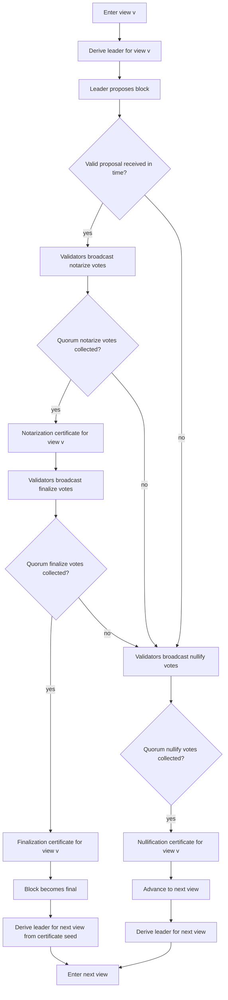
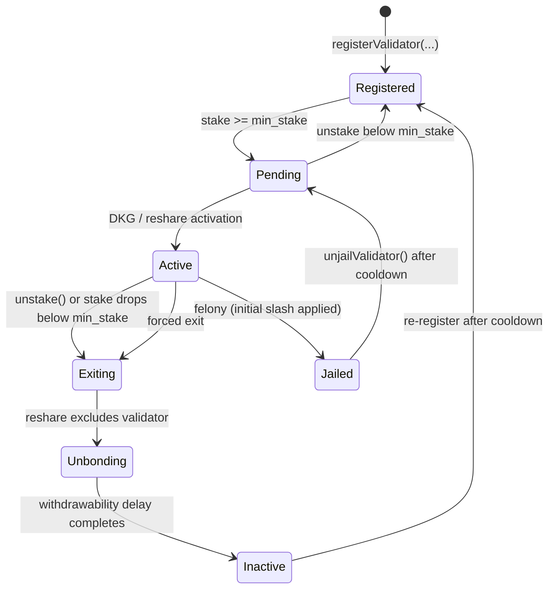

# Outbe Chain — Technical Whitepaper

**Version**: 2.0  
**Date**: July 2026  
**Status**: Aligned with the current implementation (code is the source of truth); design-only sections are explicitly marked

**Document Role**:
- `whitepaper.md` is the architectural narrative for Outbe: major design decisions, mechanism descriptions, invariants, and ADR context
- `README.md` is the technical repository reference: exact commands, RPC names, addresses, config, and operator procedures
- code and tests define actual runtime behavior for the current repository state
- where a mechanism is designed but not implemented, this document says so explicitly (`Design intent, not implemented`)
- the deviation history between whitepaper v1.0 and the code is recorded in `whitepaper_vs_code.md`

---

## Glossary

- `Single binary` — the architectural choice to run execution and consensus in one process rather than split EL/CL services.
- `Execution Layer` — the Reth-based EVM execution environment responsible for transaction execution and state transitions.
- `Consensus Layer` — the Commonware Simplex-based agreement engine responsible for leader election, certification, and finalization.
- `Blockchain Layer` — the runtime infrastructure layer that binds consensus and execution, including bridge, payload construction, hooks, CLI, and RPC.
- `System Layer` — the canonical protocol-state layer for validator membership, staking, slashing, rewards, emission, oracle, and day orchestration.
- `Custom Layer` — the Outbe-specific business-logic layer built on top of the protocol state machine.
- `Validator set` — the protocol-maintained set of validator records.
- `Registered` — a validator record exists on-chain, but the validator has not yet reached consensus participation.
- `Pending` — a validator has satisfied activation conditions and is waiting for successful DKG / reshare to enter the consensus set.
- `Active` — a validator is admitted to consensus and participates in leader selection, voting, and block proposal.
- `Exiting` — a validator requested exit (or was force-exited) and stays accountable in the current consensus set until reshare exclusion.
- `Jailed` — a validator frozen by a felony-level fault; it keeps its BLS share until the next reshare and can recover through `unjailValidator` after a cooldown.
- `Unbonding` — the delayed withdrawal state after stake exits active participation.
- `Inactive` — fully exited; stake claimable; re-registration possible after cooldown.
- `Active consensus set` — the validator subset currently loaded into the running consensus engine; during an exit window this includes `Exiting` and `Jailed` validators that still hold the current BLS share.
- `Validator node` — a node that holds consensus key material, participates in consensus, and may be selected as leader for a view.
- `Full node` — a node that syncs and serves chain data without participating in consensus.
- `Follower (upstream mode)` — a verifying full node that follows an upstream peer by re-verifying finalization certificates and walking committee transitions across reshares.
- `Leader` / `Proposer` — the validator selected by consensus for a given view; proposes the next block.
- `View` — the per-attempt consensus slot inside an epoch.
- `Round` — the consensus round identifier used by Simplex; operationally the `(epoch, view)` pair.
- `Epoch` — the consensus period tied to one participant set / engine instance; measured in blocks (`epochLengthBlocks`).
- `Certificate` — the quorum proof produced from consensus votes.
- `Notarization` / `Finalization` / `Nullification` — certificates for certified progress, finality, and abandoned views respectively.
- `Hybrid certificate` — the Outbe certificate format with aggregated vote attribution and an optional verified threshold-signature randomness sidecar.
- `VRF seed` — the randomness derived from a verified threshold BLS sidecar and used for leader selection when available.
- `mixHash` / `prev_randao` — the block-header field exposing VRF-derived randomness to EVM execution.
- `DKG` — distributed key generation for threshold BLS VRF material.
- `Reshare` — threshold-material refresh at an epoch boundary, optionally paired with an active-consensus-set transition.
- `Consensus/execution bridge` — the in-process, non-authoritative coordination surface between the consensus and execution runtimes.
- `Payload builder` — the execution-side mechanism that assembles the next block payload from mempool transactions and consensus context.
- `extra_data` — the block-header field carrying `OutbeBlockArtifacts`: the execution summary, DKG/reshare header artifacts (`BoundaryOutcome`, `DealerLog`), the sub-second timestamp part, late-finalize credits, and the committee pre-announce.
- `Begin-zone system transaction` — a protocol-inserted transaction executed before user transactions, with a normal receipt.
- `Certified parent accounting` — the begin-zone Phase 1 input: the direct parent's finalization (or certified-notarization) proof, used for participation and fee accounting.
- `Native token` — the chain's base asset used for fees, stake, and protocol accounting.
- `Stake` — validator-owned native-token value locked for consensus participation (self-stake only).
- `Unbonding` — the delayed withdrawal state after stake exits active participation.
- `Slashing` — deterministic stake penalties applied for faults or proven misconduct.
- `Rewards` — the protocol accounting for validator fee escrow, late-finalize settlement, and gem-based emission payout.
- `Gem` — the validator emission instrument: daily validator emission is minted as gems (Genesis gems for the first 21 days from genesis, Validator gems after), not as claimable native balances.
- `Emission` — protocol-native token issuance computed per Worldwide Day and distributed across configured sinks.
- `Cycle` — the System Layer module that orchestrates day boundaries: daily emission, Worldwide Day status advancement, distribution, and settlement.
- `System transaction` — a protocol-inserted execution step performed by the runtime rather than submitted by a user.
- `Precompile` — a native Rust runtime module exposed at an EVM address.
- `State migration` — deterministic storage-shape transformation activated as part of a binary upgrade (design intent; see §9).
- `Hard fork` — a coordinated binary upgrade that changes runtime behavior or state semantics.
- `Custom RPC namespace` — the `outbe_*` RPC surface exposing Outbe-specific protocol and runtime information.
- `Worldwide Day (WWD)` — the Outbe business-cycle unit; a calendar day keyed at UTC+14 with a 50-hour span covering all timezones, advancing through `FORMING → LOOKBACK_DELAY → OFFERING → WAITING → READY`.
- `Green Day` — a day whose VWAP is strictly above the previous day's VWAP; full recognition processing.
- `Red Day` — a day whose VWAP is not above the previous day's (or is zero); reduced recognition processing through the same Lysis path.
- `Tribute` — the core business-domain object (non-transferable NFT) processed by Outbe custom modules.
- `Metadosis` — the custom orchestrator module for Worldwide Day processing.
- `Lysis` — the recognition/distribution engine run by Metadosis on both Green and Red days.
- `Agent Reward` — the custom reward-routing module owning the WAA, SRA, CCA, and Merchant emission pools.
- `Nod` — the recognition-oriented custom module/token created by Lysis.
- `Gratis` — the non-transferable token distributed by Lysis and escrowed into Credis positions.
- `Credis` — the installment-credit module; positions repay in 10 monthly "anadosis" installments.
- `Promis` — the non-transferable mining-rights token minted by Desis auction clearing.
- `Desis` — the three-stage auction engine (start → reveal → clearing) attached to Intex series.
- `Intex` — the cross-chain NFT-option product: an on-chain series ledger plus target-chain Solidity contracts.
- `TEE` — the trusted-execution-environment stack (enclave binary, on-chain registry, bootstrap system transaction) protecting tribute-offer decryption keys.

---

## 1. Executive Summary

Outbe Chain is a public EVM-compatible blockchain built on **Reth SDK** (execution) and **Commonware Simplex** (consensus), combined in a single Rust binary. It features a **BLS-only hybrid signing scheme** that provides both voter attribution and verifiable random function (VRF) output in a single consensus round.

Key properties:
- ~2s-class blocks with instant BFT finality (block time is responsive and timeout-config dependent)
- Built-in unbiasable VRF from threshold BLS signatures, exposed via `prev_randao`
- Public validator set designed for ~128 validators (protocol codec cap: 256)
- Deterministic slashing with jail/unjail recovery and manual evidence precompiles
- Full EVM compatibility (MetaMask, Solidity, ethers.js), with zero-fee sponsorship extensions
- All upgrades via hard fork (decentralized governance — validators vote by choosing which binary to run)

---

## 2. Architecture Overview

### 2.1 Single Binary Design

Outbe Chain runs as one process with two Tokio runtimes:

```
Main thread:   Reth execution (Tokio runtime)
Spawned thread: Commonware Simplex consensus (commonware tokio Runner via thread::spawn)

Communication: in-process via the Reth ConsensusEngineHandle
  — fork_choice_updated()
  — new_payload()
  No HTTP Engine API. No serialization overhead.
```

### 2.2 Component Map

```
Single binary: outbe-chain
├── Blockchain Layer
│   ├── Reth execution integration (evm, engine, node, txpool)
│   ├── Commonware Simplex integration (consensus, DKG, marshal sync)
│   ├── Consensus/execution bridge (non-authoritative)
│   ├── Payload building, begin-zone system txs, block hooks, RPC, CLI
│   └── Key-management, TEE bootstrap, and upgrade infrastructure
├── System Layer
│   ├── ValidatorSet, Staking, SlashIndicator, Rewards
│   ├── EmissionLimit, Cycle (day orchestration)
│   ├── Oracle (price feeds, tally, non-participation slashing)
│   ├── ZeroFee (fee exemptions, EIP-7702 paymaster)
│   ├── ZkProof (Groth16, Poseidon), TEE / TeeRegistry
│   └── Accounting (progress marker)
└── Custom Layer
    ├── Tribute / TributeFactory
    ├── Metadosis / Lysis
    ├── Gratis / GratisFactory / GratisPool / Credis / CredisFactory
    ├── Nod / NodFactory / Gem / GemFactory / Fidelity
    ├── Promis / PromisFactory / PromisLimit
    ├── Intex / IntexFactory / Desis
    └── AgentReward / VaultProvider / common
```

### 2.3 Node Types

Outbe uses one binary with two protocol node roles plus one operational sub-mode:

#### Validator Node

A validator node runs both execution and consensus in the same binary and actively participates in block production and finality. It is selected with an explicit validator flag and requires a consensus signing key at startup.

It is responsible for:
- holding the validator's BLS signing key and threshold material
- participating in leader election, voting, notarization, and finalization
- proposing blocks when selected as leader
- keeping local consensus state aligned with the active on-chain validator set

#### Full Node

A full node runs the execution, sync, and RPC surfaces without participating in consensus. It does not hold validator threshold material, does not vote, and does not propose blocks. No consensus thread is spawned.

#### Follower (upstream mode)

A verifying full node that follows an upstream peer: it registers each epoch's committee from finalized header artifacts, re-verifies every finalization certificate before executing, and can itself serve finalization proofs downstream. This mode is mutually exclusive with validator mode. It is the in-node embodiment of the light-client verification model (§2.4).

### 2.4 Light Client Stack

Beyond the protocol roles (§2.3), Outbe defines a consumer-side verification surface for wallets, bridges, and other non-validator consumers that need independent finality verification.

**Canonical proof package.** The object a consumer verifies is:
(a) the finalization certificate as defined in §3.2.2 (aggregated vote, signer bitmap, optional VRF proof sidecar),
(b) the ordered committee public-key set active at the finalized height,
(c) the finalized block header.
The verification primitive is the two-pairing BLS check specified in §3.2.4.

Its trust model:
- bootstrap from an explicit trusted checkpoint or checkpoint policy
- fetch finalized blocks together with the canonical proof package
- verify finality locally against the committee active at that height
- advance the trusted committee across DKG reshares (§3.4) by walking consecutive finalized proofs — a committee transition is itself a proof step, not an out-of-band operator action

**Current implementation note**: there is no standalone SDK crate yet. The proof-package machinery exists in-node: the `outbe_getFinalization` RPC serves the certificate + block pair, and the upstream-follower mode implements committee walking across reshares. ADR-011 records the SDK-first decision; the embeddable SDK remains future work.

---

## 3. Consensus

### 3.1 Simplex Protocol

Simplex is a Byzantine Fault Tolerant consensus protocol used by Outbe for block agreement and finality. In Commonware's model it is intentionally minimal: consensus agrees over opaque payloads, while block dissemination, state sync, and execution integration are handled outside the core consensus construction.

For Outbe, this fits the single-binary design well:
- Simplex handles leader selection, voting, certification, and finalization
- Reth handles block execution and state transition
- block transport (buffered broadcast + marshal backfill), payload recovery, and execution wiring stay external to the core consensus primitive

At a high level, Simplex works as follows:
1. The leader for the current view proposes a block.
2. Validators vote to `notarize` the proposal once it is valid for the current view.
3. When quorum notarize votes are collected, a `notarization` certificate is formed, certifying the proposal and allowing progress.
4. Validators then vote to `finalize` the certified proposal; when quorum finalize votes are collected, the block becomes final.
5. If the leader fails to deliver a usable proposal in time, validators vote to `nullify` the view and move to the next leader/view.

#### 3.1.1 Consensus Flow Diagram



#### 3.1.2 Consensus Step Table

| Step | Trigger | Result | Next effect |
|---|---|---|---|
| Leader selection | enter a new view with valid prior proof | one validator is the leader for the current view | only that validator may originate the view proposal |
| Proposal | leader broadcasts a block proposal | validators can verify payload validity and ancestry | a valid proposal can enter the notarization path |
| Notarize | validators accept the proposal for the current view | notarize votes accumulate for one proposal in the view | quorum notarize votes form a notarization certificate |
| Finalize | validators observe a notarized proposal | finalize votes accumulate for that certified proposal | quorum finalize votes make the block final |
| Nullify | no usable proposal arrives, or the view cannot make forward progress | validators vote to abandon the current view | quorum nullify votes form a nullification certificate and move consensus forward |
| View advance | a finalization or nullification proof exists for the current view | consensus enters the next view | the next leader is derived and the loop continues |

| Property | Value |
|---|---|
| Committed-block path | leader proposal → notarize → finalize |
| Timeout path | nullify → next view |
| Block time | ~2s-class (responsive, timeout-config dependent) |
| Finality | Instant (1 block, absolute BFT) |
| Fault tolerance | f < n/3 (Byzantine) |
| Validators | ~128 design target; 256 protocol codec cap (`MAX_VALIDATORS`) |
| Message complexity | O(n²) per view |

**Block-timestamp drift band.** A normative consensus rule: every validator rejects a non-genesis block whose millisecond timestamp advances its parent by less than 1 s or more than 1 h. The lower bound stops a colluding leader majority from freezing chain time (which would stall day-indexed emission and unbonding maturity); the upper bound stops a single byzantine leader from ratcheting chain time forward. The proposer clamps its assigned timestamp into the same band, so honest blocks are never rejected and a long stall self-heals. The genesis child (block 1) is monotonic-only.

### 3.2 BLS-Only Hybrid Signing Scheme

**The problem**: No existing scheme provides both voter attribution AND VRF.
- `bls12381_threshold`: VRF yes, Attribution no (threshold = any t-of-n can sign, can't tell who)
- `bls12381_multisig`: Attribution yes, VRF no (individual sigs visible, but no randomness)

**The solution**: Each validator signs with TWO BLS12-381 keys per vote:

1. **BLS individual key (MinPk)** — for attribution. Individual signatures aggregated into one signature + signer bitmap.
2. **BLS threshold share (MinSig)** — for VRF. Partial signatures recovered into a threshold signature = VRF seed.

All vote and P2P-handshake namespaces are bound to `chain_id` (`b"outbe" || chain_id_be`), so signatures cannot cross-verify or replay across deployments.

#### 3.2.1 Signature Structure

```rust
struct HybridSignature<V: Variant> {
    bls_individual_vote: bls12381::Signature, // individual BLS vote (attribution)
    vrf_material_version: u64,                // which threshold material signed the partial
    bls_seed_partial: V::Signature,           // threshold partial (VRF)
    seed_partial_identity_sig: bls12381::Signature, // binds the partial to the signer → slashable attribution
}
```

The fourth field makes byzantine seed partials attributable: a partial is bound to its sender's individual key, so submitting an invalid or equivocating partial is provable misconduct (see §5.2.2 evidence paths). Invalid partials are verified and **sanitized** (neutralized, re-tagged as rejected) before threshold recovery, so a single byzantine validator cannot poison VRF recovery or force degraded mode while its valid vote still counts for finality.

#### 3.2.2 Certificate Structure

```rust
struct HybridCertificate<V> {
    signers: Signers,                         // signer bitmap (commonware BitMap)
    bls_aggregated_vote: aggregate::Signature<MinPk>, // ALL individual sigs aggregated
    vrf_proof: Option<VrfProof<V>>,           // randomness sidecar, not finality-critical
}
// Finality verifies bls_aggregated_vote + signers. VRF verifies separately.
// If threshold recovery fails, assemble() emits the certificate with vrf_proof = None.
```

#### 3.2.3 Certificate Size Comparison

| Scheme | Certificate size (128 validators) |
|---|---|
| BLS threshold only | ~48 bytes |
| BLS multisig only | ~96 + 16 = ~112 bytes |
| **Outbe hybrid** | **~162 bytes** |
| ed25519 hybrid (rejected) | ~8,800 bytes |

#### 3.2.4 Verification

Certificate finality verification is one aggregated-BLS check (2 pairings) regardless of signer count:
1. Aggregate public keys of signers (from bitmap; length must equal committee size, count ≥ quorum) → verify the aggregated vote.
2. The VRF threshold signature is verified **separately** against the group public key; an invalid or missing sidecar does not invalidate finality. The recovered aggregate VRF proof carried forward is, however, mandatorily re-verified at the next height by the certified-parent verifier — only individual partials are "ignore and sanitize", not the recovered aggregate.

#### 3.2.5 `certificate::Scheme` trait implementation

```rust
impl certificate::Scheme for HybridScheme {
    type PublicKey = BlsPublicKey;           // identity = BLS individual key
    type Signature = HybridSignature;
    type Certificate = HybridCertificate;

    fn is_attributable() -> bool { true }    // bitmap tells who signed
    fn is_batchable() -> bool { false }      // votes are re-verified individually by the reporter

    fn sign(subject) → Attestation           // sign with both keys
    fn verify_attestation(attestation) → bool // verify both signatures
    fn assemble(attestations) → Certificate  // aggregate votes + recover threshold (or None)
    fn verify_certificate(certificate) → bool // aggregated vote + signer quorum
}
```

### 3.3 Leader Selection

The consensus leader for each next block/view is selected by deterministic VRF-based leader election over the active consensus set.

Selection happens on the tail of the previous block/view:

```
Certificate(block N) finalized
  → seed = verified certificate.vrf_proof (raw threshold-signature bytes)
  → leader(block N+1) = modulo(seed_bytes, active_consensus_set.len())
```

`modulo` is a deterministic big-endian byte reduction of the seed modulo the set size (no additional hashing; the view number is not mixed in on the live path).

This gives the following contract:
- leader selection is unpredictable before the previous certificate exists
- once `Certificate(block N)` exists, every honest node derives the same leader for `block N+1`
- by the time `block/view N+1` starts, its leader is already known
- leader election runs over the active consensus set loaded into the engine (which during exit windows includes `Exiting`/`Jailed` share-holders, §4.1)

**Degraded election.** When no usable VRF seed exists — genesis view 1, or a missing/unverifiable prior certificate after a partition or restart — election degrades deterministically: first to a seed derived from `bootstrap_seed || round`, then to round-robin `(epoch + view) % n`. Degraded election is deterministic across honest nodes (no state split) and is not adversarially reachable: invalid seed partials are sanitized before recovery, so a byzantine validator cannot force it.

**VRF safety gate.** Randomness health is tracked explicitly (`Healthy / Degraded / Expired`). VRF material expires at `planned_activation_height + activation_grace_blocks`; past expiry, validator-mode block production **fails closed** rather than extending stale randomness.

### 3.3.1 On-Chain Randomness (VRF)

**VRF seed on-chain storage**: The VRF seed for each block is stored in the block header's `mixHash` field (`prev_randao`). It is derived as `SHA-256` over the verified BLS threshold-signature bytes from the finalization certificate sidecar. If a block's certificate carries no valid VRF proof, `prev_randao` retains the last valid seed and consensus marks randomness as degraded. After VRF expiry, validator progress stops until valid DKG/VRF material is activated.

```
Block header field:  mixHash (bytes32)
Value:               SHA-256(certificate.vrf_proof.threshold_signature)
Query historical:    eth_getBlockByNumber("0x...", false) → result.mixHash
Solidity access:     block.prevrandao
```

Any smart contract can access VRF randomness via the standard `block.prevrandao` opcode.

Properties:
- **Unpredictable**: no single validator can predict the next leader
- **Unbiasable**: threshold signature requires quorum shares — one validator cannot manipulate
- **Verifiable**: anyone can verify the VRF output from the certificate
- Active from view 2 onward; genesis view 1 is the round-robin exception

### 3.4 DKG — Fully Automatic, Required Before First Block

**There is NO fallback mode.** No DKG shares = no blocks. This is a security decision — a permanent or recurring round-robin fallback would be an attack surface.

#### 3.4.1 Chain Launch Sequence

```
1. Validators start nodes, connect via p2p
   → NO BLOCKS PRODUCED — waiting for DKG

2. If threshold material already exists locally and matches the recovered
   on-chain boundary → consensus starts immediately, no new ceremony

3. Otherwise
   → DKG starts automatically over the consensus P2P DKG channel
   → no coordinator, no manual commands

4. DKG completes → shares saved to disk
   → the ceremony outcome is committed as a mandatory BoundaryOutcome
     header artifact in block 1; the executor applies it and activates
     the epoch-0 committee snapshot on-chain
   → a block-1 proposal without a BoundaryOutcome deterministically
     forfeits its slot ("genesis_dkg_boundary_not_ready")

5. FIRST BLOCK produced
   → genesis view 1 uses deterministic round-robin
   → from view 2 onward VRF is active
```

Operational model:
- if threshold material is provided on the CLI or loaded from saved local state and matches the finalized boundary, consensus starts without a ceremony
- if no material exists, validator startup runs the ceremony immediately over the consensus P2P network
- the **genesis bootstrap DKG is n-of-n**: it requires all `n` genesis dealer logs and fail-fast aborts if a genesis validator is unreachable — a one-time coordinated launch, operator-recoverable by restarting it
- **live-chain reshares are threshold-based**: player quorum is 2f+1 and dealer-log quorum applies, so an unreachable validator does not block a reshare
- if the initial ceremony fails or times out (120 s ceremony timeout), validator startup fails rather than silently falling back to a degraded consensus mode
- the `dkg` maintenance subcommand (bootstrap / status / import / export / force-restart) exists as an operational tool, not part of the normal startup model

Genesis-state boundary: `genesis.json` seeds only public state — validator addresses + BLS MinPk public keys, stake, oracle pairs, pre-deployed contracts, and the accounting-progress marker. VRF group keys, DKG shares, polynomial scalars, and dealer secrets are produced by the runtime DKG and never appear in genesis.

#### 3.4.2 Reshare Cadence and Triggers

DKG and reshare are **height-periodic and epoch-bound**. Validator-set changes (joins, exits, jails) are frozen at an epoch boundary and activated at the next one; there is no on-demand reshare request.

| Trigger | Detection | Timing |
|---|---|---|
| Initial DKG | no shares at startup | immediate startup path |
| Validator joined / exited / jailed | `pending_set_change` in EVM state at the next frozen snapshot | next epoch boundary |
| Secret rotation | epoch cadence | every `epochLengthBlocks` |
| Stale shares detected | material mismatch vs finalized boundary | at startup (fail-fast or live-join) |

Reshare behavior:
- rotation cadence is the epoch length: `epochLengthBlocks` (default `1200` blocks, ~1 hour target); the earlier `dkgRotationIntervalBlocks` genesis key is deprecated and rejected
- prepare window is `dkgPrepareWindowBlocks` (default `600`); late-activation grace is `dkgActivationGraceBlocks` (default `600`)
- the target set is frozen at `planned_activation_height − prepare_window` and read from frozen EVM state at that height
- validators without a reachable P2P address are excluded from the peer map and therefore do not block ceremony completion if quorum remains available
- if a live reshare misses grace, validator-mode progress fails closed because old VRF material is expired (§3.3)

**Revealed-share exposure.** A validator that is offline during its DKG/reshare has its individual share evaluation publicly revealed (so the ceremony can complete) and permanently committed on-chain in the `DealerLog` artifact. A revealed share makes that validator's VRF threshold partial forgeable — bounded, because VRF drives leader election/fairness, not BFT safety (the BLS individual aggregate stays authoritative, and the group secret is safe up to `f` reveals). Operators must rotate the consensus key of any revealed validator; the set is surfaced in logs and metrics.

#### 3.4.3 Node with Stale Shares

If a node was offline during a reshare:
1. It loads old shares from disk.
2. The material is validated against the finalized boundary's VRF group public key (keccak of the public polynomial) and rejected on mismatch.
3. The node does not vote or propose with stale material; startup either fails fast or routes into the **startup live-join reshare** path.
4. A share-less node can run in verifier-only mode (follow and verify without signing) and acquires a share at the next reshare.
5. There is no degraded signing fallback.

#### 3.4.4 Reshare During Operation

During prepare/grace, the OLD active consensus set continues operating normally. After grace expires, old VRF material is no longer a liveness fallback. Activation is driven by the finalized `BoundaryOutcome` header artifact; threshold material is versioned and activated in place.

**Current implementation note**: every boundary activation restarts the Simplex engine with the new epoch — including same-set, VRF-only rotations. The originally designed "pure VRF rotation without Simplex restart" branch is not implemented; the set-change flag is computed but both paths restart the engine.

A committee transition is additionally pre-announced by the outgoing committee (`CommitteePreAnnounce` header artifact), so followers and light clients can authenticate the next epoch's set without trusting the new committee's self-attestation.

### 3.5 Consensus Data Flow

Consensus and execution are connected by two chain-carried artifact classes plus one non-authoritative in-process coordination surface:

1. **Certified-parent accounting (begin-zone system transaction)**
   - the first begin-zone system transaction of every block N ≥ 2 (`CertifiedParentAccounting`)
   - carries the **direct parent's** certified proof: parent number/hash/epoch/view, ordered committee, signer bitmap, the encoded Hybrid finalization (or certified-notarization) proof, committee-set hash, and VRF material version/group-key hash
   - execution re-verifies the proof and uses it for exact vote and fee accounting
   - progress is tracked in a dispatch-less marker account (`ACCOUNTING_PROGRESS_ADDRESS`, slot 0 = last accounted block number), preserved under EIP-161 by marker bytecode

2. **Header artifacts in `header.extra_data` (`OutbeBlockArtifacts`)**
   - `execution_summary` — per-block execution data affecting settlement (validator fee sum, day emission facts); recomputed and rejected on mismatch by every validator
   - `BoundaryOutcome` — activates a new reshared consensus set at the epoch boundary (mandatory in block 1)
   - `DealerLog` — the proposer's local finalized dealer log during an in-flight DKG ceremony
   - `timestamp_millis_part` — sub-second consensus timestamp kept out of the header for Ethereum header-hash compatibility
   - `late_finalize_credits` — late-finalize vote credits for the inclusion window (§5.2.4)
   - `committee_preannounce` — outgoing-committee authentication of the next epoch's set
   - all artifacts are bounded by a 64 KiB `extra_data` budget; the legacy vote-snapshot tag is permanently retired and rejected

3. **ConsensusExecutionBridge**
   - carries operator-facing consensus status, genesis validators, a short-lived execution-summary cache, and TEE-bootstrap plumbing
   - is **not** a source of truth for block validity, vote/slashing correctness, or DKG/reshare activation

Execution therefore derives correctness-critical consensus state only from chain history (begin-zone system-transaction inputs and `header.extra_data`), never from local bridge timing.

---

## 4. Validator Management

### 4.1 Validator Lifecycle

| Status | Description | Can propose? | Can vote? |
|---|---|---|---|
| Registered | Recorded in contract, waiting to satisfy activation requirements | No | No |
| Pending | Activation requirements satisfied, waiting for DKG / reshare inclusion | No | No |
| Active | Full consensus participant in the current consensus set | Yes | Yes |
| Exiting | Voluntary unstake or forced exit requested, waiting for reshare exclusion | Yes (until reshare) | Yes (until reshare) |
| Jailed | Frozen by a felony-level fault; keeps its BLS share until the next reshare | Yes (until reshare) | Yes (until reshare) |
| Unbonding | Exited, waiting for the configured withdrawability delay (extended for slashed validators) | No | No |
| Inactive | Fully exited, stake claimable | No | No |

Current consensus signers are validators that still hold a BLS share: `Active`, `Exiting`, and temporarily `Jailed` until the next reshare clears the share. Non-voting consensus followers may include `Registered`, `Pending`, and `Jailed` validators so they can sync, recover, or rejoin.

Felony-level faults **jail** the validator (initial slash applied at the same moment) rather than force-exiting it; a jailed validator recovers through `unjailValidator` after a cooldown, provided stake still meets the minimum. A separate force-exit path exists for permanent removal through `Exiting → Unbonding → Inactive`.

#### 4.1.1 State Diagram



#### 4.1.2 Transition Graph

| From | To | Trigger / operation | Required condition | Meaning |
|---|---|---|---|---|
| Not registered | Registered | `registerValidator(...)` | registration accepted (BLS proof-of-possession; unstaked self-registrations capped at 32) | A validator record is created and enters the lifecycle |
| Registered | Pending | `stake()` reaching `config_min_stake` | activation requirements satisfied | Admitted to the next consensus-set update path |
| Pending | Active | successful DKG / reshare activation | included in the new active consensus set; head-sync confirmed (`confirmValidatorReady`) | Starts participating in leader selection, voting, proposal |
| Pending | Registered | `unstake()` below `config_min_stake` | not yet in the consensus set | Falls back without an exit path |
| Active | Exiting | `unstake()` or stake below minimum | remains accountable until reshare | Stays in the old set until consensus exclusion completes |
| Active | Jailed | felony-level fault | initial slash applied immediately | Frozen; keeps BLS share until reshare; recoverable |
| Jailed | Pending | `unjailValidator()` | jail cooldown expired; stake ≥ minimum | Re-enters the activation path |
| Exiting | Unbonding | reshare exclusion | absent from the new active consensus set | Leaves consensus; unbonding entries mature over the withdrawal delay |
| Unbonding | Inactive | withdrawability delay completes | slashed validators wait the extended delay | Fully out of the active lifecycle |
| Inactive | Registered | `registerValidator(...)` | re-registration cooldown expired (genesis-configured) | Fresh lifecycle entry |

Protocol parameters in this table (`config_min_stake`, `config_unbonding_period`, `config_slashed_withdrawal_delay` — defaulting to 2× the normal delay, `config_reregistration_cooldown`, epoch length) are genesis-configured, changeable only via hard fork.

**Current implementation note**: the originally designed churn-rate-limited exit queue (per-epoch exit throughput bound) is not implemented; unbonding entries are enqueued without a churn limit.

#### 4.1.3 Operation Mapping

- `registerValidator(...)` creates a new validator in `Registered` or re-enters from `Inactive` after cooldown; self-registration requires a BLS proof-of-possession over the validator address
- `stake()` (self-stake only; the caller must be the validator) moves `Registered → Pending` at the activation threshold; a stake-concentration cap (`max_stake_percent`) bounds any single validator's share
- DKG / reshare activation moves confirmed `Pending` validators into `Active`
- `unstake()` and stake loss below the minimum move an `Active` validator into `Exiting` (or a `Pending` one back to `Registered`)
- a felony jails the validator with the initial slash applied at that moment; `unjailValidator()` restores it to `Pending` after the cooldown
- reshare activation excludes `Exiting`/`Jailed` validators from the new set and places exiting ones into `Unbonding`
- `claimUnbonded()` releases matured unbonding entries; slashed stake matures on the extended delay

### 4.2 Registration Flow

```
t=0        registerValidator(...)          Status: Registered
t=0+       stake reaches config_min_stake  Status: Pending
                                           pending_set_change = true
t=freeze   consensus freezes the target set (epoch boundary − prepare window)
           and runs the reshare ceremony
t=boundary finalized BoundaryOutcome activates the frozen set
                                           Status: Active
t+         validator is in the active consensus set,
           selectable as leader via VRF
```

### 4.3 Validator Set Reading

Consensus reads the active consensus participant set from EVM state via direct state access rather than through RPC or `eth_call`, at the frozen snapshot height.

This is the contract:
- consensus participation is gated by the active consensus set, not merely by the broader validator registry
- the consensus-relevant set includes only validators whose lifecycle state permits participation (share-holders: `Active`, `Exiting`, `Jailed`)
- this read belongs on the consensus / execution boundary, not on an external RPC path
- the `pending_set_change` flag in EVM state is the reshare trigger consumed by the consensus engine

---

## 5. Runtime Module Layers

This section describes Outbe by architectural layer, not by exact deployment surface. Exact contract addresses, ABI signatures, CLI syntax, and RPC method names belong in `README.md`.

### 5.1 Blockchain Layer

The Blockchain Layer is the runtime infrastructure that binds consensus and execution into one deterministic node.

It owns:
- single-binary EL+CL integration
- consensus runtime and execution runtime boundaries
- in-process engine communication
- payload construction and validation
- consensus-to-execution data transport (begin-zone system txs + header artifacts)
- deterministic block-level hooks and the begin-zone phase pipeline
- node startup modes: validator, full node, upstream follower
- RPC/CLI integration as infrastructure surfaces
- key management, TEE bootstrap, and validator bootstrap tooling

Architectural invariants:
- no layered EL/CL split over HTTP Engine API
- no local-only consensus state may affect the execution result
- proposer and validator must derive the same state root from the same block data
- block-carried consensus metadata must have a deterministic encoding and decoding contract
- begin-block and end-block runtime handlers receive an explicit block lifecycle context (`BlockContext` / `BlockRuntimeContext`) containing canonical block metadata and scoped access to the current execution state
- module ordering inside the lifecycle pipeline is static and hard-fork governed; modules must not depend on dynamic hook registration order or process-local singleton state

### 5.2 System Layer

The System Layer contains the canonical protocol-state modules: `ValidatorSet`, `Staking`, `SlashIndicator`, `Rewards`, `EmissionLimit`, `Cycle`, `Oracle`, `ZeroFee`, `ZkProof`, `TEE/TeeRegistry`, and `Accounting`.

#### 5.2.1 ValidatorSet

Purpose:
- canonical validator registry and lifecycle state machine

Owns:
- validator records and statuses (including `Jailed` and the unjail path)
- active consensus set membership and the committee snapshot store
- pending set-change signaling
- epoch metadata and epoch-boundary counter resets
- consensus-set activation after DKG/reshare (`activateResharedSet`, driven by the finalized `BoundaryOutcome` artifact)
- registration guards: BLS proof-of-possession, unstaked self-registration cap, stale-join confirmation gate

Key contract:
- validator lifecycle changes must pass through explicit state transitions
- consensus reads this layer as protocol truth for validator membership

#### 5.2.2 SlashIndicator

Purpose:
- protocol slashing and validator fault accounting

Implemented model:
- **voter downtime (automatic)**: absentees are derived from the certified-parent signer bitmap at the close of the late-finalize inclusion window; misses accumulate per epoch; at the felony threshold (default 500 missed votes) the validator is jailed and slashed
- **oracle non-participation (automatic, owned by the Oracle module)**: a validator whose valid-vote rate falls below the configured minimum over the slash window is jailed and slashed
- **proposer downtime (dormant)**: the miss counter and felony threshold (default 150) exist, but V2 certified-parent metadata requires an empty missed-proposer list, so this path currently never fires; re-enabling it requires a chain-artifact channel for proposer misses
- **evidence-based slashing (manual)**: precompile paths accept proposer double-proposal evidence, conflicting notarize/finalize votes, nullify-finalize conflicts, and VRF misconduct (invalid proof, seed-partial equivocation, invalid partial — attributable via the identity signature, §3.2.1). Evidence must be reproducible from chain artifacts; there is no automated in-node watcher yet
- **penalty**: the initial slash is a percentage of stake (default 5%), burned from the staking balance via `decrease_balance`; jail and slash fire in the same felony call
- **bookkeeping**: per-epoch miss counters reset at epoch boundaries; felony counts are cumulative; every slashing/validator-set transition is additionally persisted to an append-only local journal for operator audit

**Design intent, not implemented**: Ethereum-style correlation penalty over a rolling slashings window, inactivity leak during finality stalls, a churn-limited exit queue, and a generic `FaultSource` registry (LayerZero relay participation, off-chain computation/storage availability) remain design goals recorded here and in ADR-007; none of them exist in the current runtime.

Key contract:
- penalties must be deterministic and tied to explicit validator-state transitions
- slashing outcomes must integrate correctly with staking and validator status
- fault accounting must use chain-carried inputs (participation bitmaps, certified-parent metadata), not local timing

#### 5.2.3 Staking

Purpose:
- native stake locking, unbonding, and stake accounting

Owns:
- self-stake bookkeeping (no delegation; the staker is the validator)
- unbonding queues (per-validator linked list with maturity timestamps) and `claimUnbonded` paths
- the slashable stake surface (`slash_stake`, extended maturity for slashed entries)
- stake-related activation constraints (`config_min_stake`, `max_stake_percent`)

Key contract:
- balance movement and stake accounting must remain explicit and recoverable
- stake transitions must stay consistent with validator lifecycle transitions

#### 5.2.4 Rewards

Purpose:
- validator fee escrow, late-finalize settlement, and gem-based emission payout

Owns:
- per-block validator fee escrow: every non-genesis block's coinbase is the Rewards address; transaction fees accumulate there
- **N+K settlement**: block N's fees are settled at N+K (K = the late-finalize inclusion window) across the voters observed over the window, with a distance-decayed weight schedule and a fixed denominator; shares of absent voters are burned as residue, not redistributed
- **gem-based daily emission**: the daily validator allocation (§14.1) is reconciled against escrowed fees and paid as gems — `Genesis` gems for the first 21 days from genesis, `Validator` gems thereafter — minted proportionally to voting participation
- there is **no claimable native pending-rewards balance**; the Rewards precompile is a read surface

Key contract:
- reward accounting must be derived from canonical certified-parent voters carried by chain artifacts
- reward distribution must not depend on non-canonical local state
- block 0 produces no validator rewards

System-layer invariants:
- this layer is the protocol source of truth for validator, staking, and emission state
- state transitions must be explicit, deterministic, and auditable
- no hidden governance or proxy-admin path exists outside binary rollout / hard fork
- custom business logic may depend on this layer, but may not redefine it

### 5.3 Custom Layer

The Custom Layer contains Outbe-specific business modules built on top of the System Layer:

- `Tribute` / `TributeFactory` — spending recognition NFTs and their encrypted creation path
- `Metadosis` / `Lysis` — Worldwide Day orchestration and recognition processing
- `Gratis` / `GratisFactory` / `GratisPool` — the gratis token, COEN mining, and pooled reclaim commitments
- `Credis` / `CredisFactory` — installment credit (10 monthly "anadosis" repayments per position)
- `Nod` / `NodFactory` — recognition tokens with qualification against oracle rates
- `Gem` / `GemFactory` — validator/genesis reward gems (PoW-gated factory)
- `Fidelity` — fidelity-league computation from gratis cohorts
- `Promis` / `PromisFactory` / `PromisLimit` — mining-rights token and its allocation pool
- `Intex` / `IntexFactory` / `Desis` — NFT-option series ledger and the three-stage auction engine
- `AgentReward` — WAA/SRA/CCA/Merchant emission pools and pull-based claims
- `VaultProvider` and shared `common` utilities

See §14 for module-level descriptions.

Custom-layer invariants:
- custom logic may extend protocol behavior, but must not contradict System Layer semantics
- business modules must not introduce nondeterministic execution paths
- any mint, burn, transfer, cap, or reward path must correspond to a real runtime accounting path
- if a module is partially implemented, that status must be stated explicitly rather than implied away

### 5.4 Layer Interaction Model

The three layers interact in one direction:

- Blockchain Layer provides deterministic runtime infrastructure
- System Layer provides canonical protocol state
- Custom Layer implements Outbe-specific business behavior on top of that state

The dependency rule is:
- Blockchain may host System and Custom execution
- System may depend on Blockchain infrastructure
- Custom may depend on Blockchain infrastructure and System state
- System must not depend on Custom business semantics for its canonical truth

---

## 6. Block Lifecycle System Processing

Each block runs deterministic system processing before user transaction execution. Two implementation forms exist, and the ordering and inputs of both are part of the protocol contract:

1. **storage hooks** — direct runtime handlers that write through the current block execution state without producing receipts
2. **begin-zone system transactions** — protocol-inserted transactions with normal receipts, executed before user transactions

Begin-block handlers implement `BlockLifecycle` and receive a shared `BlockContext` (block number, timestamp, chain id, proposer, validator-set snapshot) wrapped in a `BlockRuntimeContext` carrying scoped storage access. Lifecycle writes participate in the same checkpoint, rollback, and state-root derivation rules as the rest of execution.

### 6.1 Execution Order

```
PER BLOCK:
  A. Pre-execution storage hooks (no receipts), in fixed order:
     1. Genesis-layout validation (blocks 0/1 only)
     2. Rewards begin-block
     3. ValidatorSet epoch boundary (when crossed): reset per-epoch slash
        counters → transition epoch → bounded INACTIVE-record cleanup
     4. Staking: process matured unbonding entries
     5. Oracle begin-block (vote tally, daily price S-curve)
     6. Nod, Gem, Intex begin-block hooks

  B. Begin-zone system transactions (normal receipts), in fixed order:
     Phase 1  CertifiedParentAccounting (blocks ≥ 2)
              — verify direct-parent proof; seed fee escrow from the
                parent's voters; advance the accounting-progress marker
     Phase 2  LateFinalizeCredits (blocks ≥ 2)
              — credit late finalizers; at window close (N+K): settle fees,
                record absentee participation, run voter-downtime slashing
     Phase 3  CycleTick (blocks ≥ 1)
              — record proposer; at 00:00 UTC: create the next Worldwide
                Day, settle READY days, run daily emission and distribution;
                at 12:00 UTC: advance WWD statuses
     Phase 4  BoundaryOutcome (optional)
              — apply the finalized DKG/reshare outcome; activate the
                reshared validator set
     Phase 5  TeeBootstrap (optional, one-time)
              — register enclave keys and the tribute-offer group key
     Phase 6  OracleSlashWindow (blocks ≥ 1)
              — oracle non-participation penalties (after any same-block
                BoundaryOutcome activation; bounded by the validator cap)

  C. User transaction execution
     — transaction fees accrue to the Rewards escrow (block coinbase)

  D. Post-execution
     — recompute and validate the execution-summary header artifact;
       reject the block on mismatch

PER EPOCH (every epochLengthBlocks, ~1 hour target):
  — ValidatorSet epoch transition: reset missed_blocks, missed_votes,
    blocks_proposed; DKG/reshare boundary processing (§3.4)
```

Failure policy: a revert in a consensus- or economic-critical phase (parent accounting, late-finalize settlement, cycle tick, reshare activation) fails the block rather than being silently skipped; operational phases (oracle slash window, TEE bootstrap) revert softly with a failed receipt.

### 6.2 System Processing Properties

- Deterministic inputs only: block/header data, consensus-carried artifacts, chain spec, validator-set state, and current execution storage.
- Begin-zone system transactions use `gas_price = 0` and emit normal receipts. The transaction's recovered signer is the consensus leader's EVM address (leader binding — validators reject a system tx not signed by the expected leader); inside the EVM the caller is the protocol system address. The block coinbase is the Rewards escrow address, not the proposer.
- Storage hooks write through the current block execution storage context and participate in the same state-root derivation.
- All nodes must execute the same lifecycle ordering and derive the same state root; the execution-summary artifact is recomputed and any mismatch rejects the block.

---

## 7. Cross-Chain

- Cross-chain integrations are ecosystem-level surfaces, not consensus assumptions
- The Intex product line ships target-chain Solidity contracts (NFT series, bridge, auction) that consume Outbe-side state; bridge choices and partner-specific transport layers are documented in integration-specific documents
- External consumers that need independent finality verification (wallets, bridges, non-validator integrations) should consume the Light Client Stack surface defined in §2.4 (currently: the finalization-proof RPC and the upstream-follower verification model)
- Full EVM compatibility remains the portability contract: MetaMask, Hardhat, ethers.js, and standard Solidity tooling

---

## 8. P2P Security Model

### 8.1 Threat Model

The consensus network is public — any node can connect. Attackers may attempt to:
- **Impersonate a validator**: send fake votes/proposals pretending to be a legitimate validator
- **Replay attacks**: re-send old valid messages, or replay messages across deployments
- **Eclipse attacks**: isolate a validator by surrounding it with attacker-controlled peers
- **DoS/spam**: flood validators with garbage messages to exhaust CPU/bandwidth
- **DKG manipulation**: inject fake DKG contributions to corrupt threshold shares
- **Man-in-the-middle**: intercept and modify messages between validators

### 8.2 Authentication Layers

Three layers of protection, each independent:

```
Layer 1: Transport (Commonware authenticated handshake)
  — Encrypted, mutually authenticated channel between peers
  — BLS identity verified at connection time; handshakes are namespaced
    per chain (b"outbe" || chain_id) and bounded by handshake age/timeout
    and per-IP rate limits
  — Prevents MITM, eavesdropping, cross-chain replay

Layer 2: Sender Identity (Commonware P2P lookup)
  — The peer set is derived from the on-chain validator set (plus bootnodes)
  — Every message is tagged with the sender's participant identity
  — Unknown senders → connection rejected / message dropped

Layer 3: Cryptographic Signature (BLS per-message)
  — Every consensus message (vote, proposal, DKG contribution) is BLS-signed
  — Signatures verified against the sender's BLS public key; network votes
    are re-verified individually before being admitted
  — Impossible to forge without the private key — this is the ultimate
    protection even if Layers 1 and 2 are bypassed
```

### 8.3 What Each Attack Achieves

| Attack | Protection | Result |
|---|---|---|
| **Fake vote from non-validator** | Layer 2: signer not in set | Dropped cheaply before crypto |
| **Fake vote impersonating validator X** | Layer 3: BLS signature invalid | Dropped; cannot sign as X without X's key |
| **Replay old valid vote** | View/height freshness checks | Dropped; stale views rejected |
| **Cross-deployment replay** | chain-id-bound namespaces | Signature does not verify on another chain |
| **Duplicate vote in current view** | Vote dedup per signer/view | Dropped |
| **Corrupt DKG contribution** | Ceremony-id binding + verification (§8.5) | Invalid contribution rejected; dealer excluded |
| **Fake block proposal** | Simplex leader check + BLS signature | Rejected by all validators |
| **Eclipse (isolate node)** | Validator-set-derived peer map + bootstrap peers | Hard to isolate with diverse bootnodes |
| **DoS with garbage** | Per-channel and handshake rate limits; unknown senders rejected first | Cheap rejection before expensive crypto |
| **MITM modify message** | Layer 1 (encrypted transport) + Layer 3 (BLS) | Modified message fails verification |

### 8.4 Peer Blocking and Rate Limiting

Outbe inherits Commonware P2P's blocking and rate-limiting model rather than implementing its own scoring system:

- misbehaving peers are blocked for a flat, profile-configured duration (hours-scale in the recommended profile)
- ingress is bounded by per-channel message quotas and per-IP handshake quotas
- unknown identities are rejected at the identity layer before signature verification

There is no reputation/score accumulation and no exponential-backoff ban schedule in the current implementation.

Discovery note: execution-layer peer discovery is discv5-only; DNS-based discovery is deliberately disabled.

### 8.5 DKG Message Security

DKG runs over the same authenticated P2P layer on a dedicated channel, using an **acknowledgment-based** verifiable-secret-sharing ceremony (Feldman/Desmedt construction from Commonware):

```
Dealing:
  — Each dealer broadcasts a signed public commitment
  — Private shares are routed point-to-point to each player over the
    authenticated encrypted channel

Acknowledgment:
  — Players verify received shares against the committed polynomial
    and sign acknowledgments for valid shares
  — Dealers without a quorum of acks, or with invalid finalized logs,
    are excluded from the ceremony outcome

Round binding:
  — Every ceremony message carries a ceremony id — a hash of the
    namespace, round, previous output, and participant set — so
    cross-round or cross-ceremony traffic is rejected outright
```

This differs from a complaint-based DKG: instead of broadcasting complaints with proofs against bad dealers, players simply withhold acknowledgment, and unacknowledged dealings do not enter the outcome. Share confidentiality relies on the authenticated point-to-point transport; ceremony integrity relies on commitment verification and the ceremony-id binding. The finalized dealer log is committed on-chain in the `DealerLog` header artifact (with the revealed-share semantics of §3.4.2 for offline players).

### 8.6 Block Propagation Security

```
Proposer disseminates the block:
  — buffered broadcast to connected peers
  — marshal resolver provides on-demand backfill for validators that
    missed the broadcast

Validators receiving a proposal:
  1. Simplex verifies the proposer is the expected leader for the view
  2. Vote signatures are BLS-verified against the committee
  3. The block is executed through Reth (with the timestamp drift clamp)
     and the state root verified BEFORE voting
  4. All valid → notarize vote; any check fails → no vote
```

### 8.7 Certificate Tamper Resistance

Certificates (notarization, finalization) contain:
- `bls_aggregated_vote`: BLS aggregate of all signers — cannot be modified without all private keys
- `signers` bitmap: determines which public keys to aggregate for verification — the bitmap length must equal the committee size and the signer count must reach quorum; any modification invalidates the aggregate
- `vrf_proof`: optional threshold BLS sidecar — cannot be forged without t shares; an invalid or missing sidecar does not invalidate finality

**Verification**: finality verification checks the aggregate vote against the signer bitmap. VRF verification is separate: invalid individual partials are sanitized and flagged as slashable evidence rather than breaking certificates, while the recovered aggregate proof that feeds leader election is mandatorily re-verified at the next height.

---

## 9. State Migration Model

This section describes the upgrade architecture for runtime-state evolution. Exact rollout mechanics and operator procedures belong in `README.md`.

All runtime logic is compiled into the binary. State-shape changes therefore require binary rollout and hard-fork style coordination. In Outbe, this is part of the governance model: validators choose which binary to run.

The architectural contract is:
- runtime state is versioned per module (storage slot 0 is reserved for the schema version by convention)
- migration logic ships in the binary and executes deterministically at fork activation
- all honest executors apply the same migration logic at the same activation point
- large states migrate in bounded chunks across multiple blocks rather than unbounded one-shot rewrites
- release binaries before activation; let validators roll forward; outdated nodes diverge cleanly rather than continuing with ambiguous state semantics

**Current implementation note**: this is design intent. The chain is pre-mainnet and no migration infrastructure (schema-version machinery, migration registry, chunked execution) exists in the runtime yet; storage layouts currently evolve freely under the pre-genesis compatibility rules. The contract above becomes binding at mainnet genesis.

---

## 10. CLI Tooling

This section records the purpose of Outbe's operational surfaces. Exact commands, flags, method names, and examples belong in `README.md`.

### 10.1 Node Binary

The node binary (`outbe-chain`):
- runs validator, full-node, or upstream-follower mode
- hosts the integrated execution and consensus runtime
- exposes Ethereum RPC (standard `eth,net,web3` module set) and the Outbe custom namespace
- hosts the DKG maintenance surface as a dedicated subcommand: bootstrap workflows, ceremony status inspection, import/export of threshold material, and force-restart recovery
- provides testnet-only recovery flags (forced DKG, trusted EL head) that are rejected on mainnet

### 10.2 Key Management

The key-management tooling (`outbe-keygen`) is responsible for:
- generating validator BLS signing material (MinPk) offline
- generating hybrid validator/operator key sets (BLS + EVM secp256k1)
- showing public keys and registration material
- verifying key integrity
- producing the BLS proof-of-key-ownership signature required for validator registration

Outbe supports three BLS key storage backends for validator signing keys and persisted threshold material:
- plaintext files for development and local testing
- passphrase-encrypted files (AES-256-GCM with Argon2id key derivation) for production-style at-rest protection
- OS-level secret storage through the host keychain / secret service

The architectural policy is:
- validator key material must be explicitly managed as operator-owned secret material, not treated as ephemeral cache
- the same backend policy applies to the validator's individual signing key and to persisted threshold material
- key material is never transmitted to a remote RPC

### 10.3 Chain Management CLI

The chain-management CLI (`outbe-cli`) is responsible for:
- validator operations (register, info, list)
- staking flows (stake, unstake, claim)
- rewards and emission introspection (validator emission is paid in gems; there is no claim flow on the Rewards module)
- epoch, slashing, chain, and consensus introspection
- monitoring, health, and readiness workflows (orchestration-friendly exit codes)
- oracle, tribute, zero-fee, and TEE operational commands

### 10.4 Custom RPC: `outbe_*`

The `outbe_*` namespace provides repository-specific read surfaces over committed chain state:
- validator and epoch state
- stake, reward, and slashing introspection (including participation and slash config)
- consensus status snapshots (finalized-certificate derived, not live P2P state)
- VRF seed convenience access
- sync and monitoring helpers
- finalization-proof serving for followers and light-client consumers

Historical VRF randomness remains canonically available from block headers through the standard Ethereum RPC surface (`eth_getBlockByNumber` → `mixHash` / `prevrandao` semantics).

---

## 11. Comparison with Existing Solutions

### 11.1 Core Metrics

| | Ethereum | BSC | **Outbe** |
|---|---|---|---|
| Block time | 12 sec | 3 sec | **~2s-class** |
| Finality | ~13 min | ~7.5 sec | **Instant** |
| Built-in VRF | No | No | **Yes** |
| Native EVM | Yes | Yes | **Yes** |
| Attribution + VRF | No | No | **Yes** |
| Validators | 1M+ | 21 | **~128 target (256 cap)** |
| MetaMask / EVM Tooling | Yes | Yes | **Yes** |
| Slashing model | Initial + correlation | Jail | **Initial 5% + jail/unjail** |
| Certificate size | ~100 B | 65 B | **~162 B** |
| Architecture | 2 binaries | 1 binary | **1 binary (Rust)** |

### 11.2 Unique Properties

Properties that no other existing solution provides simultaneously:
1. Attribution + VRF in one consensus round, with attributable (slashable) VRF partials
2. Instant BFT finality + second-scale blocks
3. Single Rust binary (Reth + Simplex in-process)
4. EVM-native validator management via precompiles
5. Deterministic day-indexed emission with a typed sink pipeline and terminal fallback
6. Automatic DKG with no manual ceremony (one-time n-of-n genesis bootstrap; threshold-based live reshares)
7. Hard fork as decentralized governance (no proxy admin keys)

---

## 12. Architectural Decisions Record

Status legend: **Implemented** — matches the running code; **Partially implemented** — the decision holds but parts remain design intent; **Superseded** — replaced by a later decision, kept for history.

### ADR-001: Single Binary Architecture — Implemented
- **Decision**: One process, two Tokio runtimes
- **Rationale**: Eliminates HTTP Engine API latency, simpler deployment

### ADR-002: BLS-Only Hybrid Signing Scheme — Implemented
- **Source**: Novel design, components from Commonware
- **Decision**: BLS multisig (attribution) + BLS threshold (VRF), extended with a per-partial identity signature so VRF misconduct is attributable and slashable
- **Rationale**: ~42x smaller certificates than the ed25519 variant, single crypto family
- **Rejected**: ed25519+threshold (larger certs, two crypto families), threshold-only (no attribution), multisig-only (no VRF)

### ADR-003: System Transaction Pattern — Implemented (begin-zone form)
- **Source**: reth-bsc precedent
- **Decision**: protocol logic that must be receipt-visible runs as begin-zone system transactions (`gas_price = 0`, leader-signed, normal receipts) executed before user transactions; the original post-execution placement was replaced by the begin-zone phase pipeline
- **Rationale**: Full EVM verifiability, deterministic, compatible with standard tools

### ADR-004: Rust Precompiles (not Solidity) — Implemented
- **Decision**: All logic as Rust precompiles, upgrades via hard fork
- **Rationale**: No proxy admin keys = decentralized governance. Native speed. Hard fork = validators vote by choosing binary.

### ADR-005: Timestamp-Based Emission — Superseded (day-indexed emission)
- **Original decision**: emission from `block.timestamp − genesis_timestamp`
- **Current decision**: emission is computed per Worldwide Day as a closed-form exponential decay of the integer day number (fixed-point, float-free), anchored to the genesis block's UTC day; dispatched once per day by the Cycle module rather than per block
- **Rationale preserved**: independence from variable block times and timeout configuration — the day index inherits this property while removing per-block emission accounting

### ADR-006: VRF Leader Election (single genesis RoundRobin exception) — Implemented
- **Source**: Commonware Random elector
- **Decision**: No blocks without DKG. Genesis view 1 uses the only allowed round-robin fallback because no prior certificate exists. From view 2 onward leader election is VRF-only, with a deterministic degraded chain (`bootstrap_seed || round` → round-robin) for missing-certificate recovery and a fail-closed expiry gate.
- **Rationale**: Permanent or recurring RoundRobin fallback is an attack surface. A single genesis exception is required because there is no threshold seed before the first certificate exists.

### ADR-007: Slashing and Forced Exit — Partially implemented
- **Source**: Ethereum consensus specs (post-Bellatrix slashing model)
- **Implemented**: deterministic initial slash (percentage of stake, burned), jail with cooldown-gated `unjailValidator` recovery, extended withdrawability for slashed stake (default 2× the normal delay), voter-downtime and oracle-non-participation auto-slashing, manual evidence precompiles for proposer equivocation and VRF misconduct (both safe under threshold-BLS because the evidence binds a single signer)
- **Design intent, not implemented**: correlation penalty over a rolling slashings window, inactivity leak when finality stalls, churn-rate-limited exit queue, generic `FaultSource` registry
- **Rationale**: vote-equivocation evidence is not used because partial threshold signatures alone are non-attributable; Outbe instead makes VRF partials attributable via the identity signature (ADR-002)

### ADR-008: Fully Automatic DKG — Implemented
- **Decision**: DKG runs over Simplex p2p automatically. No manual ceremony. No coordinator. The genesis bootstrap is a one-time n-of-n ceremony; live reshares are threshold-based.
- **Rationale**: Simpler operations. Same code path family for initial DKG, reshare, and rotation.

### ADR-009: Epoch-Bound Validator Set Freeze and Rotation — Implemented (amended)
- **Decision**: Consensus freezes the target validator set at `epoch boundary − prepare window` and activates it at the boundary via the finalized `BoundaryOutcome` artifact. Cadence is the epoch length (`epochLengthBlocks`, default 1200 blocks) with 600-block prepare and grace windows. The originally planned "pure VRF rotation without Simplex restart" branch was dropped: every activation restarts the engine deterministically.
- **Rationale**: Keeps validator-set activation deterministic and removes wall-clock reshare semantics.
- **Rejected**: 24h wall-clock secret rotation, 10s pending-set activation checks, and the separate 21000-block rotation interval (deprecated in favor of the epoch length).

### ADR-010: Hard Fork State Migrations — Design intent (pre-mainnet)
- **Decision**: Storage version per precompile, migration functions in binary, activated at fork block
- **Rationale**: No Solidity proxy contracts. No admin keys. Validators vote by running updated binary.
- **Status**: becomes binding at mainnet genesis; no runtime migration infrastructure exists yet (§9)
- **Rejected**: Solidity upgradeable proxies (centralized admin), custom migration protocol

### ADR-011: Light Client Stack as SDK-first Consumer Surface — Partially implemented
- **Decision**: Light-client verification is delivered as a wallet-embeddable SDK consuming the canonical proof package defined in §2.4; any thin light-node / relay wrapper is a consumer convenience layer on top of that SDK, not a new protocol role or a second binary.
- **Implemented today**: the finalization-proof RPC and the upstream-follower mode (in-node verification walking committee transitions across reshares).
- **Rationale**: Preserves the single-binary invariant (ADR-001). Avoids duplicating Simplex verification into a second node mode.
- **Rejected**: Second node mode inside `outbe-chain` as a separate binary; operator-trusted RPC proxy as the source of finality.

---

## 13. Risks and Mitigations

### 13.1 Critical Risks

| Risk | Severity | Mitigation |
|---|---|---|
| Hybrid scheme unaudited | Critical | Formal security analysis + external crypto audit before mainnet |
| DKG share leakage / revealed shares | Critical | Periodic reshare, hardened key storage; revealed-share set surfaced in logs/metrics with a mandatory operator key-rotation policy (§3.4.2) |
| System tx non-determinism | Critical | Consensus data carried in chain artifacts; execution-summary recompute-and-reject; leader binding on system txs; property-based testing |
| TEE host compromise | High | Enclave attestation, supermajority + snapshot-bound bootstrap gates, prior-committee endorsement on reshare key handoff (§14.2) |

### 13.2 Operational Risks

| Risk | Severity | Mitigation |
|---|---|---|
| O(n²) message complexity | Medium | ~128-validator target keeps per-view traffic manageable; committee-based voting is a V2 option |
| Two BLS keys per validator | Low | Same curve (BLS12-381). Dedicated key-management tooling generates both. |
| Reshare coordination | Medium | Threshold participation for live reshares; fail-closed VRF expiry; startup live-join for stragglers |
| Incomplete slashing coverage | Medium | Proposer-downtime and correlation/inactivity mechanics are design intent (§5.2.2); interim coverage = voter downtime + oracle participation + manual evidence paths |
| External bridge assumptions | Medium | Cross-chain remains an external integration choice, not a core protocol dependency |
| Immature Simplex ecosystem | Medium | Reth battle-tested on Ethereum mainnet; Commonware pinned by tag and reviewed on update |

### 13.3 Certificate Size (effectively solved)

With BLS aggregation, the certificate is ~162 bytes (vs ~8,800 for the rejected ed25519 variant). At second-scale blocks, certificate bandwidth remains operationally small.

---

## 14. Business Modules

The following modules implement Outbe's tokenomics and spending recognition system as native Rust precompile and lifecycle modules.

### 14.1 Emission Distribution

Emission is computed and allocated **per Worldwide Day**, not per block. At the 00:00 UTC `CycleTick` (§6.1), the Cycle module asks `EmissionLimit` for the day's emission and dispatches it through a static, hard-fork-governed sink table:

```
day_emission(day) = INITIAL_DAY_EMISSION × exp(−k_soft × day_number)
  — INITIAL_DAY_EMISSION = 2³⁰ tokens
  — fixed-point (Taylor series), no floating point
  — clamped to a floor of 2²⁶ tokens from day 2920 (~year 8) onward
  — day_number = UTC-day difference from the genesis anchor
    (the genesis block's timestamp bucketed to a day key)
```

| Sink | Allocation | Recipient | Description |
|---|---|---|---|
| Validator sink | 4% | Rewards | Daily validator allocation; reconciled against escrowed fees and paid as gems proportional to voting participation |
| WAA sink | 4% | AgentReward WAA pool | Wallet-address pool, distributed per Worldwide Day by tribute count |
| SRA sink | 4% | AgentReward SRA pool | Signer-of-record-attestation pool, distributed per Worldwide Day by tribute count |
| CCA sink | 4% | AgentReward CCA accounting | Dedicated CCA reward accumulation, query, and claim surface |
| Merchant sink | 4% | AgentReward Merchant accounting | Merchant reward accumulation |
| Metadosis terminal sink | remaining 80% | Metadosis | Terminal fallback and unallocated emission for tribute processing |

Sink semantics:
- non-terminal sinks run under local storage checkpoints; a failed or unused non-terminal allocation rolls back and falls into the terminal Metadosis sink
- a terminal Metadosis failure is fatal to the dispatch (the block fails rather than mis-crediting emission)
- dust from splits routes deterministically to terminal Metadosis

Validator rewards are certificate-based and split into two flows:
- **fees**: every block's transaction fees are escrowed on the Rewards address (the block coinbase) and settled at `N+K` across the voters observed over the late-finalize inclusion window, with a distance-decayed weight schedule and a fixed denominator; absent voters' shares are burned as residue
- **emission**: the daily 4% validator allocation is reconciled against the day's escrowed fees, and the emission top-up is minted as **gems** — `Genesis` gems for the first 21 days from genesis, `Validator` gems thereafter — proportional to voting participation. There is no claimable native pending-rewards balance.

Consensus metadata does not carry money fields; execution reads settlement inputs from committed header artifacts (execution summary) and certified-parent metadata, and recomputes or validates them locally.

### 14.2 Module Descriptions

| Module | Purpose | Description |
|---|---|---|
| **Tribute** | Spending NFTs | Non-transferable NFTs representing a user's Acts of Consumption for a Worldwide Day. Created by TributeFactory, burned after Lysis processing. |
| **TributeFactory** | Encrypted tribute creation | Processes encrypted tribute offers validated by **TEE enclave attestation** (DCAP quote policy). Uses X25519 ECDHE + HKDF-SHA256 + ChaCha20Poly1305 for offer encryption. Validates SU-hash uniqueness (double-spend prevention), oracle price (VWAP-max S-curve), and the Poseidon-derived token id computed in-enclave. |
| **TEE stack** | Offer-key protection | A real enclave binary (gramine-sgx capable; process-isolation mock for local dev) holds the tribute-offer decryption key, established by an in-enclave DKG and registered on-chain via the one-time block-1 `TeeBootstrap` system transaction. Registration is bound to consensus state by three deterministic gates: bootstrap supermajority + committee-snapshot binding, reshare membership, and prior-committee endorsement on key handoff. |
| **Metadosis** | Daily cycle orchestrator | Processes Worldwide Days: determines the day type, runs Lysis, runs auction clearing on Green days, and consumes the terminal remainder of daily emission. |
| **Lysis** | Recognition engine | Runs on **both** day types. Computes the day's symbolic demand (32% of tribute volume, capped by the Metadosis limit; Red days divide demand and supply by 8), distributes Gratis across tributes via a fidelity-league-keyed fraction algorithm (default fraction 32%, ceiling 64%), creates Nods with `floor_price = max(tribute_price, entry_price) × 1.08` using oracle exchange rates, and burns processed tributes. |
| **Nod** | Recognition tokens | Created by Lysis on both Green and Red days. A Nod bucket qualifies later, when the oracle COEN rate reaches its floor price. |
| **Agent Reward** | Emission pools | Owns four daily pools (WAA, SRA, CCA, Merchant — 4% of emission each). WAA/SRA distribute proportionally to tribute count with a 32% per-address cap and iterative excess redistribution; CCA/Merchant accumulate. Pull-based claiming; a zero-amount claim means claim-all. |
| **Gratis** | Recognition token | Non-transferable token distributed by Lysis; escrowed into Credis positions. |
| **GratisFactory** | COEN mining | Burns Gratis to mint COEN at a 1:1 ratio (`mineCoen`). |
| **Credis** | Installment credit | Credit positions repaid in 10 monthly "anadosis" installments; escrows Gratis and re-inserts reclaim commitments into the gratis pool. |
| **Fidelity** | Fidelity index | Computes a validator-independent fidelity league per address from LIFO gratis cohorts; consumed by Lysis's fraction algorithm. |
| **Gem / GemFactory** | Reward gems | The validator emission instrument (§14.1) and its PoW-gated factory (SHA-256 work check). |
| **Promis** | Mining rights token | Non-transferable fungible token minted by Desis auction clearing. Read-only ERC-20-style surface. |
| **Promis Limit** | Promis allocation pool | Single-value state module storing the unallocated promis limit; read/written by Metadosis and Desis as a cross-day accumulator. |
| **Intex / Desis** | NFT options + auction | `Intex` is the series ledger (create/qualify/call lifecycle). `Desis` is the three-stage auction engine (start → reveal → clearing) with a commit-entry bond; clearing loads each Intex with 100k Promis and returns rounding remainders to PromisLimit. Target-chain Solidity contracts (NFT series, bridge, auction) complete the cross-chain surface. |
| **ZeroFee** | Fee exemptions | System module (distinct from Gratis): a trait-registry granting zero-fee admission to protocol transactions (e.g. oracle votes) plus an EIP-7702 paymaster precompile giving delegated EOAs a daily free-transaction quota. Deterministic txpool priority classes rank sponsored protocol traffic above the tip market. |
| **ZkProof** | Proof verification | Groth16 verification precompile and Poseidon-BN254 hashing surface. |

### 14.3 Daily Cycle (Worldwide Day Processing)

A Worldwide Day is keyed at UTC+14 and spans 50 hours of wall-clock time so that every timezone's calendar day is covered. Each day advances through explicit statuses, driven by two daily begin-zone Cycle ticks (00:00 UTC and 12:00 UTC — the second exists because the forming/offering window edges land at 12:00 UTC):

```
FORMING (50h)  →  LOOKBACK_DELAY (502h ≈ 21 days)  →  OFFERING (50h)
              →  WAITING (12h)  →  READY (processed & settled)
```

Processing flow:

```
1. Users submit encrypted tribute offers via TributeFactory
   → enclave attestation → decryption → oracle price → Tribute NFT created
   → SU hashes marked as used (prevent double-spending)
   → wallet / SRA / merchant addresses recorded for Agent Reward

2. The offering window closes (day sealed for new tributes)

3. Metadosis processes the Worldwide Day:
   a. Determine day type:
      Green Day: current VWAP > previous VWAP
      Red Day:   current VWAP ≤ previous VWAP (or VWAP unavailable)

   b. Lysis (both day types; Red divides demand/supply by 8):
      — Day symbolic demand = tribute volume × 32%, capped by the
        Metadosis limit
      — Distribute Gratis across tributes via the fidelity-league
        fraction algorithm (default 32%, ceiling 64%)
      — Create Nods with floor_price = base price × 1.08
      — Burn processed tributes

   c. Green Day only: Desis auction clearing (Intex loading with Promis)

4. Emission for this day (00:00 UTC CycleTick, §14.1):
   4%  → Validator allocation (reconciled vs fees, paid as gems)
   4%  → WAA pool     4% → SRA pool
   4%  → CCA pool     4% → Merchant pool
   80% → Metadosis processing pool (terminal)
```

### 14.4 VRF Independence

**Note**: None of the business modules depend on VRF. The VRF seed (in `block.prevrandao` / `mixHash`) is used for:
- Consensus leader election (proposer selection every block)
- Available to any smart contract via the `block.prevrandao` opcode

Business modules (Tribute, Metadosis, Lysis, etc.) operate on Worldwide Day boundaries and oracle prices, not on per-block randomness.

---
